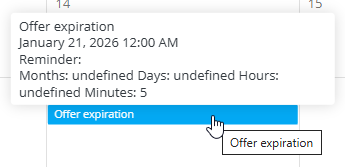

# Reminders

The **Reminders** view provides a calendar-based overview of scheduled reminders and allows users to create notifications for important events, deadlines, and follow-ups.

To access **Reminders**, go to **Resources / Reminders** in the [**navigation**](../../Common/UI/Navigation.md).

## Schema

The following fields are used when creating or editing a reminder:

| Field | Description |
|------|------------|
| **Reminder date** | The target date and time the reminder refers to (for example a deadline, expiration date, or planned event). |
| **Category** | Classification of the reminder, selected from predefined [reminder categories](../Management/ReminderCategories.md). |
| **Users** | Users who will receive the reminder notification. |
| **Reminder offset (Months, Days, Hours, Minutes)** | Time offset that defines **how long before the reminder date** the notification should be triggered. |

## Reminders calendar view

Reminders are displayed in a **monthly calendar view**.

- Each reminder appears on its scheduled date
- Multiple reminders can exist on the same day
- Users can navigate between months

### Hover preview

Hovering over a reminder opens an information tooltip showing:

- Reminder name
- Reminder date and time
- Offset configuration

### Editing reminders

**Double-click** on a reminder to open it in edit mode. Reminder details such as date, category, users, and offset can be modified.

## Creating a new reminder

A new reminder is created using the reminder dialog.

The reminder dialog allows configuring the reminder date, category, users, and offset.

## Reminder offset usage

The reminder offset defines **when the reminder notification is triggered relative to the reminder date**.

The offset is calculated **backwards** from the reminder date.

Examples:

- **Months: 0, Days: 0, Hours: 0, Minutes: 0**  
  → The reminder triggers **exactly at the reminder date and time**

- **Days: 1**  
  → The reminder triggers **one day before** the reminder date

- **Hours: 2, Minutes: 30**  
  → The reminder triggers **2 hours and 30 minutes before**

- **Months: 1**  
  → The reminder triggers **one month before**

This mechanism allows reminders to be scheduled in advance for tasks such as offer expirations, inspections, meetings, or follow-ups.
