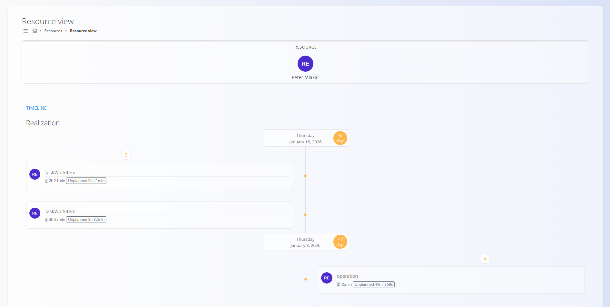

# Resource view

The **Resource view** provides a **chronological timeline of effort recorded in the system** for the **currently logged-in user**.

To access **Resource view**, go to **Resources / Resource view** in the [navigation](../../Common/UI/Navigation.md).

### Overview

This view shows **when and where effort was recorded** by the logged-in user, displayed on a vertical timeline.

> [!NOTE]
> This view is intended for **review and analysis only**, allowing users to see how their recorded effort is distributed over time. No data is entered or edited from this screen.

## Timeline

The main area of the screen is a **time-based timeline**, ordered chronologically.

Each entry represents recorded effort and typically shows:

- The related task or operation
- The amount of effort recorded
- Whether the effort was planned or unplanned

Dates are displayed as timeline markers, making it easy to understand **when work was performed**.

## Realization

The timeline displays **realized (actual) effort** only.

It reflects effort already recorded in the system through tasks, operations, or time logging.
