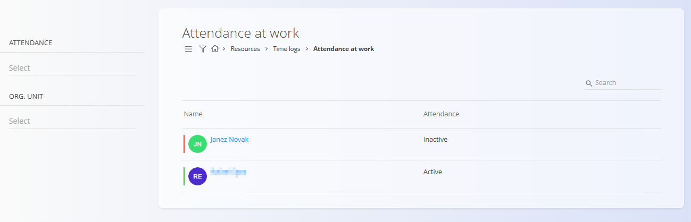
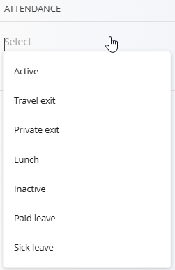

# Attendance at work

The **Attendance at work** view provides a real-time overview of the current attendance status of workers.  
It is primarily intended for supervisors, team leads, and managers who need to quickly see who is present, absent, or in a specific attendance state.

To access **Attendance at work**, go to **Resources / Time logs / Attendance at work** in the [**navigation**](../../Common/UI/Navigation.md).

## Overview

The main list displays workers and their **current attendance status**.

For each worker, the following information is shown:

- **Name**
- **Current attendance state**

The attendance state reflects the worker’s latest time log or attendance action (for example, sign-in, lunch, leave, or sign-out).

This view is updated automatically based on time logging activity.

## Attendance statuses

Workers can appear in different attendance states, depending on their current activity:

- **Active** – The worker is currently working  
- **Lunch** – The worker is on a lunch break  
- **Private exit** – The worker has temporarily left for private reasons  
- **Travel exit** – The worker is out on a business trip  
- **Paid leave** – The worker is on approved paid leave  
- **Sick leave** – The worker is on sick leave  
- **Inactive** – The worker is not currently logged in or present  

These states are derived from time logs and leave records and do not require manual updates in this view.

## Filters

Filters on the left side allow narrowing down the list:

- **Attendance** – Filter by a specific attendance state (Active, Lunch, Paid leave, etc.)
- **Organizational unit** – Show only workers from a selected organizational unit

Filters can be combined to quickly locate specific groups of workers.

## Typical use cases

This view is commonly used to:

- Monitor who is currently working on-site
- Check if a worker is on lunch, leave, or sick leave
- Get a quick overview of attendance across teams or organizational units
- Support operational decisions and workforce coordination

## Relation to other time log views

- **Attendance at work** focuses on *current status only*  
- Historical time entries and detailed edits are handled in **[Time logs – View](TimeLogsView.md)**
- Active time logging, leave requests, and sign-in/out actions are handled in **[Time logs – Manage](TimeLogsManage.md)**
