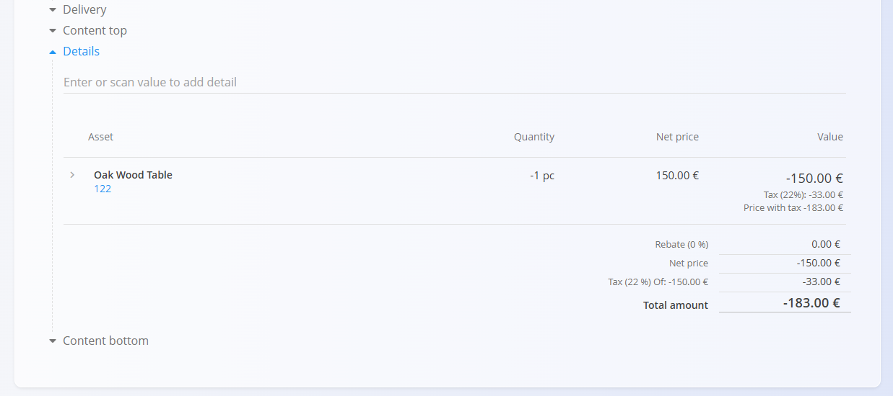
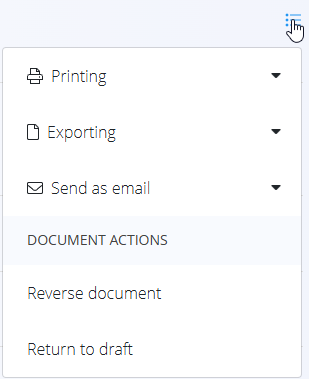

# Credit notes

A **Credit note** is a sales document used to reduce or cancel all or part of an already issued invoice. It is typically created when goods are returned, an overcharge occurred, or a correction is required after invoicing.  

Credit notes decrease the customer’s outstanding balance. For increases or additional charges, see **[Debit notes](DebitNotes.md)**.

> [!TIP]
>
> You can easily review the current **debit and credit records** for each customer in the **[Company cards](../Views/CompanyCards.md)** view.

To access this page, go to **Sales / Documents / Credit notes**.

## How credit notes fit into the sales workflow

Credit notes are used after an invoice has already been issued:

1. Issue an **[Issued invoice](IssuedInvoices.md)** for delivered goods or services.  
2. Identify the need for a correction (return, discount, or pricing error).  
3. Create a **Credit note** linked to the issued invoice or as a standalone document.  
4. Review and publish the credit note, moving it to **Committed**.  
5. The credited amount reduces the customer’s balance or is refunded according to payment terms.  
6. Reverse the credit note if it was created by mistake (see **[Reversals](../../Logistics/Documents/Reversals.md)**).

Credit notes affect accounting only and do not impact inventory.

## Schema

| Field | Description |
|-------|-------------|
| [**Code**](../../Common/UI/DocumentCodes.md) | System-generated identifier of the credit note. |
| **Purchase order code** | Optional reference to the customer’s purchase order. |
| **Customer** | Customer receiving the credit, selected from the [**Business directory**](../../Common/Management/BusinessDirectory.md) (mandatory). |
| **Issue date** | Date when the credit note is issued. |
| **Delivery date** | Original delivery date of the invoiced goods or services. |
| **Due date** | Date when the credit becomes effective (mandatory). |
| **Reference type** | Type of payment reference used (mandatory). |
| **Reference number** | Reference number based on the chosen reference type. |
| **[Organization bank account](../Management/OrganizationBankAccounts.md)** | Bank account used for refunds or accounting (mandatory). |
| **[Cost center](../../Common/Management/CostCenters.md)** | Optional allocation to a cost center. |
| **Purpose code** | Optional reason or classification for the credit. |
| **Rebate** | Overall rebate applied to the credit note. |
| **[Delivery term](../Management/DeliveryTerms.md)** | Delivery conditions  as agreed upon with the customer. |
| **[Mode of transport](../../Common/Management/ModeOfTransport.md)** | Transport method  as agreed upon with the customer. |
| **Content top** | Introductory text from [**Predefined texts**](../../Common/Management/PredefinedTexts.md). |
| **Delivery** | Delivery company and address information. |
| **Content bottom** | Closing or legal text from [**Predefined texts**](../../Common/Management/PredefinedTexts.md). |

### Detail fields

| Field | Description |
|--------|-------------|
| [**Asset**](../../Assets/Assets/Assets.md) | Credited item or service. |
| **Quantity** | Quantity being credited (usually negative). |
| **Net price** | Net price per unit. |
| **Discount (%)** | Optional line-level discount. |
| **Value** | Calculated totals (net, tax, gross) with negative amounts. |

## Management

Credit notes can have **Draft** and **Committed** states.

### List view

The credit notes list can be filtered by:
- **Document dates**
- **View** (Draft / Committed)
- **Customer**

Each row displays:
- Customer  
- Document code  
- Document date  
- Credit amount (negative value)  

Drafts can be edited; committed credit notes are final unless reversed.

## Actions

### Creating a new credit note

Credit notes can be created in two ways:

- Via the [**action button**](../../Common/UI/ActionButton.md) on the **Credit notes** screen  
- From an existing [**Issued invoice**](IssuedInvoices.md) via *Linked documents → + Credit note*

Once you start a new credit note, follow these steps:

1. Create a new draft credit note using one of the methods above.

   

2. Fill in the required header fields such as **Customer**, **Dates**, **Reference type**, and **Organization bank account**.

3. Add items in the **Details** section by typing or scanning an **asset name**, **EAN**, or **serial number**.  
   - Matching items are displayed for selection.

   

4. Edit quantities and values as needed, then click **Save** to confirm the detail.

> [!NOTE]
> When adding a new detail to a **Credit note**, the **quantity is set to `-1` by default** as credit notes represent a reduction of the invoiced amount.

5. When ready, click **Publish** at the top of the page.  
   The document moves from **Draft** to **Committed** and becomes financially effective.

> [!NOTE]  
> Once published, a credit note cannot be edited. Any corrections must be done via reversal.

### Editing a credit note

Only **Draft** credit notes can be edited.

You can modify:
- Header fields  
- Alternative currency
- Transport
- Delivery information
- Detail lines  
- Content texts (top and bottom)

Committed credit notes are read-only.

#### Attachments

Files can be added in the **Attachments** section to store supporting documents such as return confirmations or agreements.

#### Linked documents

The **Linked documents** section allows you to link a previously created **Issued invoice**.

Published credit notes do **not** display the Linked documents section.

#### Alternative currency

The Alternative currency section allows prices in the document to be expressed in a currency different from the system’s default currency. This is typically used for international sales. Rates are taken from the [Exchange rates](../../Common/CodeLists/ExchangeRates.md) code list.

When an alternative currency is selected, document prices are automatically recalculated using the specified exchange rate.

#### Transport

The Transport section defines how goods are delivered to the customer and under which delivery conditions. 

The information entered here is used for logistics coordination, customer communication, and printed sales documents.

## Menu

The document menu provides additional actions:

- **Printing**
- **Exporting**
- **Send as email**
- **Reverse document**
- **Return to draft** (only if allowed)

Reversing a credit note negates its financial effect. For details, see **[Reversals](../../Logistics/Documents/Reversals.md)**.

## Deletion

Draft credit notes can be deleted only if they contain **no details**. Details can be removed via Menu → **Delete all details**.

If you need to delete some individual detail lines:
1. Open each detail line by clicking on them.
2. Remove it using **Delete**.
3. Repeat until all desired lines are removed.

Once empty, the **Delete** action can be performed.

Committed credit notes **cannot** be deleted, but they can be [reversed](../../Logistics/Documents/Reversals.md) or **returned to draft**.

---
