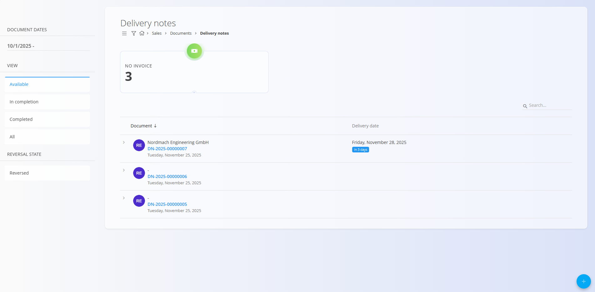
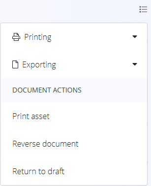

# Delivery notes

A **Delivery note** is a logistics document that accompanies goods during delivery. It confirms what items are being dispatched, in what quantities, and on which date. Delivery notes are usually created from a **Sales order**, but can also be created independently when needed.

A delivery note does **not** represent a financial document—it is primarily operational. Once items are delivered, a delivery note typically leads to the creation of an **Issue** (warehouse output), and later to an **Issued invoice**.

To access this page, go to **Sales / Documents / Delivery notes** in the [navigation](../../Common/UI/Navigation.md).

## How delivery notes fit into the sales workflow

Delivery notes act as the bridge between the commercial and warehouse processes:

1. A customer confirms an order → a [**Sales order**](SalesOrder.md) is created.  
2. From the sales order, a user generates a **Delivery note** via *Linked documents → + Delivery note*.  
3. Once the delivery note is prepared, an [**Issue**](../../Logistics/Documents/Issues.md) is created and linked (full or partial delivery).  
4. After delivery, the process continues toward [**Issued invoice**](IssuedInvoices.md) creation.

Delivery notes can also be copied, linked to existing issues or projects, or used to trigger production or maintenance tasks.

## Schema

### Header fields

| Field | Description |
|-------|-------------|
| **Code** | System-generated identifier of the delivery note. |
| **Customer** | Delivery recipient, selected from the [Business directory](../../Common/CodeLists/BusinessDirectory.md) (mandatory). |
| **Document date** | Date when the delivery note is created. |
| **Delivery date** | Date when the delivery is planned to occur (mandatory). |
| **Delivery – Company / Address** | Customer delivery details taken from the Business directory. |
| **Content top** | Optional predefined introductory text from [Predefined texts](../../Common/CodeLists/PredefinedTexts.md) (entity: *Delivery note*). |
| **Details** | This section lists all items included in the delivery (mandatory). | 
| **Content bottom** | Optional closing or legal text from [Predefined texts](../../Common/CodeLists/PredefinedTexts.md) (entity: *Delivery note*). |

### Details

| Field | Description |
|--------|-------------|
| **[Asset](../../Assets/Assets/Assets.md)** | Item or service being delivered. |
| **Delivery date** | Delivery date for this specific item. |
| **Issued quantity** | Shows how many units have already been issued (e.g., *0/3* before issue, *3/3* after full issue). |

## Management

### List view

The Delivery notes list shows all documents separated by:

- **Available**
- **In completion**
- **Completed**
- **All**
- **Reversed** (Reversal state)

**Indicators displayed at the top:**

- **No invoice** – Delivery notes that have not yet resulted in an issued invoice.

These indicators update automatically based on selected filters (Document dates, Status, Reversal state, Customer).

**Available example:**

**Completed example:**

## Actions

### Creating a new Delivery note

Delivery notes can be created in two ways:

- From the **Delivery notes** list, by clicking [**action button**](../../Common/UI/ActionButton.md).
- From a **Sales order** using *Linked documents → + Delivery note* to create a new delivery note draft.
    

Example of an empty Delivery note draft: 

### Editing a Delivery note

A delivery note is divided into expandable sections:

- **Attachments**
- **Linked documents**
- **Document**
- **Delivery**
- **Content top**
- **Details**
- **Content bottom**

### Completing a Delivery note

When the delivery note is ready, click **Complete** at the top of the page.

## Linked documents

The linked documents section enables the creation of operational or follow-up documents:

Available actions of delivery notes in the **available** status include:

- [**Sales order**](SalesOrder.md)  - Link to an existing sales order
- **Copy delivery note** 
- **Copy delivery note with contents**  
- **Link project** - Link to an existing project
- [**+ Production order**](../../Production/ProductionOrders.md)
- [**+ Maintenance order**](../../Maintenance/MaintenanceOrders.md)
- [**+ Issued invoice**](IssuedInvoices.md)
- **[+ Empty issue](../../Logistics/Documents/Issues.md)**
- **[+ Full issue](../../Logistics/Documents/Issues.md)**
- **[Issue](../../Logistics/Documents/Issues.md)** – Link an existing issue

## Menu

The top-right menu includes:

- **Printing**
- **Exporting (PDF)**
- **Print asset** (Completed documents)
- **Reverse document** (Completed documents)
- **Return to draft** (Completed documents)

> **Reversal note:**  
> A reversed delivery note appears under *Reversal state → Reversed* in the sidebar.

## Attachments

A standard **Attachments** block allows files (PDFs, photos, certificates, etc.) to be uploaded and stored with the delivery note.

## Deletion

- **Only draft delivery notes can be deleted.**  
- **Delivery notes containing details cannot be deleted.**  
- **Reversed delivery notes cannot be deleted.**

To delete a draft delivery note:

1. Remove all **Details** lines.  
2. Click **Delete** in the document header.

If confirmed, the document is permanently removed.

> [!NOTE]  
> A delivery note cannot be deleted if it is referenced by dependent documents (Issues, Invoices, Production orders, etc.).

---
