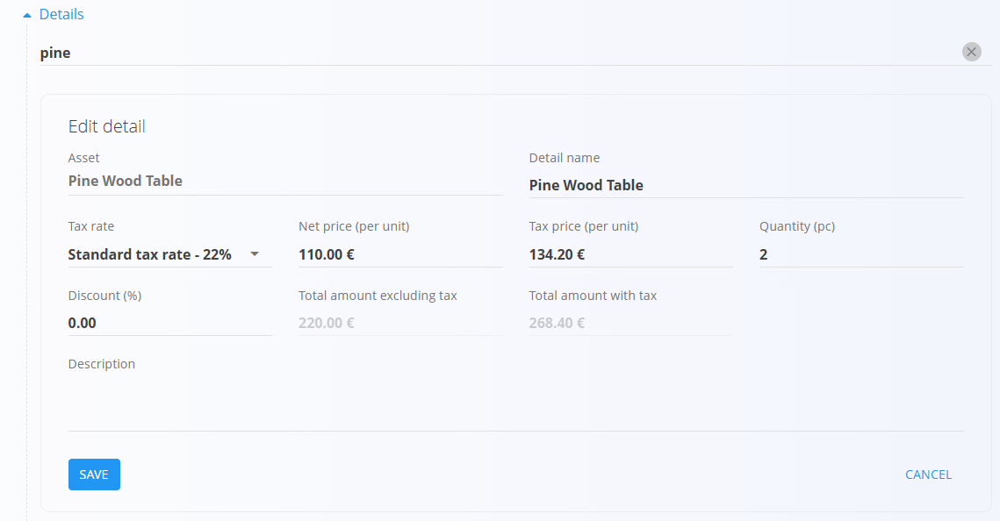

# Issued invoices

**Issued invoices** are financial documents sent to customers so they can pay for confirmed sales. They summarize delivered goods or services, taxes, due dates, and chosen payment methods. From the **Issued invoices** page you can also record partial or full payments directly against each invoice.

To access this page, go to **Sales / Documents / Issued invoices** in the [**navigation**](../../Common/UI/Navigation.md).

## How issued invoices fit into the sales workflow

Issued invoices are typically created at the end of the sales chain:

1. A customer accepts an **[Offer](Offers.md)**.  
2. A **[Sales order](SalesOrders.md)** is created and fulfilled.  
3. Goods are shipped using **[Delivery notes](DeliveryNotes.md)** and related issues.  
4. Finally, an issued invoice is created (often from the delivery note or sales order) and sent to the customer for payment.

Invoices can also be created manually as stand-alone documents when required.

## Schema

  
<strong>Document</strong>

| Field | Description |
|-------|-------------|
| [**Code**](../../Common/UI/DocumentCodes.md) | Unique identifier of the invoice (system-generated). |
| **Purchase order code** | Optional reference to the customer’s purchase order. |
| **Customer** | Customer receiving the invoice, selected from the [**Business directory**](../../Common/Management/BusinessDirectory.md) (mandatory). |
| **Issue date** | Date when the invoice is issued. |
| **Delivery date** | Date when the goods or services were delivered. |
| **Due date** | Payment deadline shown to the customer  (mandatory). |
| **Reference type** | Type of payment reference (e.g., structured reference, model)  (mandatory). |
| **Reference number** | Reference number used on payment documents, based on the chosen reference type. |
| **[Organization bank accounts](../Management/OrganizationBankAccounts.md)** | Account where the payment should be received, selected from the Organization bank accounts code list (mandatory). |
| **[Cost center](../../Common/Management/CostCenters.md)** | Optional allocation of revenue to a cost center. |
| **Purpose code** | Optional code describing the purpose of the invoice (if configured). |
| **Rebate** | Overall rebate applied to the total invoice amount. |
| **Content top** | Introductory text from [**Predefined texts**](../../Common/Management/PredefinedTexts.md). |
| **Content bottom** | Closing or legal text from [**Predefined texts**](../../Common/Management/PredefinedTexts.md). |
| **Payment method** | Payment option selected from [**Payment methods**](../Management/PaymentMethods.md). |

  
<strong>Transport, Alternative currency, and Delivery</strong>

| Field | Description |
|--------|-------------|
| **[Delivery term](../../Common/Management/DeliveryTerms.md)** | Delivery conditions  as agreed upon with the customer. |
| **[Mode of transport](../../Common/Management/ModeOfTransport.md)** | Transport method  as agreed upon with the customer. |
| [**Alternative currency**](../../Common/Management/Currencies.md) | Alternative currency to the default one used in the document |
| [**Exchange rates**](../Management/ExchangeRates.md) | Exchange rate of the alternative currency with respect to the default currency	|
| **Delivery** | Delivery company and address information. |

  
<strong>Details</strong>

| Field | Description |
|--------|-------------|
| [**Asset**](../../Assets/Assets/Assets.md) | Invoiced item or service from the **Assets** domain. |
| **Quantity** | Quantity of the asset being invoiced. |
| **Net price** | Net price per unit, usually taken from price lists or the related document. |
| **Discount (%)** | Optional line-level discount. |
| **Value** | Calculated line totals (net, tax, and gross amounts). |

## Management

### Document states

Issued invoices use payment-based workflow states:

- **Draft** – The invoice is not yet published. All fields can be edited freely.

- **Committed** – The invoice has been published and is now an official financial document. Once Committed, only limited fields can be changed, and the document cannot be deleted.

    - **Unpaid invoices** – The invoice has been issued but no payments have been recorded.  
    - **Partially paid invoices** – One or more payments have been recorded, but an outstanding amount remains.  
    - **Fully paid invoices** – The invoice has been completely settled; no outstanding amount remains.
    - **Reversed** – A reversal document has been created to correct or cancel the invoice.

These states determine what actions are available (payment recording, reversal, exporting, etc.) and how the invoice appears in the list views.

### List view

The list view shows all invoices that match the selected filters and date ranges.

**Indicators**

At the top of the list, the system displays key indicators that summarize the currently filtered data. The following indicators are shown:

- **Unpaid overdue** (interactive) – Number and value of invoices that are past their due date and still unpaid. Click it to display exclusively these invoices on the list.  
- **Total amount** – Total gross amount of invoices in the current view.  

These indicators update based on the filters on the left:

- **Document dates**
- **Delivery date**
- **Due date**
- **View**  
  - **Drafts**  
  - **Committed**  
  - **Unpaid invoices**  
  - **Partially paid invoices**  
  - **Fully paid invoices**  
  - **All**
- **Reversal state** (for reversed invoices)  
- **Customer**  
- **Payment method**

Use the **Search** bar to quickly find invoices by code, customer, or other visible values.

## Actions

### Creating a new issued invoice

Issued invoices can be created in two ways:

- Directly from the **Issued invoices** screen using the [**action button**](../../Common/UI/ActionButton.md).  
- From other sales documents via **Linked documents → + Issued invoice**, such as:
  - A committed [**Sales order**](SalesOrders.md)  
  - A [**Delivery note**](DeliveryNotes.md)  

  In these cases, most fields — including the customer, delivery data, and detail items — are automatically pre-filled.

  

Once you start a new Issued invoice, follow these steps:

1. Use the [**action button**](../../Common/UI/ActionButton.md) or the **Linked documents** panel in another document to create a new draft invoice.

2. Fill in the key header fields:
   - [**Customer**](../../Common/Management/BusinessDirectory.md)  
   - **Issue date**  
   - **Delivery date**  
   - **Due date** (mandatory)  
   - **Reference type / Reference number**  
   - [**Organization bank account**](../Management/OrganizationBankAccounts.md)  
   - [**Payment method**](../Management/PaymentMethods.md)

   

3. Add items in the **Details** section. Type or scan a **serial number**, **EAN**, or **asset name** in the Details bar.  
   The system displays all matching items.

4. Adjust **quantity**, **price**, **discount**, or **tax rate**, then click **Save**.

    

5. Continue adding as many detail lines as needed. After saving, the detail appears in the list:

   

6. (Optional) Add:
   - **Content top / Content bottom** text  
   - **Alternative currency** (see below)
   - **Delivery information**  
   - **Attachments**  

7. When the invoice is ready, click **Publish** at the top of the page.  
   Publishing moves the document from **Draft** to **Committed**, finalizes totals, and enables accounting export and further processing.

> [!NOTE]  
> Once published, an issued invoice cannot be edited or deleted. If a correction is needed, use **[Reverse document](../../Logistics/Documents/Reversals.md)** action in the menu.

### Editing an issued invoice

Click any issued invoice in the list to open it. Draft invoices can be edited freely. The document is divided into multiple expandable sections. 

While the invoice is in **Draft** status you can edit all sections:

- Header fields (dates, references, customer, bank account, etc.)
- Alternative currency
- Transport
- Delivery information
- **Details** – add, remove, or change invoice lines
- **Payment methods** – define how the customer is expected to pay
- **Content top** and **Content bottom** – choose predefined texts

#### Attachments

At the top of every document, an **Attachments** section is available. 

You can upload any relevant file—such as delivery notes, transport documents, photos, or supporting records. All attached files remain stored together with the document and can be reviewed at any time.

#### Linked documents

The linked documents section enables the creation of operational or follow-up documents. This section also shows any previously linked documents.

> [!NOTE]
> The available **Linked document** actions depend on the document type and status.

Example for a new draft document:

Available actions may include:

- **Issued invoice** - Copy current document to a new issued invoice
- [**+ Credit note**](CreditNotes.md) - Create a credit note
- [**+ Debit note**](DebitNotes.md) - Create a debit note
- [**Delivery note**](DeliveryNotes.md) - Link to an exiting delivery note.
- [**Prepayments**](Prepayments.md) - Link to an exiting prepayment.

#### Alternative currency

The Alternative currency section allows prices in the document to be expressed in a currency different from the system’s default currency. This is typically used for international sales. Rates are taken from the [Exchange rates](../Management/ExchangeRates.md) code list.

When an alternative currency is selected, document prices are automatically recalculated using the specified exchange rate.

#### Transport

The Transport section defines how goods are delivered to the customer and under which delivery conditions. 

The information entered here is used for logistics coordination, customer communication, and printed sales documents.

### Publishing an invoice

When you are ready, click **Publish** to confirm the invoice and move it out of the **Draft** state. Once published, all related invoice actions become available.

### Recording payments

After an invoice is published, use the **Payment** button to record incoming payments.

In the payment dialog you can see:

- **Total cost** – Invoice gross amount and due date.  
- **Payment** – Amount being paid now and date of payment.  
- **Remaining amount** – Outstanding balance after the payment.

You can register multiple payments over time. The system automatically updates the invoice status:

- **Unpaid** – No payments recorded.  
- **Partially paid** – Some payments recorded, but an outstanding amount remains.  
- **Fully paid** – Remaining amount is zero.

> [!NOTE]  
> When an invoice is fully covered by recorded payments, it appears in the **Fully paid invoices** view. Partially paid documents appear under **Partially paid invoices**, and unpaid ones under **Unpaid invoices**.

## Menu

For published invoices, the menu in the top-right corner provides additional options:

Available actions include:

- **Printing** – Print the invoice using configured printouts.  
- **Exporting** – Export to PDF or other available formats.  
- **Send as email** – Email the invoice directly to the customer.  
- **[Reverse document](../../Logistics/Documents/Reversals.md)** – Create a reversal invoice for corrections.  
- **Return to draft** – Move the invoice back to draft status for editing (if allowed by business rules).

## Deletion

Draft documents can be deleted on the edit screen, but only if they contain **no details**.

If the draft still includes items in the **Details** section:

1. Click the material serial number to open the **Edit detail** screen.  
2. Click **Delete** inside the Edit detail window to remove the material.  
3. Repeat this for all remaining materials.

Once the document contains no materials, you can click **Delete** to remove the draft.

> [!NOTE]
> - Only **draft** invoices can be deleted.  
> - Once an invoice is published, you can no longer delete it; instead, use **[Reverse document](../../Logistics/Documents/Reversals.md)** or **Return to draft** if available.  
> - If any payments have been recorded, the invoice cannot be deleted until those payments are removed and the document is returned to draft.

