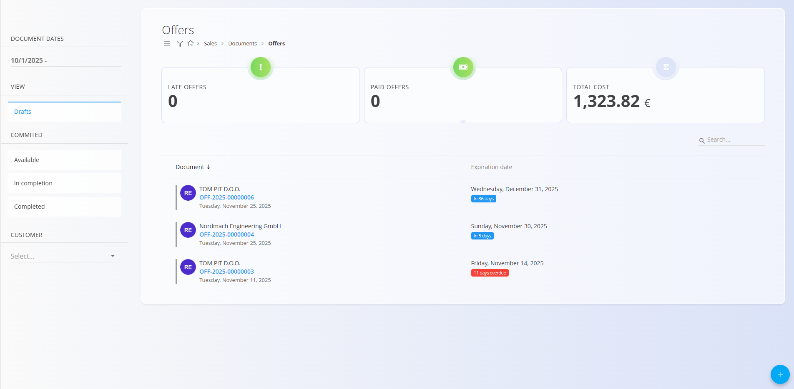
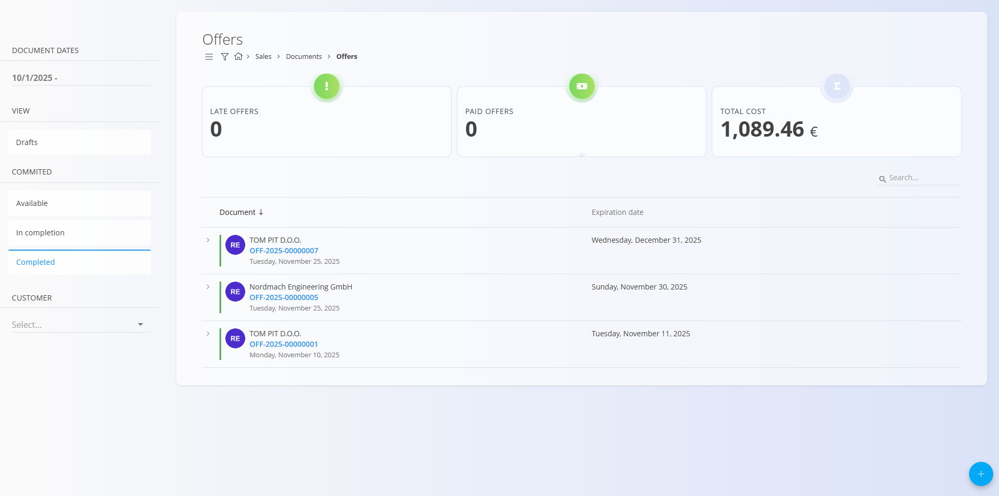
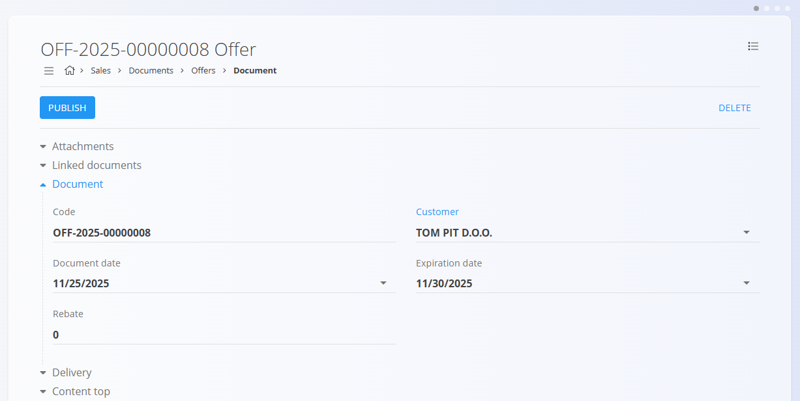
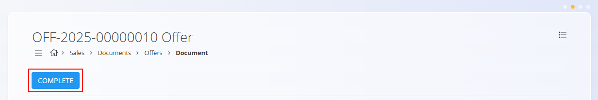
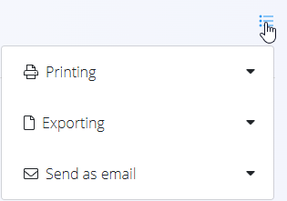

# Offers

An **Offer** is a sales document used to present a proposed price, quantity, and delivery terms to a customer before a sale is confirmed.  
Offers help formalize quotations, compare pricing options, and smoothly transition into follow-up documents such as **Sales orders**, **Delivery notes**, and **Issued invoices**.

To access this page, go to **Sales / Documents / Offers** in the [navigation](../../Common/UI/Navigation.md).

## How offers fit into the sales workflow

A typical flow:

1. Create an **Offer** and send it to the customer.  
2. When approved, convert it into a [**Sales order**](SalesOrder.md) using the [**Linked documents**](#linked-documents) section.  
3. From the sales order, continue the operational workflow—production, purchasing, delivery, etc.  
4. Eventually, generate a [**Delivery note**](DeliveryNotes.md), and finally an [**Issued invoice**](IssuedInvoices.md).

## Schema

| Field | Description |
|-------|-------------|
| **Code** | System-generated identifier of the offer. |
| **Customer** | The customer receiving the quotation, selected from the [Business directory](../../Common/CodeLists/BusinessDirectory.md) (mandatory). |
| **Document date** | Date when the offer is created. |
| **Expiration date** | Validity date of the offer (mandatory). |
| **Rebate** | Optional overall discount applied to the entire offer (e.g., enter *2* for a 2% discount). |
| **Delivery – Company / Address** | Delivery-related information for the customer. Company and address values are sourced from the [Business directory](../../Common/CodeLists/BusinessDirectory.md). |
| **Content top** | Predefined introductory text from [Predefined texts](../../Common/CodeLists/PredefinedTexts.md) (entity: *Offer*). |
| **Details** | List of quoted items (assets) with pricing and delivery information. Items originate from the [Assets](../../Assets/Assets/Assets.md) list (mandatory). |
| **Content bottom** | Closing or legal statements from [Predefined texts](../../Common/CodeLists/PredefinedTexts.md) (entity: *Offer*). |
| [**Payment methods**](../../Common/CodeLists/PaymentMethods.md) | Available payment methods shown to the customer. |

### Detail fields

| Field | Description |
|--------|-------------|
| [**Assets**](../../Assets/Assets/Assets.md) | Item or service being offered.  |
| **Delivery date** | Planned delivery date for this item. |
| **Quantity** | Quantity of the asset. |
| **Net price (per unit)** | Unit price taken from the asset’s configuration or applicable [asset price list](../../Assets/Assets/AssetPriceLists.md). |
| **Discount (%)** | Optional discount applied to this specific line. |
| [**Tax rates**](../../Common/CodeLists/TaxRates.md) | Applied tax rule. |
| **Value** | Total line value (quantity × net price, after discounts). |

## Management

### List view

The Offers list provides an overview of all quotations, separated into **Drafts**, **Available**, **In completion**, and **Completed**.  

At the top of the Offers list, the system displays key indicators that summarize the currently filtered data.  The following indicators are shown:

- **Late offers** – Offers whose expiration date has passed and have not been accepted or completed.
- **Paid offers** – Offers for which full payment has been recorded.
- **Total cost** – The combined total value of all offers included in the active filter. 

Filters on the left help narrow down results by **document dates**, **status**, and **customer**. 

An example of a list with **Completed** offers:

## Actions

### Creating a new Offer

1. Use the **action button** to create a new draft offer.  

2. Fill in the [**Customer**](../../Common/CodeLists/BusinessDirectory.md), **Expiration date**, and **Rabate** (optional) fields.

    

3. Add items into the details section:

    

4. Save the added details.

    

5. Select the [**Payment method**](../../Common/CodeLists/PaymentMethods.md).

   

6. When ready, click **Publish** on located on top of the page to finalize the offer. A published offer moves to the **Available** state and enables additional document actions.

    

### Editing an offer

Click any offer in the list to open it. Draft offers can be edited freely. The Documents is divided into multiple expandable sections. 

Published offers allow limited modifications depending on system configuration.

#### Attachments

At the top of every document, an **Attachments** section is available. 

You can upload any relevant file—such as delivery notes, transport documents, photos, or supporting records. All attached files remain stored together with the document and can be reviewed at any time.

#### Linked documents

Offers support the creation of several related documents, allowing a complete business process flow.

> [!NOTE]
> The available **Linked document** actions depend on the document type and status.

Common actions include:

- **Project** – link the offer to a project  
- **Copy offer** – duplicate this offer  
- **+ Proforma invoice** – create a proforma invoice  
- **+ Sales order** – create a [sales order](SalesOrders.md) directly from the offer (typical workflow when a customer accepts the offer)

### Completing an offer
Once the offer in the **Available** status is ready, click on **Complete**.

> [!NOTE]
> An offer is also automatically moved to the **completed** status when a new [**Sales order**](SalesOrder.md) is created from directly from it using the **Linked documents** action.

## Menu

Once published, the top menu provides options for: 
- Printing
- Exporting (to PDF)
- Sending the document via email (only for commited documents)

## Deletion

Draft documents can be deleted on the edit screen, but only if they contain **no details**.

If the draft still includes items in the **Details** section:

1. Click the material serial number to open the **Edit detail** screen.  
2. Click **Delete** inside the Edit detail window to remove the material.  
3. Repeat this for all remaining materials.

Once the document contains no materials, you can click **Delete** to remove the draft.

Committed documents **cannot** be deleted

> [!NOTE]  
> An offer can be deleted only if it is not linked to another dependent document (e.g., Sales orders).

---

