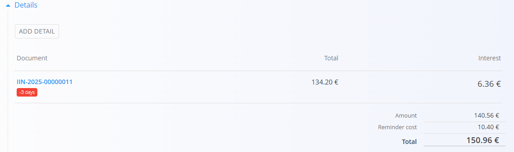

# Overdue reminders

An **Overdue reminder** is a sales document used to notify customers about unpaid invoices and request payment, optionally including reminder costs and interest.

To access this page, go to **Sales / Documents / Overdue reminders** in the [navigation](../../Common/UI/Navigation.md).

## How overdue reminders fit into the sales workflow

A typical flow:

1. Identify an [**Issued invoice**](IssuedInvoices.md) that has an outstanding amount past its due date.
2. Create an **Overdue reminder** with the invoice details and applicable reminder cost and interest.
3. Send the reminder to the customer and record any follow-up actions.
4. When the invoice is settled, no further reminders are needed.

## Schema

| Field | Description |
|-------|-------------|
| [**Code**](../../Common/UI/DocumentCodes.md) | System-generated identifier of the overdue reminder. |
| **Title** | The document title. Defaults to "Overdue reminder". |
| **Customer** | The customer to whom the reminder is sent, selected from the [**Business directory**](../../Common/CodeLists/BusinessDirectory.md) (mandatory). |
| **Document date** | Date when the reminder is created. |
| **Reminder cost** | Fixed cost for sending the reminder (e.g., administrative fee). Can be applied per document or per detail. |
| **Details** | List of overdue items linked to [**Issued invoices**](IssuedInvoices.md) with amounts and optional interest. |
| [**Issued invoice**](IssuedInvoices.md) | The overdue invoice being reminded. Selecting it automatically loads the outstanding amount. |
| **Interest** | Interest value to be charged for the overdue period. Needs to be entered manually. |

## Management

### List view

The Overdue reminders list provides an overview of all reminders, separated into: **Drafts**, and **Committed**.
- **Draft** — The document is not yet published. All fields can be edited freely.
- **Committed** — The document has been published. It cannot be deleted or freely modified.

Filters on the left help narrow down results by **document dates**, **status**, and **customer**.

## Actions

### Creating a new overdue reminder

1. Use the [**action button**](../../Common/UI/ActionButton.md) to create a new draft overdue reminder.

   

2. Fill in the **Customer**, **Document date**, and **Reminder cost** (optional) fields.

3. Add items into the **Details** section:
   - Click **Add detail**.
   - Select the overdue [**Issued invoice**](IssuedInvoices.md) to include.
   - The system automatically adds the **outstanding amount** and applies any **reminder cost**.
   - Enter the **Interest** manually if applicable.

   

4. Click **Save** to confirm added details. Repeat step 3 to add more items.

   

5. When ready, click **Publish** at the top of the page to finalize the reminder.

> [!NOTE]
> When you click **Publish**, the document is confirmed and moves from the **Draft** state into the **Committed** group of states.

## Editing an overdue reminder

 **Draft** reminders can be edited freely. Click any reminder in the list of drafts to open it.
 
 Published reminders **cannot** be edited.

## Menu

The top menu provides options for:
- Printing
- Exporting (to PDF)

## Deletion

Draft documents can be deleted on the edit screen.

Committed overdue reminders **cannot** be deleted.

---
