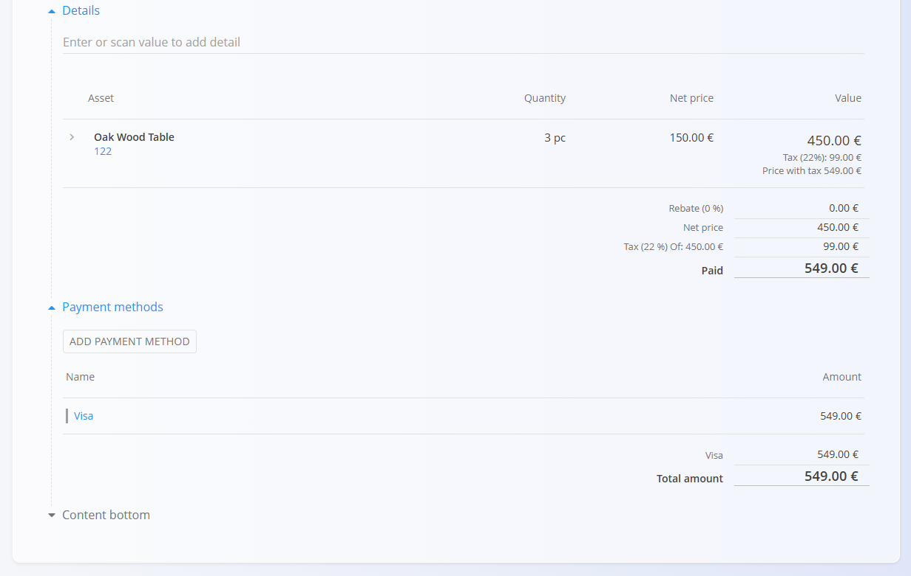
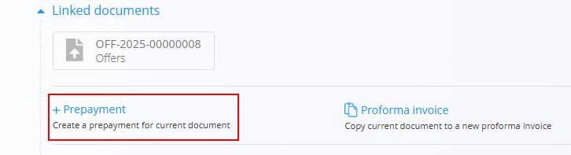
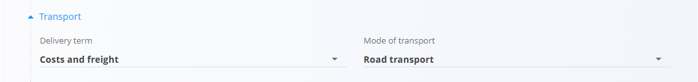

# Prepayments

A **Prepayment** is a sales document used when a customer pays an agreed amount in advance before goods or services are delivered. It records received funds that can later be fully or partially applied to [issued invoices](IssuedInvoices.md). Prepayments can be created manually or directly from a committed [**Proforma invoice**](ProformaInvoices.md), linking them to the sales process.

To access this page, go to **Sales / Documents / Prepayments**.

## How prepayments fit into the sales workflow

Prepayments are used when a customer pays part of the amount in advance. They integrate into the standard sales process as follows:

1. Create an **[Offer](Offers.md)** and convert it into a [**Proforma invoice**](ProformaInvoices.md).  
2. Commit the Proforma invoice, making it eligible for prepayments.  
3. Create a **Prepayment** – either manually or through *Linked documents → + Prepayment* on the Proforma invoice.  
4. Record the received amount and publish the prepayment (it becomes Committed).  
5. Apply the prepayment when issuing the **[final invoice](IssuedInvoices.md)**, fully or partially reducing the amount due.  
6. Reverse the prepayment if the advance payment must be canceled or refunded (see **[Reversals](../../Logistics/Documents/Reversals.md)**).

Prepayments track received funds and do not affect inventory.

## Schema

| Field | Description |
|-------|-------------|
| [**Code**](../../Common/UI/DocumentCodes.md) | System-generated identifier of the prepayment. |
| **Purchase order code** | Optional reference to the customer's purchase order. |
| **Customer** | Customer making the payment, selected from the [**Business directory**](../../Common/Management/BusinessDirectory.md) (mandatory). |
| **Issue date** | Date when the prepayment document is issued. |
| **Delivery date** | Estimated delivery date related to the sale. |
| **Due date** | Deadline for receiving the prepayment (mandatory). |
| **Reference type** | Type of payment reference used on payment documents (mandatory). |
| **Reference number** | Payment reference based on the chosen reference type. |
| **[Organization bank account](../Management/OrganizationBankAccounts.md)** | Bank account receiving the prepayment (mandatory). |
| **[Cost center](../../Common/Management/CostCenters.md)** | Optional allocation to a cost center. |
| **Purpose code** | Optional description of payment purpose. |
| **Rebate** | Overall rebate applied to the prepayment amount. |
| **[Delivery term](../Management/DeliveryTerms.md)** | Delivery conditions  as agreed upon with the customer. |
| **[Mode of transport](../../Common/Management/ModeOfTransport.md)** | Transport method  as agreed upon with the customer. |
| **Content top** | Introductory text from [**Predefined texts**](../../Common/Management/PredefinedTexts.md). |
| **Delivery** | Delivery company and address information. |
| **Content bottom** | Closing or legal text from [**Predefined texts**](../../Common/Management/PredefinedTexts.md). |
| **Payment method** | Payment method selected from [**Payment methods**](../Management/PaymentMethods.md). |

### **Detail fields**

| Field | Description |
|--------|-------------|
| [**Asset**](../../Assets/Assets/Assets.md) | Item or service that the prepayment relates to. |
| **Quantity** | Quantity of the asset. |
| **Net price** | Net price per unit. |
| **Discount (%)** | Optional discount on the line item. |
| **Value** | Total values (net, tax, gross) calculated for the line. |

## Management

Prepayments can have **Draft** and **Committed** states.

### List view

The prepayments list can be filtered by:
- **Document dates**
- **View** (Draft / Committed)
- **Customer**

Each row displays:
- Customer name  
- Document code  
- Document date  
- Prepayment amount  

Drafts can be edited; committed prepayments are final unless reversed.

## Actions

### Creating a new prepayment

1. Use the [**action button**](../../Common/UI/ActionButton.md) to create a new draft prepayment.

   

2. Fill in mandatory header fields: **Customer** (from the [**Business directory**](../../Common/Management/BusinessDirectory.md)), **Due date**, **Reference type**, **Reference number**, and **[Organization bank account](../Management/OrganizationBankAccounts.md)**.

3. Add items in the Details section. Type or scan a **serial number**, **EAN**, or **asset/material name** into the Details bar.
   - The system displays matching assets and materials.

4. Save the added details.

5. Select the **[Payment method](../Management/PaymentMethods.md)**.

    

6. When ready, click **Publish** at the top of the page to finalize the prepayment. This moves the document to the **Committed** state and enables additional actions.

> [!NOTE]
> When you click **Publish**, the document is confirmed and moves from **Draft** into the **Committed** group of states.
>
> A draft prepayment can also be created from a committed [**Proforma invoice**](ProformaInvoices.md) via **+ Prepayment**.
>
>

### Editing a prepayment

A draft prepayment can be modified until it is published.

Changes can be made to:
- Header fields (customer, dates, reference numbers, bank account)
- Alternative currency
- Transport
- Delivery information
- Detail lines (assets, quantities, prices)
- Payment methods
- Content text (top/bottom)

#### Attachments

Files can be uploaded in the **Attachments** section to provide additional documentation.

#### Linked documents

The linked documents section enables the creation of operational or follow-up documents. This section also shows any previously linked documents. 

> [!NOTE]
> - The available **Linked document** actions depend on the document type and status.
> - Prepayments can be partially or fully applied during invoice creation.

Available actions may include:
- **[+ Issued invoice](IssuedInvoices.md)** – Create a final invoice applying the prepayment.
- **Prepayment** – Duplicate the details from the current prepayment to a new document.

#### Alternative currency

The Alternative currency section allows prices in the document to be expressed in a currency different from the system’s default currency. This is typically used for international sales. Rates are taken from the [Exchange rates](../../Common/CodeLists/ExchangeRates.md) code list.

When an alternative currency is selected, document prices are automatically recalculated using the specified exchange rate.

#### Transport

The Transport section defines how goods are delivered to the customer and under which delivery conditions. 

The information entered here is used for logistics coordination, customer communication, and printed sales documents.

#### Delivery section

The Delivery section defines where the goods will be shipped. It is filled automatically from the customer or vendor data but can be adjusted for each document.  

These values affect the printed document and follow-up logistics documents, but do not modify the master data.

## Menu

The document menu provides additional actions:
- **Printing**
- **Exporting**
- **Send as email**
- **Reverse document** (creates a financial reversal)
- **Return to draft** (only if allowed by system settings)

A reversal negates the financial effect of a committed prepayment. See **[Reversals](../../Logistics/Documents/Reversals.md)** for more details.

## Deletion

Draft documents can be deleted on the edit screen, but only if they contain **no details**.

If the draft still includes items in the **Details** section:

1. Click the material serial number to open the **Edit detail** screen.  
2. Click **Delete** inside the Edit detail window to remove the material.  
3. Repeat this for all remaining materials.

Once the document contains no materials, you can click **Delete** to remove the draft.

Committed documents **cannot** be deleted, but they can be [reversed](../../Logistics/Documents/Reversals.md).  

---

