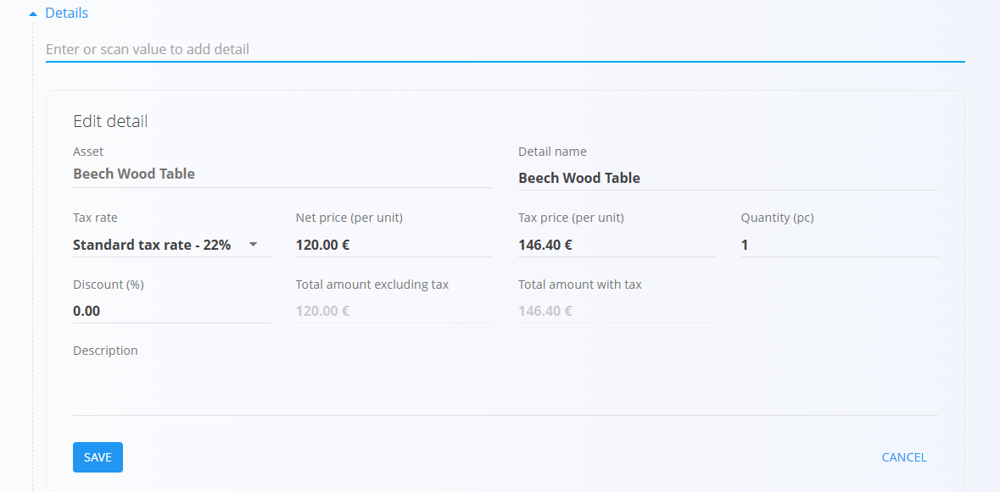
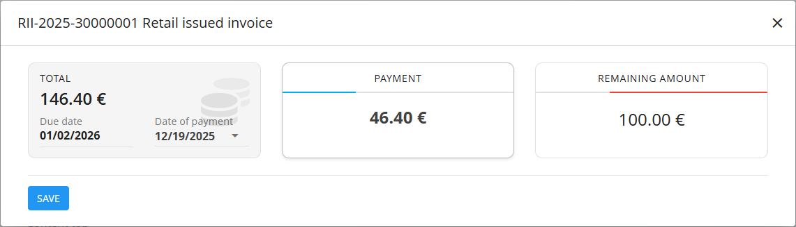

# Retail issued invoices

A **Retail issued invoice** is a sales document used for direct, in-store sales to end customers. It is typically created when a customer purchases goods on the spot, without a preceding offer or sales order. Retail issued invoices support immediate or later payment tracking, but **do not affect stock levels**. Inventory changes must be handled separately through Logistics documents.

To access this page, go to **Sales / Documents / Retail issued invoices**.

## How retail issued invoices fit into the sales workflow

Retail issued invoices are designed for walk-in or over-the-counter sales:

1. A customer visits the shop and selects one or more items.  
2. A **Retail issued invoice** is created manually using the action button.  
3. The invoice is published and appears as **Unpaid** by default.  
4. Payments are recorded directly on the invoice (full or partial).  
5. The invoice moves automatically to **Partially paid** or **Fully paid** based on recorded payments.  
6. Stock is adjusted separately using an [**Issue**](../../Logistics/Documents/Issues.md) document (or [**Delivery note**](DeliveryNotes.md) + [**Issue**](../../Logistics/Documents/Issues.md) if goods are delivered).

## Schema

| Field | Description |
|-------|-------------|
| [**Code**](../../Common/UI/DocumentCodes.md) | System-generated identifier of the retail invoice. |
| **Purchase order code** | Optional reference provided by the customer. |
| **Customer** | Customer selected from the [**Business directory**](../../Common/CodeLists/BusinessDirectory.md) (mandatory). Only contacts classified as **Customer** and **Person** are available. |
| **Issue date** | Date when the invoice is issued. |
| **Delivery date** | Date when goods are handed over or delivered. |
| **Due date** | Payment deadline (mandatory). |
| **Reference type** | Type of payment reference (mandatory). |
| **Reference number** | Reference number based on the selected reference type. |
| **[Organization bank account](../CodeLists/OrganizationBankAccounts.md)** | Bank account receiving the payment (mandatory). |
| **[Cost center](../../Common/CodeLists/CostCenters.md)** | Optional cost center assignment. |
| **Purpose code** | Optional code describing the purpose of the transaction. |
| **Rebate** | Overall rebate applied to the invoice. |
| **Delivery** | Delivery company and address information. |
| **Content top** | Introductory text from [**Predefined texts**](../../Common/CodeLists/PredefinedTexts.md). |
| **Content bottom** | Closing or legal text from [**Predefined texts**](../../Common/CodeLists/PredefinedTexts.md). |

### Detail fields

| Field | Description |
|--------|-------------|
| [**Asset**](../../Assets/CodeLists/Assets.md) | Sold item or service. |
| **Quantity** | Quantity sold (default: **1**). |
| **Net price** | Net price per unit. |
| **Discount (%)** | Optional line-level discount. |
| **Value** | Calculated totals (net, tax, gross). |

## Management

Retail issued invoices move through the following states:

- **Draft**
- **Unpaid invoices**
- **Partially paid invoices**
- **Fully paid invoices**

### List view

The list can be filtered by:
- **Document dates**
- **View** (Drafts, Committed, Unpaid, Partially paid, Fully paid)
- **Customer**
- **Payment method**

Each row displays:
- Customer name  
- Document code  
- Document date  
- Paid amount and total amount  

If a partial amount is recorded, the invoice moves to **Partially paid invoices**. The list shows the whole amount and the already paid amount. On the left side the record shows **blue** color.

When the full amount is paid, the invoice moves to **Fully paid invoices**. The list shows the amount paid. On the left side the record shows **green** color.
   

## Actions

### Creating a new retail issued invoice

Retail issued invoices can only be created manually.

1. Click the [**action button**](../../Common/UI/ActionButton.md) to create a new draft retail issued invoice.

   

2. Select a **Customer**. Only records classified as both **Customer** and **Person** in the [**Business directory**](../../Common/CodeLists/BusinessDirectory.md) are available.
   
   

3. Fill in required header fields such as **Due date**, **Reference type**, and **Organization bank account**.

4. Add items in the **Details** section by typing or scanning an asset name or code.  

   

5. Save the detail lines and review totals.

6. Add **Payment methods** at the bottom of the document (optional).

   

7. Click **Publish** to confirm the invoice.  
   The document moves to **Unpaid invoices**.

## Recording payments

Payments are recorded using the **Payment** button at the top of the document.

In the payment dialog you can see:

- **Total cost** – Invoice gross amount and due date.  
- **Payment** – Amount being paid now and date of payment.  
- **Remaining amount** – Outstanding balance after the payment.

You can register multiple payments over time. The system automatically updates the invoice status:

- **Unpaid** – No payments recorded.  
- **Partially paid** – Some payments recorded, but an outstanding amount remains.  
- **Fully paid** – Remaining amount is zero.

> [!NOTE]  
> When an invoice is fully covered by recorded payments, it appears in the **Fully paid invoices** view. Partially paid documents appear under **Partially paid invoices**, and unpaid ones under **Unpaid invoices**.

## Stock handling

Retail proforma invoices **do not decrease stock**, regardless of payment status.

To adjust inventory:
- Create an [issue](../../Logistics/Documents/Issues.md) document, or  
- Create a [delivery note](DeliveryNotes.md) followed by an [issue](../../Logistics/Documents/Issues.md).

## Menu

The document menu for published invoices provides:
- **Printing**
- **Exporting**
- **Send as email**
- **Reverse document** - See [**Reversals**](../../Logistics/Documents/Reversals.md) for details.
- **Return to draft**

   

> [!NOTE]
>
> Draft invoices do not have **Reverse document**, but they have a **Delete all details** option.

## Deletion

**Draft** retail issued invoices can be deleted if they contain **no details**. You can use the **Delete all details** option in the document menu.

If the draft still includes items in the **Details** section:

1. Click the material serial number to open the **Edit detail** screen.  
2. Click **Delete** inside the Edit detail window to remove the material.  
3. Repeat this for all remaining materials.

**Published** invoices (any payment status) cannot be deleted, but they can be **reversed** or **returned to draft**, depending on system settings.

---
