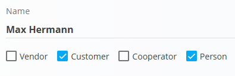
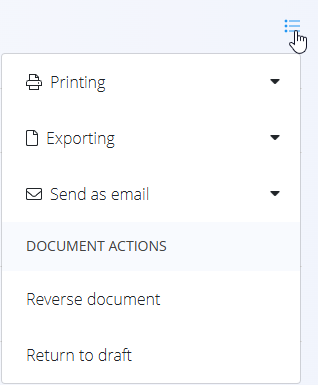

# Retail proforma invoices

A **Retail proforma invoice** is a sales document used in retail scenarios to record a sale in an invoice-like format while allowing flexible payment handling.  
It is typically used when a customer purchases goods in person and payment may be recorded immediately or later.

Retail proforma invoices support the same payment lifecycle as retail issued invoices and can be printed or sent to the customer at any stage.

To access this page, go to **Sales / Documents / Retail proforma invoices**.

## How retail proforma invoices fit into the sales workflow

Retail proforma invoices are used for over-the-counter or direct retail sales:

1. A customer visits the shop and selects one or more items.  
2. A **Retail proforma invoice** is created manually using the [**action button**](../../Common/UI/ActionButton.md).  
3. The document is published and moves to the **Unpaid invoices** state.  
4. Payments are recorded using the **Payment** button:
   - Partial payments move the document to **Partially paid invoices**.
   - Full payment moves the document to **Fully paid invoices**.
5. The proforma invoice can be printed or sent to the customer.
6. Stock is adjusted separately using an [**Issue**](../../Logistics/Documents/Issues.md) document (or a [**Delivery note**](DeliveryNotes.md) followed by an Issue).

Retail proforma invoices **do not affect inventory**.

## Schema

| Field | Description |
|-------|-------------|
| [**Code**](../../Common/UI/DocumentCodes.md) | System-generated identifier of the document. |
| **Purchase order code** | Optional reference provided by the customer. |
| **Customer** | Mandatory. Selected from the [**Business directory**](../../Common/Management/BusinessDirectory.md). Only entities classified as **Customer** and **Person** are available. |
| **Issue date** | Date when the document is created. |
| **Delivery date** | Delivery or pickup date. |
| **Due date** | Payment deadline (mandatory). |
| **Reference type** | Type of payment reference (mandatory). |
| **Reference number** | Reference number used on payment documents. |
| **[Organization bank account](../Management/OrganizationBankAccounts.md)** | Account where payments are received (mandatory). |
| **[Cost center](../../Common/Management/CostCenters.md)** | Optional cost allocation. |
| **Purpose code** | Optional purpose classification. |
| **Rebate** | Overall rebate applied to the document. |
| **Delivery** | Delivery company and address information. |
| **Content top** | Introductory text from [**Predefined texts**](../../Common/Management/PredefinedTexts.md). |
| **Content bottom** | Closing or legal text from [**Predefined texts**](../../Common/Management/PredefinedTexts.md). |

### Detail fields

| Field | Description |
|--------|-------------|
| [**Asset**](../../Assets/Management/Assets.md) | Item or service being sold. |
| **Quantity** | Quantity of the asset (default: **1**). |
| **Net price** | Net price per unit. |
| **Discount (%)** | Optional line-level discount. |
| **Value** | Calculated net, tax, and gross totals. |

## Management

Retail proforma invoices support the following states:

- **Draft**
- **Unpaid invoices**
- **Partially paid invoices**
- **Fully paid invoices**

Once published, the **Payment** button becomes available and payments can be recorded.

### List view

The list view can be filtered by:

- **Document dates**
- **View**
  - Drafts
  - Unpaid invoices
  - Partially paid invoices
  - Fully paid invoices
- **Customer**

Each row displays:
- Customer
- Document code
- Document date
- Paid amount
- Total amount

## Actions

### Creating a new retail proforma invoice

Retail proforma invoices can only be created manually.

1. Click the [**action button**](../../Common/UI/ActionButton.md) to create a new draft retail proforma invoice.

   

2. Select a **Customer**. Only records classified as both **Customer** and **Person** in the [**Business directory**](../../Common/Management/BusinessDirectory.md) are available.

   

3. Fill in mandatory header fields: **Due date**, **Reference type**, **Reference number**, and **[Organization bank account](../Management/OrganizationBankAccounts.md)**.

4. Add items in the **Details** section by typing or scanning a serial number, EAN, or asset name.

   

5. Save the details.

6. Select a **Payment method** at the bottom of the document (optional).
   
   

7. When ready, click **Publish** to confirm the document.  
   The document moves from **Draft** to **Unpaid invoices**.

### Payments

Payments are recorded using the **Payment** button at the top of the document.

In the payment dialog you can see:

- **Total cost** – Invoice gross amount and due date.  
- **Payment** – Amount being paid now and date of payment.  
- **Remaining amount** – Outstanding balance after the payment.

You can register multiple payments over time. The system automatically updates the invoice status:

- **Unpaid** – No payments recorded.  
- **Partially paid** – Some payments recorded, but an outstanding amount remains.  
- **Fully paid** – Remaining amount is zero.

> [!NOTE]  
> When an invoice is fully covered by recorded payments, it appears in the **Fully paid invoices** view. Partially paid documents appear under **Partially paid invoices**, and unpaid ones under **Unpaid invoices**.

### Editing a retail proforma invoice

A retail proforma invoice can be edited while it is in **Draft** state.

Editable sections include:
- Document header
- Detail lines
- Delivery information
- Content texts

Once published, edits are no longer allowed unless the document is returned to draft (if permitted).

### Menu

The document menu provides additional actions:

- **Printing**
- **Exporting**
- **Send as email**
- **Reverse document**
- **Return to draft**

> [!NOTE]
>
> Draft invoices do not have **Reverse document**, but they have a **Delete all details** option.

## Stock handling

Retail proforma invoices **do not decrease stock**, regardless of payment status.

To adjust inventory:
- Create an [issue](../../Logistics/Documents/Issues.md) document, or  
- Create a [delivery note](DeliveryNotes.md) followed by an [issue](../../Logistics/Documents/Issues.md).

## Deletion

- Draft documents can be deleted **only if they contain no details**.
- Published documents cannot be deleted.
- Published documents can be **reversed** or **returned to draft** (if allowed by system settings).

---

