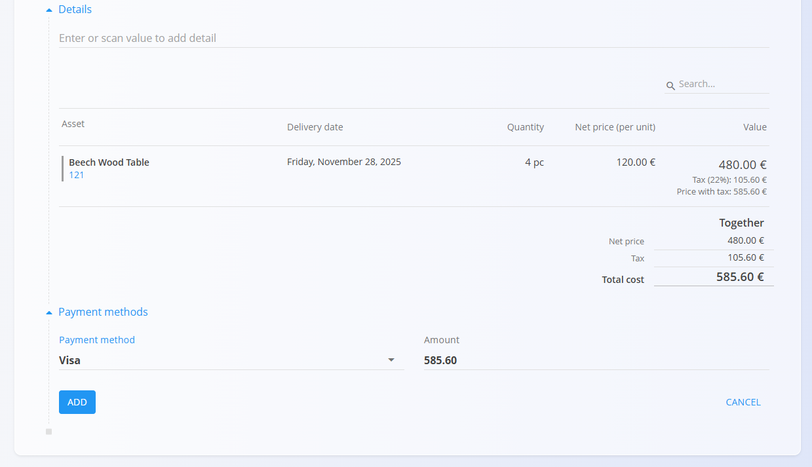

# Sales orders

A **Sales order** represents the customer’s confirmed intention to purchase goods or services. It is typically created from an approved **Offer**, but it can also be created independently.  
Sales orders define *what* the customer will receive, *when*, and *under which conditions*, and they serve as the basis for delivery, production, procurement, and invoicing workflows.

To access this page, navigate to **Sales / Documents / Sales orders** in the [navigation](../../Common/UI/Navigation.md).

## How sales orders fit into the sales workflow

Sales orders are one of the core steps in the sales chain:

1. A quotation is prepared in an **[Offer](Offers.md)**.  
2. When the customer confirms the offer, a **Sales order** is created from the offer (via [*Linked documents*](Offers.md#linked-documents)).  
3. The sales order triggers downstream operational processes:
   - [**Delivery notes**](DeliveryNotes.md)
   - [**Production orders**](../../Production/ProductionOrders.md)
   - [**Maintenance orders**](../../Maintenance/MaintenanceOrders.md)
   - [**Supply orders**](../../Supply/Documents/SupplyOrders.md)
   - [**Issued invoices**](IssuedInvoices.md)

Once the sales order is fulfilled and invoiced, it moves toward completion.

## Schema

| Field | Description |
|-------|-------------|
| **Code** | System-generated identifier of the sales order. |
| **Customer** | Customer receiving the order, taken from the [Business directory](../../Common/CodeLists/BusinessDirectory.md) (mandatory). |
| **Document date** | Date when the sales order is created. |
| **Delivery date** | Expected delivery date for the order (mandatory). |
| **Rebate** | Optional discount applied to the entire sales order. |
| **Purchase order** | Optional reference to a related [supply order](../../Supply/Documents/SupplyOrders.md). |
| **Delivery – Company / Address** | Customer delivery details, taken from the [Business directory](../../Common/CodeLists/BusinessDirectory.md). |
| **Details** | List of items (assets) being sold, with delivery dates, pricing, quantities, and taxes (mandatory). |
| [**Payment methods**](../CodeLists/PaymentMethods.md) | Payment options connected to the sales order. |

### Detail fields

| Field | Description |
|--------|-------------|
| **Asset** | The item or service being sold. |
| **Delivery date** | Planned delivery date for this line. |
| **Quantity** | Quantity of the selected asset. |
| **Net price (per unit)** | Unit price applied (from asset settings or price lists). |
| **Discount (%)** | Line-specific discount. |
| **Tax rate** | Applied tax percentage from [Tax rates](../CodeLists/TaxRates.md). |
| **Value** | Final line value (quantity × price − discount). |

## Management

### List view

The list shows all sales orders with their current status and delivery dates.

At the top of the list, the system displays real-time summary indicators based on the currently applied filters from the left sidebar. The following indicators are available:

- **Late sales orders** – Sales orders whose planned delivery date has passed and are not yet completed.
- **Total cost** – The aggregated total value of all sales orders included in the active filter.

**Drafts:**

**Available (published):**

Filters include:

- **Document dates**
- **Drafts**
- **Committed:** Available, In completion, Completed
- **Customer**
- **Business entry**
- **Search bar**

## Actions

### Creating a new Sales order

Click the **action button** to create a new sales order draft.  
Sales orders can be created:

- Directly from the **Sales orders** screen  
- From a published **Offer**, via *Linked documents → + Sales order*

Example:

### Editing a Sales order

The sales order is divided into multiple expandable sections.

#### Document

Includes core fields:

- Code  
- Customer  
- Document date  
- Delivery date  
- Rebate  
- Purchase order  

#### Details

Details define the ordered items.

Add a new detail:

Saved detail:

#### Payment methods

Payment method assignments appear at the bottom of the document.

### Publishing a Sales order

When ready, click **Publish** on located on top of the page to finalize the order. A published sales order moves to the **Available** state and enables additional document actions.

**Available (published):**

#### Completing a Sales order

Once the published sales order is ready, click **Complete**:

> [!NOTE]
> A sales order is also automatically completed when a linked document is created.  
> 
>For example, when a [**delivery note**](DeliveryNotes.md) or [**issued invoice**](IssuedInvoices.md) is generated from a sales order, the sales order moves to the **Completed** status.

## Linked documents

The Linked documents section allows creation, linkage, and review of operational documents:

Available actions include:

- [**+ Delivery note**](DeliveryNotes.md)
- **+ Empty [delivery note](DeliveryNotes.md)****
- **Link existing [delivery note](DeliveryNotes.md)**
- [**+ Production order**](../../Production/ProductionOrders.md)
- [**+ Maintenance order**](../../Maintenance/MaintenanceOrders.md)
- [**+ Issued invoice**](IssuedInvoices.md)
- **Link to project**
- **Copy sales order**

## Attachments

At the top of every document, an **Attachments** section is available. 

You can upload any relevant file—such as delivery notes, transport documents, photos, or supporting records. All attached files remain stored together with the document and can be reviewed at any time.

## Menu

Click the context menu to:

- Print  
- Export (PDF)  
- Import details (for draft orders)
- Delete all details (for draft orders)
- Return to draft (for completed orders)

## Deletion

- **Only draft sales orders can be deleted.**  
- **Sales orders containing details cannot be deleted.**

Deleting is done via **Delete** on the document header.

If confirmed, the system removes the document permanently; otherwise, no changes are made.

---
