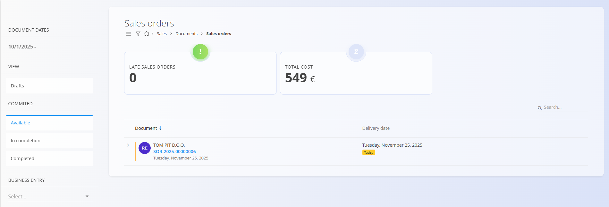
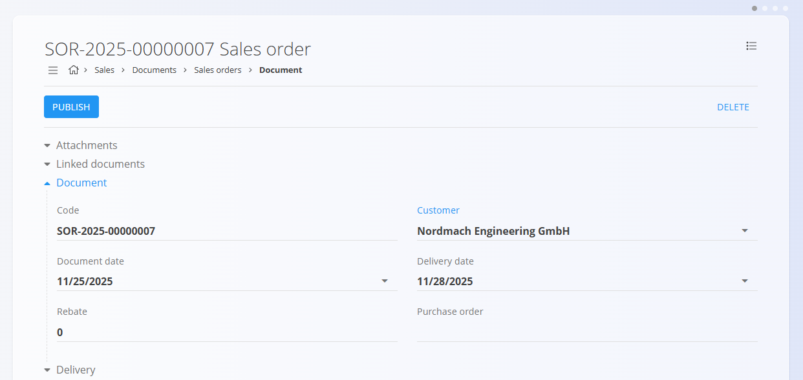
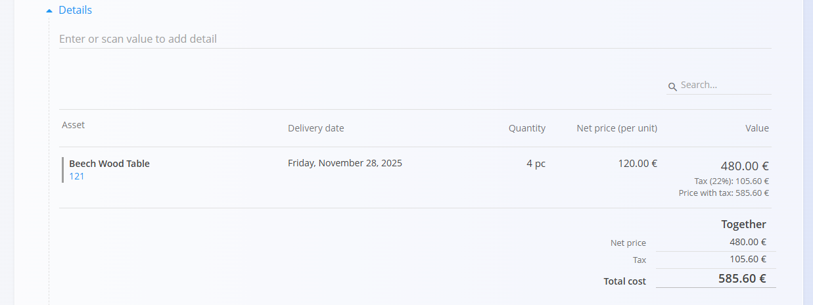
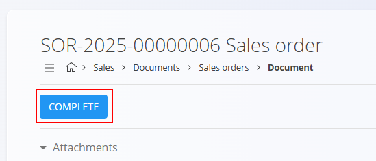
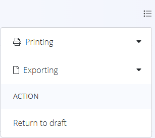

# Sales orders

A **Sales order** represents the customer’s confirmed intention to purchase goods or services. It is typically created from an approved **Offer**, but it can also be created independently.  
Sales orders define *what* the customer will receive, *when*, and *under which conditions*, and they serve as the basis for delivery, production, procurement, and invoicing workflows.

To access this page, navigate to **Sales / Documents / Sales orders** in the [**navigation**](../../Common/UI/Navigation.md).

## How sales orders fit into the sales workflow

Sales orders are one of the core steps in the sales chain:

1. A quotation is prepared in an **[Offer](Offers.md)**.  
2. When the customer confirms the offer, a **Sales order** is created from the offer (via [*Linked documents*](Offers.md#linked-documents)).  
3. The sales order triggers downstream operational processes:
   - [**Delivery notes**](DeliveryNotes.md)
   - [**Production orders**](../../Production/Documents/ProductionOrders.md)
   - [**Maintenance orders**](../../Maintenance/Documents/MaintenanceOrders.md)
   - [**Supply orders**](../../Supply/Documents/SupplyOrders.md)
   - [**Issued invoices**](IssuedInvoices.md)

Once the sales order is fulfilled and invoiced, it moves toward completion.

> [!NOTE]
>Your company may follow all steps or only some of them, depending on the type of business (for example, service companies may not use Delivery notes).

## Schema

  
<strong>Document</strong>

| Field | Description |
|-------|-------------|
| [**Code**](../../Common/UI/DocumentCodes.md) | System-generated identifier of the sales order. |
| **Customer** | Customer receiving the order, taken from the [Business directory](../../Common/Management/BusinessDirectory.md) (mandatory). |
| **Document date** | Date when the sales order is created. |
| **Delivery date** | Expected delivery date for the order (mandatory). |
| **Rebate** | Optional discount applied to the entire sales order. |
| **Purchase order** | Optional reference to a related [supply order](../../Supply/Documents/SupplyOrders.md). |
| **[Delivery term](../../Common/Management/DeliveryTerms.md)** | Delivery conditions as agreed upon with the customer. |
| **[Mode of transport](../../Common/Management/ModeOfTransport.md)** | Transport method agreed upon with the customer. |
| **Delivery – Company / Address** | Customer delivery details, taken from the [Business directory](../../Common/Management/BusinessDirectory.md). |
| [**Payment methods**](../Management/PaymentMethods.md) | Payment options connected to the sales order. |

  
<strong>Transport, Alternative currency, and Delivery</strong>

| Field | Description |
|--------|-------------|
| **[Delivery term](../../Common/Management/DeliveryTerms.md)** | Delivery conditions  as agreed upon with the customer. |
| **[Mode of transport](../../Common/Management/ModeOfTransport.md)** | Transport method  as agreed upon with the customer. |
| [**Alternative currency**](../../Common/Management/Currencies.md) | Alternative currency to the default one used in the document |
| [**Exchange rates**](../Management/ExchangeRates.md) | Exchange rate of the alternative currency with respect to the default currency	|
| **Delivery** | Delivery company and address information. |

  
<strong>Intrastat</strong>

| Field | Description |
|------|-------------|
| [**Country dispatch**](../../Common/Management/Countries.md) | Country from which the goods were dispatched. This value is typically derived from the material’s Intrastat configuration. |
| [**Nature of transaction**](../../Accounting/Management/Intrastat/NatureOfTransactions.md) | Classification of the transaction type used for Intrastat reporting (for example, direct sales or purchases). |
| [**Place of delivery**](../../Accounting/Management/Intrastat/PlaceOfDelivery.md) | Indicates where the goods are delivered, according to Intrastat definitions. |

  
<strong>Details</strong>

| Field | Description |
|--------|-------------|
| **Asset** | The item or service being sold. |
| **Delivery date** | Planned delivery date for this line. |
| **Quantity** | Quantity of the selected asset. |
| **Net price (per unit)** | Unit price applied (from asset settings or price lists). |
| **Discount (%)** | Line-specific discount. |
| **[Tax rates](../../Common/Management/TaxRates.md)** | Applied tax percentage. |
| **Value** | Final line value (quantity × price − discount). |

## Management

### Document states

Documents move through several possible states during their lifecycle:

- **Draft** – The document is not yet published. All fields can be edited freely.
- **Committed** – The document has been published. It cannot be deleted or freely modified.
    - **Available** – The document is valid and ready for further processing.
    - **In completion** – The document is partially processed (e.g., partially delivered or received).
    - **Completed** – All actions related to the document have been fully executed.

### List view

The list shows all sales orders with their current status and delivery dates.

At the top of the list, the system displays real-time summary indicators based on the currently applied filters from the left sidebar. The following indicators are available:

- **Late sales orders** – Sales orders whose planned delivery date has passed and are not yet completed.
- **Total cost** – The aggregated total value of all sales orders included in the active filter.

**Drafts:**

**Available (published):**

Filters include:

- **Document dates**
- **Drafts**
- **Committed:** Available, In completion, Completed
- **Customer**
- **Search bar**

## Actions

### Creating a new sales order

Sales orders can be created in two ways:

- Directly from the **Sales orders** screen using the [**action button**](../../Common/UI/ActionButton.md)
- From a published [**Offer**](Offers.md), via *Linked documents → + Sales order*. In this case, most fields — such as the customer, delivery information, and detail items — are automatically pre-filled based on the offer.

  

To create a completely new Sales order, follow these steps:

1. Click the **action button** button to create a new Sales order.  
2. Enter the **Customer**, **Document date**, and **Delivery date** (or review them if pre-filled).  

   

3. Add items into the details section. Type or scan a **serial number**, **EAN**, or **material name** into the Details bar (or review them if pre-filled).  
   - The system displays **all matching materials and serial numbers**. If multiple matches exist, select the correct one from the list.

   

4. Adjust the **Quantity**, **Delivery date**, or other fields as needed.  
5. Click **Save** the confirm added details. Repeat step 3 to add more items.
6. Review or adjust delivery information in the **Delivery** section.  
7. (Optional) Add attachments or link the order to a Project using **Linked documents**.  
8. When ready, click **Publish** at the top of the page.

Once published, the Sales order moves into the **Committed → Available** state, enabling all related actions such as creating Delivery notes, Production orders, Maintenance orders, or Issued invoices.

### Editing a sales order

The sales order is divided into multiple expandable sections.

#### Attachments

At the top of every document, an **Attachments** section is available. 

You can upload any relevant file—such as delivery notes, transport documents, photos, or supporting records. All attached files remain stored together with the document and can be reviewed at any time.

#### Linked documents

The Linked documents section allows creation and linkage of operational documents. It also shows any previously linked documents.

> [!NOTE]
> The available **Linked document** actions depend on the document type and status.

Available actions include:

- [**+ Delivery note**](DeliveryNotes.md)
- **+ Empty [delivery note](DeliveryNotes.md)****
- **Link existing [delivery note](DeliveryNotes.md)**
- [**+ Production order**](../../Production/Documents/ProductionOrders.md)
- [**+ Maintenance order**](../../Maintenance/Documents/MaintenanceOrders.md)
- [**+ Issued invoice**](IssuedInvoices.md)
- **Link to project**
- **Copy sales order**

#### Document

Includes core fields:

- Code  
- Customer  
- Document date  
- Delivery date  
- Rebate  
- Purchase order  

#### Alternative currency

The Alternative currency section allows prices in the document to be expressed in a currency different from the system’s default currency. This is typically used for international sales. Rates are taken from the [Exchange rates](../Management/ExchangeRates.md) code list.

When an alternative currency is selected, document prices are automatically recalculated using the specified exchange rate.

## Transport and Intrastat sections

When **Intrastat** is set to **Obliged** in **System / Configuration / Intrastat**, additional sections become available in the receive document form.

- **Transport** - Used to capture logistics-related information about how the goods were delivered.
- **Intrastat** - Used to collect data required for Intrastat reporting. These fields are only shown when Intrastat reporting is enabled for the system.

> [!NOTE]  
Several Intrastat-related values are taken from **material code lists** (Intrastat configuration), such as country and transaction nature. These fields are not freely configurable per document and depend on predefined master data.

#### Delivery section

The Delivery section defines where the goods will be shipped. It is filled automatically from the customer or vendor data but can be adjusted for each document.  

These values affect the printed document and follow-up logistics documents, but do not modify the master data.

#### Details

Details define the ordered items.

Add a new detail:

Saved detail:

#### Payment methods

Payment method assignments appear at the bottom of the document.

### Publishing a sales order

When the draft is ready, click **Publish** located at the top of the page to commit the order. A Committed sales order moves to the **Available** state and enables additional document actions.

> [!NOTE]
> When you click **Publish**, the document is confirmed and moves from the **Draft** state into the **Committed** group of states.

Completing a sales order performs the following actions:

- The document moves from _Available_ to _Completed_ state.
  
- Editing is restricted.

- Most **Linked document** actions are disabled.

> [!NOTE]
> Completing a sales order is an administrative action that finalizes its lifecycle. It does **not** perform additional stock movements or financial postings — those occur in the linked delivery or invoice documents.

#### Completing a sales order

Once the published sales order is finalized, for example, when a [**delivery note**](DeliveryNotes.md) or [**issued invoice**](IssuedInvoices.md) has been generated from a sales order, click **Complete**:

## Menu

Click the context menu to:

- Print  
- Export (PDF)  
- Import details (for draft orders)
- Delete all details (for draft orders)
- Return to draft (for completed orders)

## Deletion

Draft documents can be deleted on the edit screen, but only if they contain **no details**.

If the draft still includes items in the **Details** section:

1. Click the material serial number to open the **Edit detail** screen.  
2. Click **Delete** inside the Edit detail window to remove the material.  
3. Repeat this for all remaining materials.

Once the document contains no materials, you can click **Delete** to remove the draft. If confirmed, the system removes the document permanently; otherwise, no changes are made.

> [!NOTE]
> - Only **draft** sales orders can be deleted.  
> - Once a sales order is published, you can no longer delete it; instead, use **Return to draft**.  

