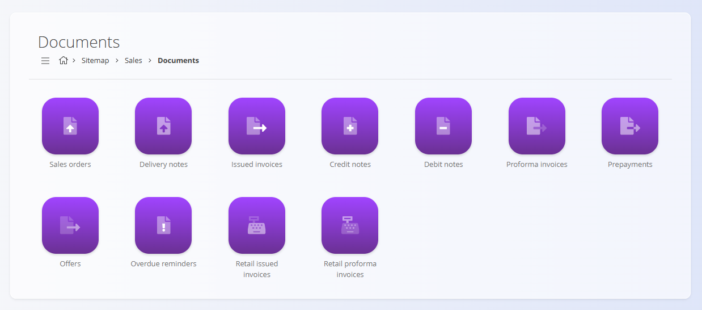
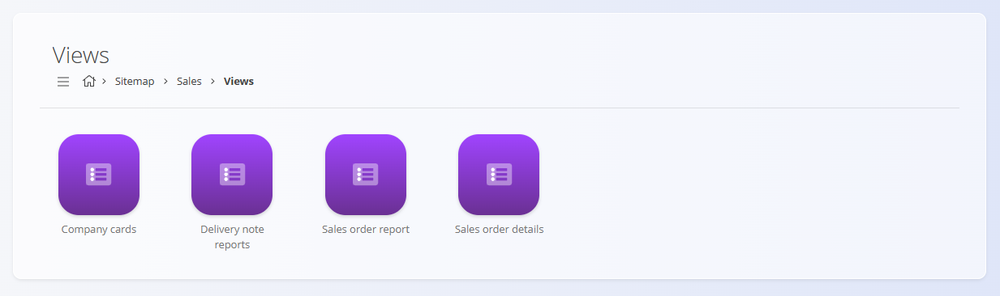

# Sales

The **Sales** domain contains all records and documents needed to manage commercial transactions with customers. It includes offers, sales orders, delivery notes, invoices, and analytical views used to understand sales performance and document flows.

Where the **[Assets](../../Assets/Domain/AssetsDomain.md)** domain defines *what* is sold, the Sales domain defines *how* it is offered, confirmed, delivered, and billed.

To access Sales, navigate to **Sales** in the [navigation](../../Common/UI/Navigation.md).

> [!NOTE]  
> The available domains depend on each company’s configuration and business model.

## What is included in the Sales domain?

The domain is organized into several functional areas:

- **[Documents](#documents)** – all customer-facing commercial documents  
- **[Views](#views)** – analytical screens for monitoring sales activity and performance  
- **[Management](#management)** – code lists and configuration for commercial processes

## Documents

The **Documents** section contains customer-facing commercial documents that support the sales lifecycle, from offers to final invoices.

Available sales documents include:

- **[Sales orders](../Documents/SalesOrders.md)** – Confirmed commercial commitments that drive delivery and invoicing.  
- **[Delivery notes](../Documents/DeliveryNotes.md)** – Track goods delivered to customers.  
- **[Issued invoices](../Documents/IssuedInvoices.md)** – Billing documents for delivered products or services.  
- **[Credit notes](../Documents/CreditNotes.md)** – Negative invoices correcting or refunding previous billing.  
- **[Debit notes](../Documents/DebitNotes.md)** – Additional charges applied to previous invoices.  
- **[Proforma invoices](../Documents/ProformaInvoices.md)** – Preliminary invoices issued prior to delivery or payment.  
- **[Prepayments](../Documents/Prepayments.md)** – Manage customer advance payments.  
- **[Offers](../Documents/Offers.md)** – Commercial proposals created before the sales order is confirmed.  
- **[Overdue reminders](../Documents/OverdueReminders.md)** – Notifications for unpaid or overdue invoices.  
- **[Retail issued invoices](../Documents/RetailIssuedInvoices.md)** – Sales invoices created through retail workflows.  
- **[Retail proforma invoices](../Documents/RetailProformaInvoices.md)** – Retail-mode proforma documents.

Each document type contributes to the sales workflow, ensuring full traceability from initial offer to final invoice.

## Views

The **Views** section provides analytical tools used to understand the performance and behavior of sales documents.

Available views include:

- **[Company cards](../Views/CompanyCards.md)** – High-level customer profiles summarizing commercial activity.  
- **[Delivery note reports](../Views/DeliveryNoteReports.md)** – Analysis of delivery performance and shipping activity.  
- **[Sales order report](../Views/SalesOrderReport.md)** – Overview of sales order volumes, trends, and statuses.  
- **[Sales order details](../Views/SalesOrderDetails.md)** – Detailed breakdown of individual sales documents.

These screens do **not** create transactions—they support analysis and decision-making.

## Management

The **Management** section contains configuration and master data required by commercial processes and financial interactions.

Available configuration and code lists include:

- **Configuration** – Global sales settings and behavior rules.  
- **[Business directory](../../Common/CodeLists/BusinessDirectory.md)** – Customer and partner records used throughout sales documents.  
- **[Banks](../CodeLists/Banks.md)** – Bank definitions used on invoices and payment instructions.  
- **[Payment methods](../CodeLists/PaymentMethods.md)** – Methods used for settling sales invoices.  
- **[Organization bank accounts](../CodeLists/OrganizationBankAccounts.md)** – Internal bank accounts used for outgoing billing.  
- **[Countries](../../Common/CodeLists/Countries.md)** – Geographic entries used on customer records and documents.  
- **[Measure units](../../Common/CodeLists/MeasureUnits.md)** – Consistent measurement units used in commercial documents.  
- **[Cost centers](../../Common/CodeLists/CostCenters.md)** – Classification of sales and revenue by cost center.  
- **[Currencies](../../Common/CodeLists/Currencies.md)** – Currency definitions used in price lists and invoices.  
- **[Exchange rates](../../Common/CodeLists/ExchangeRates.md)** – Daily or periodic exchange rates used for currency conversion.  
- **[Predefined texts](../../Common/CodeLists/PredefinedTexts.md)** – Standardized text blocks used throughout sales documents.  
- **[Tax rates](../../Common/CodeLists/TaxRates.md)** – Definitions of VAT and tax rates used in invoicing.  
- **[Clause templates for delivery notes](../CodeLists/ClauseTemplatesDeliveryNotes.md)** – Predefined clauses for delivery documentation.  
- **[Clause templates for issued invoices](../CodeLists/ClauseTemplatesIssuedInvoices.md)** – Predefined clauses used in invoice footers.

hese elements define how sales operations behave and how commercial data is structured.

## Sales Processes

Sales operations typically follow a structured lifecycle:

### **1. Offering**  
Sales representatives create offers that outline items, quantities, and prices.

### **2. Ordering**  
Customers confirm offers, generating sales orders that drive fulfillment and invoicing.

### **3. Delivery**  
Delivery notes record the movement of goods to the customer, connecting Sales with **[Logistics](../../Logistics/Domain/LogisticsDomain.md)**.

### **4. Billing**  
Issued invoices document customer charges, supported by debit/credit notes and prepayments.

### **5. Analysis**  
Views provide insight into sales performance, customer activity, and document aging.

## Sales and Other Domains

Sales integrates with other operational domains:

| Area | Interaction |
|------|-------------|
| **[Assets](../../Assets/Domain/AssetsDomain.md)** | Defines the items, prices, and configurations used in sales documents. |
| **[Materials](../../Assets/Domain/Materials.md)** | Provides availability and stock data for planning and fulfillment. |
| **[Logistics](../../Logistics/Domain/LogisticsDomain.md)** | Manages the physical delivery of goods. |
| **[Supply](../../Supply/Domain/SupplyDomain.md)** | Ensures procurement of items sold to customers. |

## Summary

The Sales domain manages all commercial activity with customers, ensuring a complete workflow from offer to invoice.  It provides the tools needed to create, track, and analyze sales documents while integrating tightly with logistics, supply, assets, and finance.

---