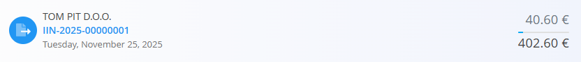

# Company cards

The **Company cards** view provides a detailed overview of all **debit and credit records** related to each company. Instead of showing a single consolidated balance, this screen lists **individual financial documents** (such as [issued invoices](../Documents/IssuedInvoices.md), [credit notes](../Documents/CreditNotes.md), and [debit notes](../Documents/DebitNotes.md)) and indicates whether each record is **unpaid**, **partially paid**, or **fully paid**.

This view is intended for **financial monitoring and reconciliation** and does not allow creating or editing documents.

To access this view, go to **Sales / Views / Company cards**.

## Company cards list

Each entry represents a **single financial record** for a company, not a summarized balance.

- **Debit** → The customer owes money to your company  
- **Credit** → Your company owes money to the customer (e.g., overpayments, corrections)  

Clicking a row opens the related document (e.g., an **issued invoice**), allowing you to inspect or record payments.

### Filters

The left sidebar allows you to refine the results:

- **Created date** – Filters invoices by creation date  
- **Due date** – Filters invoices by due date  
- **Company card type**  
  - *All*  
  - *Debit*  
  - *Credit*  
- **Company** – Select a specific customer  

## Payment status indicators

The Company cards view visually indicates the payment status of each debit or credit record by showing the **outstanding amount** and the **original total amount**.

### Fully paid records

When a document has been **fully paid**, only the final settled amount is shown, indicating that no outstanding balance remains.

In this case:
- The document is completely settled
- There is no remaining open balance
- The displayed amount represents the final paid value

### Partially paid records

When a document has been **partially paid**, the outstanding amount is shown separately from the original total. This makes it easy to see how much is still open.

In this example:
- The **top amount** represents the **amount paid**
- The **bottom amount** represents the **original document total**

### Unpaid records

When a document has **not been paid at all**, the outstanding amount is shown as **0.00**, while the full document value is displayed below.

This indicates that:
- No payments have been applied yet
- The full amount is still outstanding

These visual cues allow you to quickly distinguish between unpaid, partially paid, and fully settled records without opening each document.

## Usage notes

- This view aggregates **debit and credit documents together**, allowing quick inspection of payment status.  
- Use this view to track overdue payments, partial settlements, and credit positions at document level.

For applying payments or correcting balances, use the relevant document screens such as [**Issued invoices**](../Documents/IssuedInvoices.md), [**Credit notes**](../Documents/CreditNotes.md), or [**Debit notes**](../Documents/DebitNotes.md).

---
