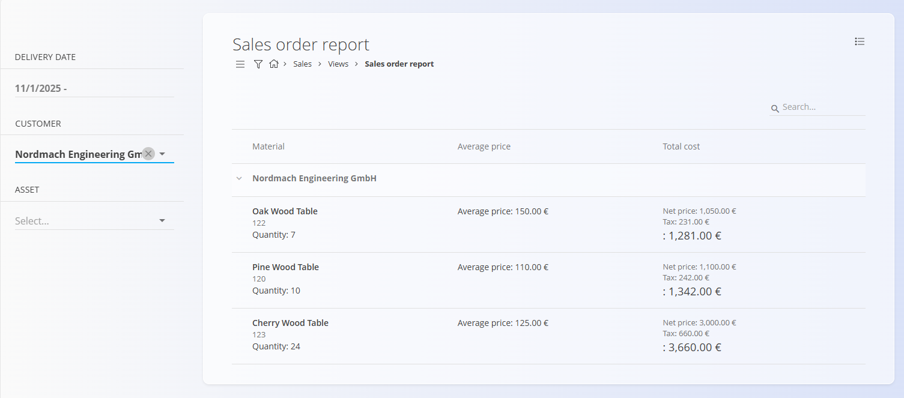

# Sales order report

The **Sales order reports** view provides a consolidated overview of ordered items, grouped by customer. It is designed for analysis and reporting purposes and does **not** create or modify documents.

To access this page, go to **Sales / Views / Sales order report**.

### Purpose of this view

Sales order reports help you:

- Analyze ordered quantities and values per customer
- Review order history for specific assets
- Understand average prices and total ordered costs
- Quickly drill down into order performance without opening individual documents

This view is **read-only** and reflects data from committed [**Sales orders**](../Documents/SalesOrders.md).

## Layout and structure

The report is organized hierarchically:

- **Customers** act as top-level groups
- Under each customer, ordered **assets** are listed
- Each asset row aggregates data from all relevant [**Sales orders**](../Documents/SalesOrders.md)

For each asset, the report shows:
- Ordered **quantity**
- **Average price**
- **Total cost**, including net value and tax

## Filters

The filters on the left allow you to narrow down the report:

- **Order date** — Filter orders within a specific date range.
- **Customer** — Show order data for one or more selected customers.
- **Asset** — Show order data for one or more selected assets.

Filters can be combined to focus on very specific ordering scenarios.

## Interpretation of values

- **Quantity** represents the total ordered quantity for the asset
- **Average price** is calculated across all identical assets sold to the customer
- **Total cost** shows:
  - Net price
  - Tax amount
  - Final total value

All amounts are calculated based on the [**Sales orders**](../Documents/SalesOrders.md) included by the selected filters.

## Notes

- Only **committed sales orders** are included in this report.
- Draft or reversed sales orders are not shown.
- The view is intended for **analysis only** and does not support actions such as editing, reversing, or creating documents.

For detailed document-level information, open the related [**Sales orders**](../Documents/SalesOrders.md) directly from the **Sales / Documents / Sales orders** section.

---
