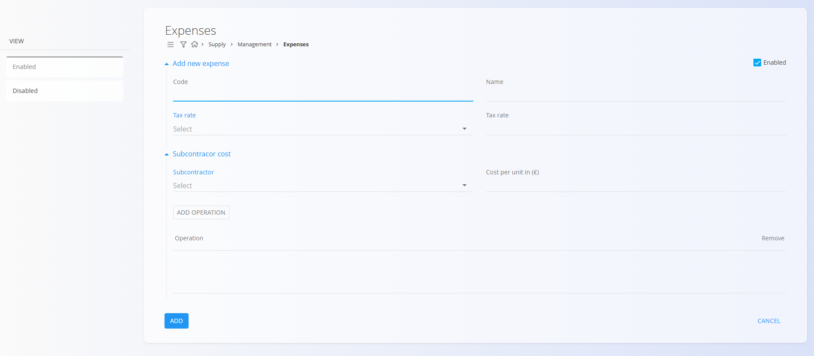

# Expenses

The **Expenses** code list contains all costs that your organization wants to register as predefined expenses. These can include recurring services, equipment-related costs, subcontractor fees, or any non-material cost that needs to be referenced in supply or production processes.

This list helps maintain consistency by storing all expenses in one place, making them available for use across documents and operational workflows.

To access this code list, go to **Supply / Management / Expenses** in the [navigation](../../Common/UI/Navigation.md).

## Schema

| Field | Description |
|-------|-------------|
| **Code** | Unique identifier of the expense. |
| **Name** | Descriptive name of the expense. |
| **[Tax rate](../../Common/CodeLists/TaxRates.md)** | Tax rate applied to the expense. |
| **Enabled** | Indicates whether the expense is available for use in documents. |
| **Subcontractor** | Business partner providing the subcontracted service, selected from the [Business directory](../../Common/CodeLists/BusinessDirectory.md). |
| **Cost per unit (€)** | Cost of this subcontracted operation per unit. |
| **Operations** | List of operations associated with this subcontractor cost. |

### Operation fields (Add operation dialog)

| Field | Description |
|-------|-------------|
| [**Processes**](../../Production/CodeLists/Processes.md) | Process in which the operation is used. |
| **Version** | Version of the selected process. |
| **Operation** | Specific operation belonging to the selected process and version. |

## Management

### List of expenses

The list displays all defined expenses along with their tax rate.

Each record includes a status indicator to the left of its name:  
- **Blue** indicates the expense is **enabled**  
- **Gray** indicates the expense is **disabled**

### Filters

The left sidebar contains two filters:

- **Enabled**  
- **Disabled**

These filters control whether the list shows active or inactive expense entries.

## Actions

Click the [**action button**](../../Common/UI/ActionButton.md) to create a new expense. The input form includes fields such as:

- Code  
- Name  
- Tax rate  
- Enabled  

#### Subcontractor cost

This optional section allows adding subcontractor-related costs.  
You can specify:

- Subcontractor  
- Cost per unit (€)  
- Operations  

Click **Add operation** to open the operation selection dialog.

After entering the information, click **Add** to save the record or **Cancel** to return to the list.

## Editing

To edit an expense, click the entry in the list and the system opens the edit mode.

All fields—including subcontractor cost and operations—can be modified. You can enable or disable an expense using the **Enabled** checkbox.

When you are done editing, click **Save**. If you do not want to save the changes, click **Cancel**.

## Deletion

Click **Delete** on the edit screen to remove the expense permanently.

**Are you sure you want to delete this record?**

Deletion is allowed only if the expense is not referenced in dependent records.

> [!NOTE]  
> Disabled expenses remain in the system but cannot be selected in new documents.

---
