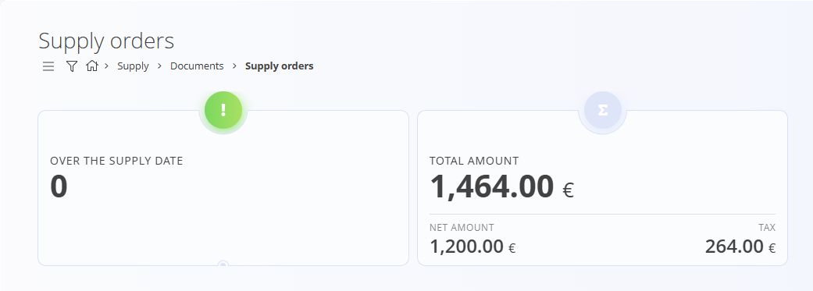
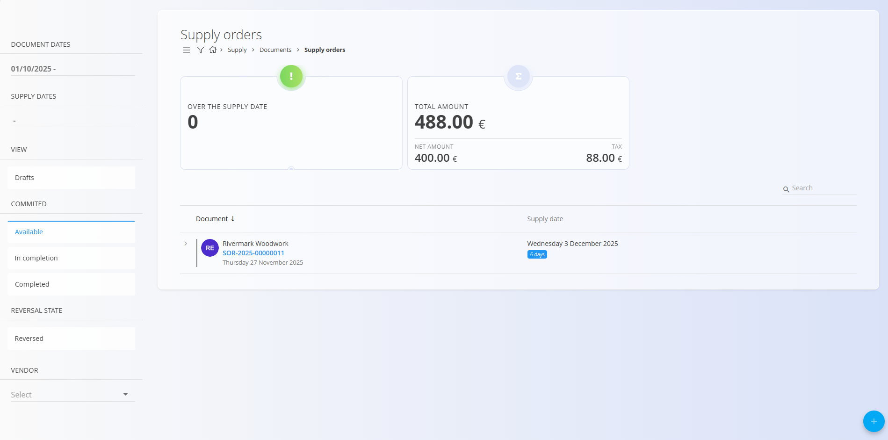
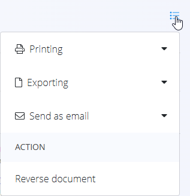

# Supply orders

A **Supply order** is the formal purchasing document used to confirm materials or services ordered from a vendor.  
It defines *what* your organization will receive, *when*, and under *which conditions*, and is the basis for operational workflows such as material receiving and cost center allocation.

To access this page, navigate to **Supply / Documents / Supply orders** in the [navigation](../../Common/UI/Navigation.md).

## How supply orders fit into the supply workflow

Supply orders represent the formal confirmation stage in the purchasing process.

1. A request is usually initiated using an [**Inquiry**](Inquiries.md).  
2. When accepted, a **Supply order** is created from the inquiry using the *Linked documents* section.  
   - Supply orders can also be created directly without an inquiry and later linked to one if needed.  
3. From a Supply order, you can create one or multiple [**Receive**](../../Logistics/Documents/Receives.md) documents:  
   - Several **partial** receives  
   - Or a single **full** receive  
4. Once all materials are received, the Supply order automatically moves to the **Completed** status.  
   - If only partially received, it remains **Available** until completed.

## Schema

| Field | Description |
|-------|-------------|
| **Code** | System-generated identifier of the supply order. |
| **Vendor** | Vendor providing the materials or services, selected from the [Business directory](../../Common/CodeLists/BusinessDirectory.md). |
| **Document date** | Date when the supply order is created. |
| **Supply date** | Planned supply or delivery date for the requested materials (mandatory). |
| **Rebate** | Optional discount applied to the entire supply order. |
| **[Cost center](../../Common/CodeLists/CostCenters.md)** | Internal cost center associated with this purchase. |
| **Offer code** | Optional reference to the vendor’s offer or external document. |
| **Delivery – Company / Address** | Delivery location details, taken from the Business directory or manually adjusted if needed. |
| **Top content** | Predefined introductory text from [Predefined texts](../../Common/CodeLists/PredefinedTexts.md) (entity: *Supply order*). |
| **Bottom content** | Closing or legal statements from predefined texts. |
| **Details** | List of ordered materials or expenses, including quantities, prices, taxes, and delivery information. |

### Detail fields

| Field | Description |
|--------|-------------|
| **[Material](../../Assets/Domain/Materials.md)** | Material being purchased. |
| **EAN** | Barcode identifier for the material (optional). |
| **Quantity** | Ordered quantity. |
| **Supply date** | Specific supply date for this material line. |
| **Net price (per unit)** | Unit price taken from supplier material records or entered manually. |
| **Discount (%)** | Optional discount applied to this specific detail line. |
| **[Tax rate](../../Common/CodeLists/TaxRates.md)** | Applied tax rule. |
| **Supplier code** | Vendor’s internal code/reference for the selected material. |
| **Total cost** | Line total (quantity × net price − discount + tax). |

## Indicators

At the top of the Supply orders list, the system displays two key indicators summarizing the currently filtered data.

- **Over the supply date** (interactive) – Supply orders whose planned supply date has passed and are not yet fully received. Clicking this indicator automatically filters the list to show only such orders.
- **Total amount** – Displays the total value (net + tax) of all supply orders included in the active filter.

## Management

### List view

The list shows all supply orders with their current status and supply dates.

Filters include:

- **Document dates**  
- **Supply dates**  
- **View**  
  - Drafts  
- **Committed**  
  - Available  
  - In completion  
  - Completed  
- **Reversal state: Reversed**  
- **Vendor**  
- Search bar  

## Actions

### Creating a new Supply order

Supply orders can be created:

- Directly from the **Supply orders** screen using the [**action button**](../../Common/UI/ActionButton.md)
- From a published [**Inquiry**](Inquiries.md) via *Linked documents → + Supply order*

#### Document section

The document contains the following fields:

- Code  
- Vendor  
- Document date  
- Supply date  
- Rebate  
- Cost center  
- Offer code  
- Delivery  
- Top content  

#### Details

The Details section allows adding requested materials or expenses.

##### Edit detail

Fields include:

- Material  
- EAN  
- Quantity  
- Supply date  
- Net price (per unit)  
- Tax rate  
- Supplier code  
- Discount (%)  

##### Saved detail

The bottom summary displays:

- Net price  
- Tax  
- Total cost  

### Editing a Supply order

Click any supply order in the list to open it.  
Draft supply orders can be edited freely.

Expandable sections:

- Linked documents  
- Attachments  
- Document  
- Delivery  
- Top content  
- Details  
- Bottom content  

#### Attachments

At the top of every document, an **Attachments** section is available. 

You can upload any relevant file—such as delivery notes, transport documents, photos, or supporting records. All attached files remain stored together with the document and can be reviewed at any time.

#### Linked documents

The **Linked documents** section allows creating and linking operational documents to a supply order.

Available actions include:

- **Add project** – Add project to supply order  
- [**+ Empty receive**](../../Logistics/Documents/Receives.md) – Create an pre-created draft receive document, ready to be updated when the actual delivery arrives 
- [**+ Full receive**](../../Logistics/Documents/Receives.md) – Create a full receive document (with **all** or **part** of the materials) and link it  
- [**Receive**](../../Logistics/Documents/Receives.md) – Link an existing receive draft to the supply order  
- **Add task** – Add task to supply order  
- **Copy supply order** – Duplicate the supply order with its contents

### Completing a Supply order

A supply order is automatically moved to **Completed** when:

- All materials have been fully received  
- A *full receive* operation covers the entire quantity  

Partially received supply orders remain in **Available** state.

## Menu

The **Menu** in the top-right corner provides:

- **Printing** – Print the supply order  
- **Exporting** – Export to PDF  
- **Send as email**  
- **Reverse document**  

## Deletion

Draft supply orders can be deleted on the edit screen, but only if they contain **no details**.

If the draft still includes items in the **Details** section:

1. Click the material line to open the **Edit detail** screen.  
2. Click **Delete** inside the Edit detail window to remove the material.  
3. Repeat this for all remaining materials.

Once the document contains no materials, you can click **Delete** to remove the draft.  
If confirmed, the system removes the document permanently; otherwise, no changes are made.

> [!NOTE]  
> - Only **draft** supply orders can be deleted.  
> - Once a supply order is published, it can no longer be deleted.  
> - Published documents cannot be deleted, but they can be [reversed](../../Logistics/Documents/Reversals.md).

---
