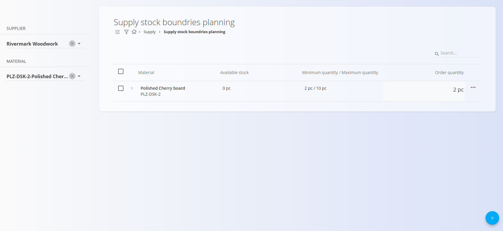
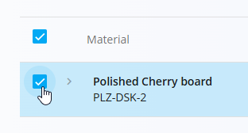

# Supply stock boundaries planning

The **Supply stock boundaries planning** view helps you proactively plan purchases by identifying materials that have fallen below their defined minimum stock levels. From this screen, you can directly create [**Supply orders**](../../Supply/Documents/SupplyOrders.md) or [**Inquiries**](../../Supply/Documents/Inquiries.md) for the affected materials, with most details pre-filled.

This page works closely with:
- **[Stock boundaries](../../Logistics/Management/StockBoundaries.md)** – where minimum and maximum quantities are defined
- **[Supplier materials](../../Supply/Management/SupplierMaterials.md)** – where materials are assigned to vendors

To access this page, go to **Supply / Supply stock boundaries planning**.

### How it works

A material appears in this view only when **all** of the following conditions are met:

1. A **minimum and maximum quantity** is defined in [**Stock boundaries**](../../Logistics/Management/StockBoundaries.md) 
2. The material is assigned to at least one vendor in [**Supplier materials**](../../Supply/Management/SupplierMaterials.md)  
3. The **available stock** is **below the minimum quantity**

When these conditions are fulfilled, the material becomes visible and actionable in the planning list.

## List view

The main list displays materials that require attention, with the following columns:

- **Material**
- **Available stock**
- **Minimum quantity / Maximum quantity**
- **Order quantity**

### Filters

The left sidebar allows you to narrow down the results using:
- **Supplier**
- **Material**

Only materials matching the selected filters and planning conditions are shown.

### Row details

Each row can be expanded to show additional planning information, such as:
- **Ordered / Planned** quantities
- Existing **Supply orders** or **Inquiries**
- **Supplier**
- **Delivery date**
- **Price**

This helps you understand whether replenishment is already in progress before creating new documents.

## Creating supply orders or inquiries

Supply orders and inquiries are created directly from this screen.

1. Select one or more materials using the checkbox and optionally type the **Order quantity** directly on the list.

   

2. Click the [**action button**](../../Common/UI/ActionButton.md) and choose:
   - **Create new supply order**, or
   - **Inquiry**

   

3. A dialog opens where you confirm:
   - **Vendor**
   - **Supply date**

   

4. Click **Create** to proceed.

You are then redirected to a new **Supply order** or **Inquiry** with all relevant details—material, quantities, and vendor—already filled in.

## Purpose and benefits

Supply stock boundaries planning enables you to:
- Detect low-stock situations early
- Centralize replenishment planning
- Reduce manual data entry when creating supply documents
- Coordinate purchasing decisions based on real stock levels and existing orders

This view is especially useful for planners and purchasing teams managing multiple suppliers and materials.

