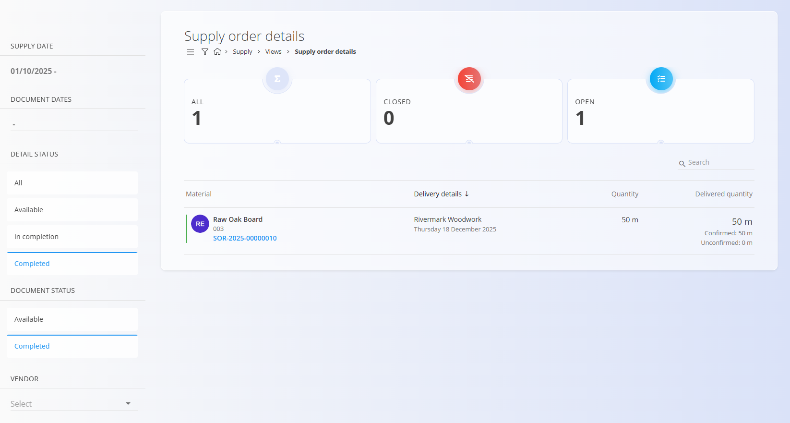
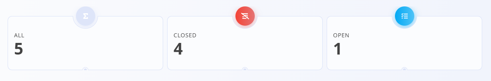
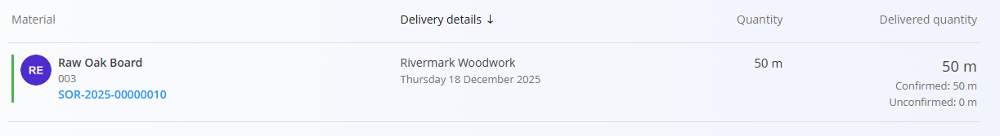

# Supply order details

The Supply order details view provides an aggregated list of all order items from incoming [**supply order**](../Documents/SupplyOrders.md) documents.
This view is analytical only — it does **not** create or change supply orders.

To access this view, go to **Supply / Views / Supply order details** in the [**navigation**](../../Common/UI/Navigation.md).

## Indicators

At the top of the **Supply order details** list, the system displays key indicators that summarize the currently filtered items. These indicators give an immediate overview of the supply order line statuses, which is especially helpful when managing large volumes of incoming materials. 

Clicking any of the indicators automatically filters the list to show only the corresponding items.

The following indicators are shown:

- **All** – The total number of supply order items matching the current filter criteria.
- **Closed** – Items that have been fully delivered or items whose delivery date has passed and are therefore considered closed.
- **Open** – Items that are still pending delivery, either fully undelivered or only partially delivered.

## Supply order details list

Each line in the list represents a **single supply order item**, including:

- **Material** – The material being supplied (name, code, and link to the supply order document)
- **Delivery details** – Vendor and expected delivery date
- **Quantity** – Ordered quantity
- **Delivered quantity** – Shows confirmed vs. unconfirmed delivery  
  - Example: *50 m (Confirmed: 50 m / Unconfirmed: 0 m)*

This allows you to see what has been delivered, what remains open, and what has reached or passed its delivery date.

## Filters

The left sidebar contains filtering options to help analyze and locate supply order items:

- **Supply date** – Filter by expected supply date
- **Document dates** – Filter by supply order document date range
- **Detail status**  
  - *All*  
  - *Available*  
  - *In completion*  
  - *Completed*
- **Document status**  
  - *Available*  
  - *Completed*
- **Vendor** – Filter supply items by supplier

These filters allow you to narrow results to only the materials, delivery dates, and statuses relevant to your planning.

## Purpose

This view is designed for:

- Monitoring upcoming supply deliveries  
- Checking which supply order items are fully or partially delivered  
- Reviewing unconfirmed vs. confirmed delivered quantities  
- Tracking vendor-specific incoming materials  
- Supporting supply planning and warehouse preparation

It complements the [**Supply orders**](../Documents/SupplyOrders.md) document screen by focusing on **items**, not documents.

