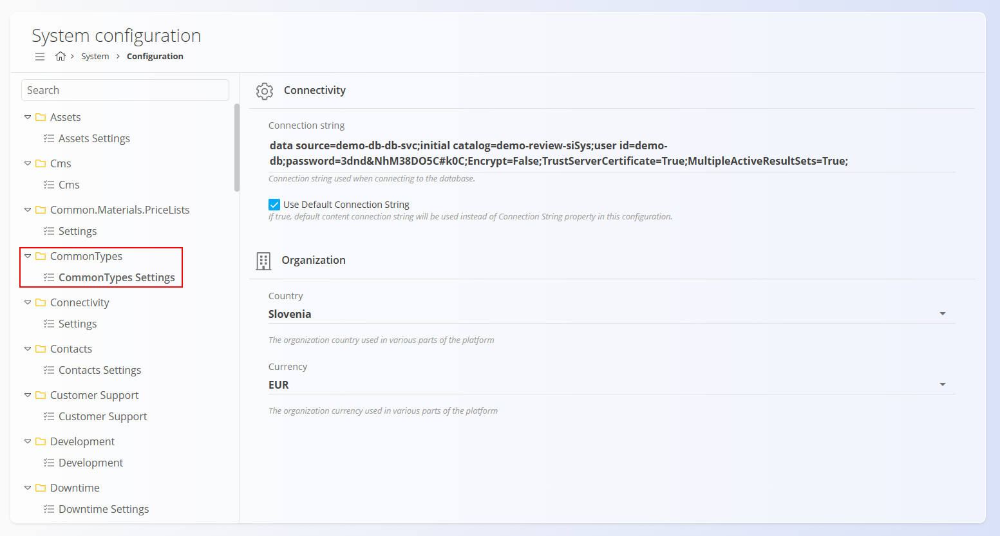
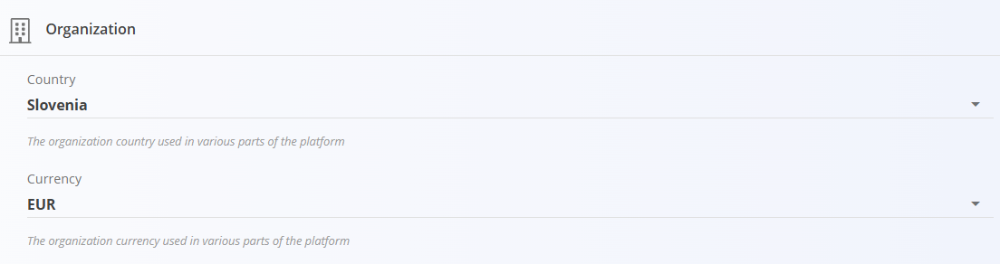
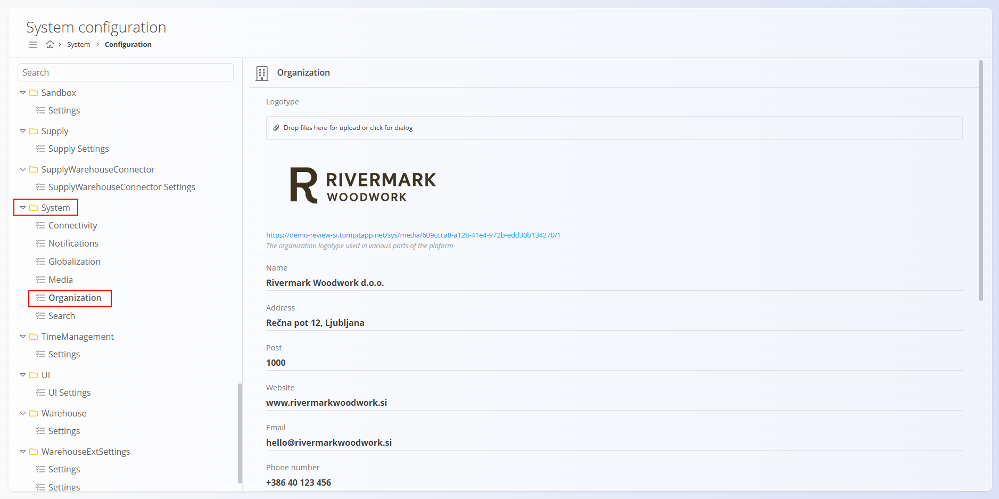
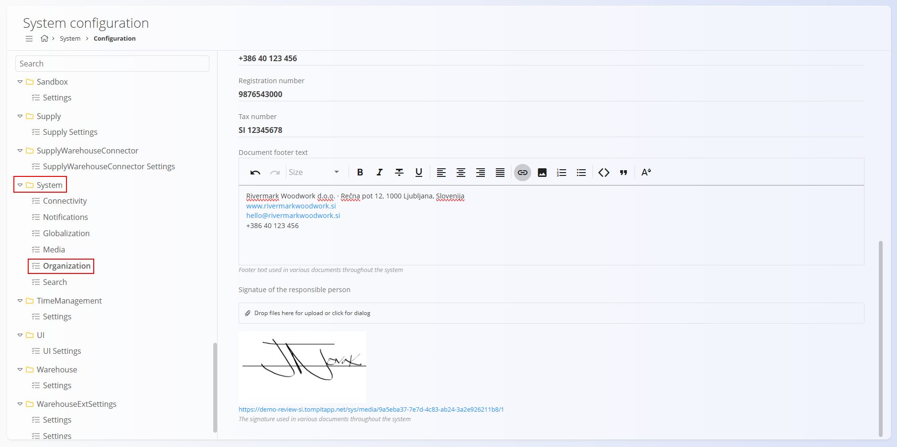

# Configuration

The **Configuration** section, found under **System / Configuration**, contains global system settings that define core organizational and localization behavior. 

> [!IMPORTANT]
>
>These settings are referenced by nearly all modules ([Sales](../../Sales/Domain/SalesDomain.md), [Supply](../../Supply/Domain/SupplyDomain.md), [Logistics](../../Logistics/Domain/LogisticsDomain.md), [Projects](../../Projects/Domain/ProjectsDomain.md), etc.) and must be configured before operational work begins.

Although the System domain includes many technical settings, this document covers two key areas:

- **Common Types → Common Types Settings**  
- **System → Organization**

These two configuration groups must be set up during the initial system setup, as they influence all modules across the platform.

> [!WARNING]  
> These settings affect every domain. Only system administrators should modify them.

## Common Types Settings

The **Common Types Settings** section defines the **default country** and **default currency** used throughout the platform. Many modules rely on these values for correct formatting, taxation, legal structure, and document output.

To access these settings go to **CommonTypes / CommonTypes Settings** in the left sidebar and click on **Organization**.

### Country

Select the country where the organization operates. This setting controls localization and regulatory defaults across documents and modules.

> [!IMPORTANT]  
> The selected country **must already exist** in the **[Countries](../../Common/CodeLists/Countries.md)** code list. If not configured there first, it will not appear in the dropdown menu.

### Currency

Select the default currency for the organization. This setting controls monetary formatting and default document currency across modules and reports.

> [!IMPORTANT]  
> The selected currency **must already exist** in the **[Currencies](../../Common/CodeLists/Currencies.md)** code list.

These two settings form the foundation for all financial and commercial operations across the platform.

## Organization

The **Organization** section defines your company’s identity and legally required business information. These values appear on printed documents such as invoices, delivery notes, sales orders, and supply orders.

### Schema

| Field | Description |
|---|---|
| **Logotype** | Upload the company logotype used on official documents. Accepted formats: PNG, JPG. Upload via drag-and-drop or file dialog. |
| **Name** | Full legal name of the company. |
| **Address** | Street name and number, including city or municipality. |
| **Post** | Postal code of the registered business address. |
| **Website** | Displayed on various sales and supply documents. |
| **Email** | Primary contact email for customer or supplier communication. |
| **Phone number** | General contact number displayed on documents. |
| **Registration number** | Official company registration number. |
| **Tax number** | Tax identification number (e.g., VAT ID). |
| **Document footer text** | Formatted footer appearing on documents across the system. Typical contents: company name, full address, website, email, phone number, legal statements or disclaimers. Supports multiline formatting. |
| **Signature of the responsible person** | Upload the signature image used on selected official documents. Accepted formats: PNG, JPG. Displayed on invoices, confirmations, and similar outputs. |

---
