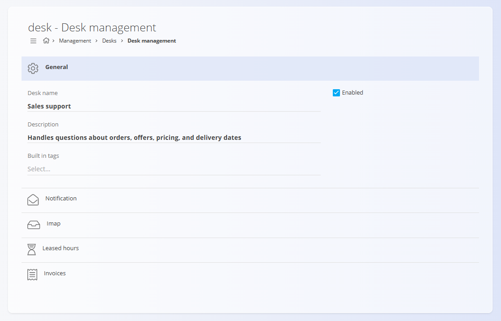
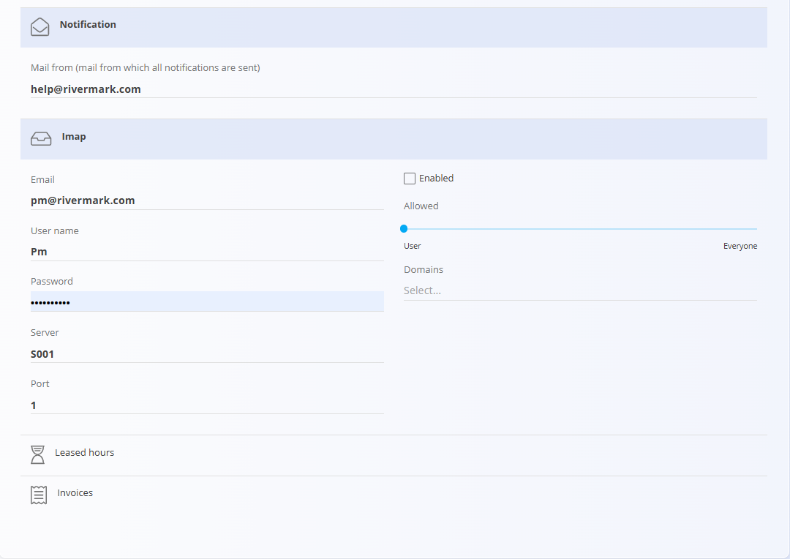

<!-- app_route: /management/customer-support/desks -->
<!-- app_label: Desks -->
<!-- canonical_source_url: https://github.com/Tom-PIT/Connected.Docs/blob/main/en/Domains/Customers/Management/Desks.md -->
<!-- canonical_source_title: Desks -->

# Desks

Desks are used to organize and manage **support tickets** by responsibility area, such as **Maintenance**, **Logistics**, or **Sales**. They define how tickets are grouped, how notifications are sent, and how optional features such as email intake, leased hours, and invoicing are handled.

Desks help ensure that incoming requests are routed correctly and processed consistently across the organization.

To access this screen, go to **Customers / Management / Desks** in the [navigation](../../../Zajednicko/UI/Navigacija.md).

## Schema

| Field | Description |
|------|-------------|
| **Desk name** | Name of the desk shown in lists and ticket views (mandatory). |
| **Description** | Short explanation of the desk’s purpose (optional). |
| **Enabled** | Indicates whether the desk is active and can receive tickets. |
| **Built-in tags** | Optional tags automatically applied to tickets created under this desk. |
| **Sender email (Notification)** | Email address used as the sender for desk-related notifications. |
| **IMAP enabled** | Enables creating tickets from incoming emails. |
| **IMAP email** | Email address used to receive incoming requests. |
| **IMAP credentials** | Authentication details for the IMAP inbox. |
| **IMAP server** | IMAP server host. |
| **IMAP port** | IMAP server port. |
| **IMAP restrictions** | Rules that limit who may create tickets via email. |

## Management

You can access the **Desks** code list from the **Management** section of the system. All desks are managed centrally and can be used across ticketing and support-related workflows.

### List of desks

The user interface displays a list of all desks defined in the system. 

Each desk includes:
- A status color indicator showing whether it is enabled
- The desk name
- A short description (optional)

## Actions

### Add a new desk
Click the [action button](../../../Common/UI/ActionButton.md) to add a new desk.

The desk form is divided into multiple sections that define how the desk behaves. When adding or editing, use the fields described in the [**Schema**](#schema).

#### General

Defines the core properties of the desk. See the [**Schema**](#schema) for field names and descriptions.

#### Notification

Defines the sender email address used for all notifications related to tickets handled by the desk. See the [**Schema**](#schema).

#### IMAP

Allows a desk to be connected to an email inbox. When enabled, incoming emails are automatically converted into support tickets. See the [**Schema**](#schema) for configuration fields.

#### Leased Hours

Used to manage prepaid or contractually agreed support hours for a desk. Click **Add leased hours** to add a date and the amount of leased hours.

#### Invoices

Provides an overview of invoices related to the desk’s activity. Click **Add invoice** to add a date and the amount billed.

### Edit a desk

Click on a desk in the list to open it in edit mode. You can modify all fields and settings as needed. Changes are saved automatically.