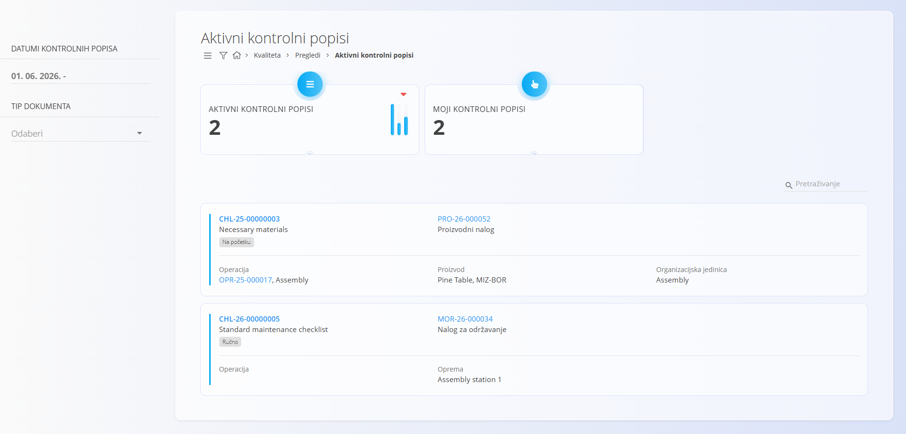
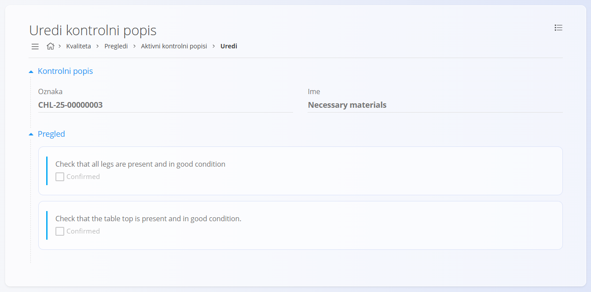

<!-- app_route: /quality/views/active-checklists -->
<!-- app_label: Aktivni kontrolni popisi -->
<!-- canonical_source_url: https://github.com/Tom-PIT/Connected.Docs/blob/main/hr/Kvaliteta/Pregledi/AktivniKontrolniPopisi.md -->
<!-- canonical_source_title: Aktivni kontrolni popisi -->

# Aktivni kontrolni popisi

Prikaz **Aktivni kontrolni popisi** prikazuje sva trenutno aktivna izvršavanja kontrolnih popisa. Operateri ga koriste za praćenje i dovršavanje kontrolnih popisa tijekom proizvodnih i servisnih procesa. Nakon završetka kontrolnog popisa, on se više ne prikazuje na ovom zaslonu, već se premješta u prikaz **Gotovi kontrolni popisi**.

Za pristup ovom prikazu otvorite **Kvaliteta / Pregledi / Aktivni kontrolni popisi** u [navigaciji](../../../Zajednicko/UI/Navigacija.md).

## Pregled

Ovaj prikaz omogućuje pregled svih trenutno aktivnih (nezavršenih) kontrolnih popisa. Namijenjen je operaterima, djelatnicima održavanja i nadzornicima za brzo prepoznavanje kontrolnih popisa koji zahtijevaju dovršetak.

## Shema

| Polje | Opis |
|-------|------|
| **Kontrolni popis** | Oznaka i naziv kontrolnog popisa koji se izvršava. Prikazuje i oznaku faze izvršavanja (npr. **Na početku** ili **Ručno**). |
| **Dokument** | Izvorni dokument i njegova oznaka: [Proizvodni nalog](../../Proizvodnja/Dokumenti/ProizvodniNalozi.md) ili [Nalog za održavanje](../../Odrzavanje/Dokumenti/NaloziZaOdrzavanje.md). |
| **Operacija** | Oznaka i naziv operacije povezane s izvršavanjem kontrolnog popisa. |
| **Proizvod** | Naziv i oznaka proizvoda povezanog s operacijom (za proizvodne procese). |
| [**Organizacijska jedinica**](../../Proizvodnja/Upravljanje/OrganizacijskeJedinice.md) | Organizacijska jedinica odgovorna za izvršavanje kontrolnog popisa. |
| **Oprema** | Prikazuje se za kontrolne popise povezane s održavanjem te označava opremu na kojoj se izvršava kontrolni popis. |

## Popis aktivnih kontrolnih popisa

Na vrhu stranice prikazana su dva pokazatelja:

- **Aktivni kontrolni popisi** – ukupan broj trenutno aktivnih kontrolnih popisa.
- **Moji kontrolni popisi** – broj aktivnih kontrolnih popisa dodijeljenih prijavljenom korisniku.

## Filtri

Pomoću filtara možete suziti prikaz:

- **Datumi kontrolnih popisa** – filtriranje prema datumu početka ili razdoblju izvršavanja.
- **Tip dokumenta** – prikaz samo kontrolnih popisa povezanih s određenom vrstom dokumenta:
    - [Nalog za održavanje](../../Odrzavanje/Dokumenti/NaloziZaOdrzavanje.md)
    - [Proizvodni nalog](../../Proizvodnja/Dokumenti/ProizvodniNalozi.md)

## Interakcija s redovima

- Kliknite **oznaku kontrolnog popisa** za otvaranje stranice za pregled i izvršavanje kontrolnog popisa.
- Kliknite **oznaku dokumenta** za otvaranje povezanog dokumenta:
    - [Proizvodni nalog](../../Proizvodnja/Dokumenti/ProizvodniNalozi.md)
    - [Nalog za održavanje](../../Odrzavanje/Dokumenti/NaloziZaOdrzavanje.md)
- Kliknite **oznaku operacije** za otvaranje stranice [Izvršavanje](../../Proizvodnja/Dokumenti/Izvedba.md) za odabranu operaciju.

## Izvršavanje kontrolnog popisa

Stranica za izvršavanje prikazuje oznaku i naziv kontrolnog popisa te popis svih kontrolnih točaka koje je potrebno izvršiti.

Ovisno o konfiguraciji kontrolnog popisa, operater može potvrđivati stavke, unositi mjerne vrijednosti, odabirati unaprijed definirane vrijednosti, unositi tekst ili priložiti datoteke.

## Izbornik

Izbornik sadrži dodatne radnje dostupne na ovoj stranici.

Dostupne radnje:

- **Ispis**
- **Izvoz u PDF ili CSV**

Za više informacija pogledajte [**Radnje izbornika**](../../../Zajednicko/Koncepti/RadnjeIzbornika.md).