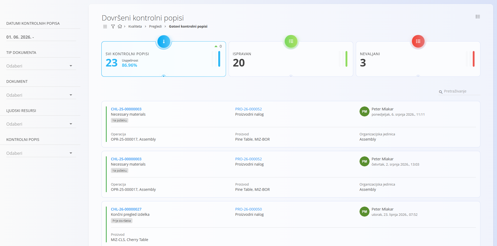
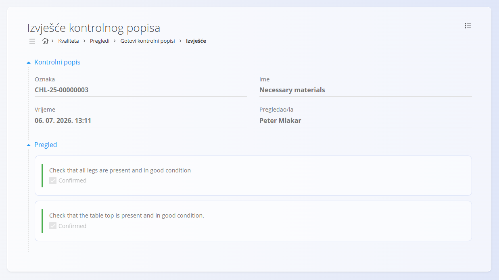

<!-- app_route: /quality/views/completed-checklists -->
<!-- app_label: Gotovi kontrolni popisi -->
<!-- canonical_source_url: https://github.com/Tom-PIT/Connected.Docs/blob/main/hr/Kvaliteta/Pregledi/GotoviKontrolniPopisi.md -->
<!-- canonical_source_title: Gotovi kontrolni popisi -->

# Gotovi kontrolni popisi

Prikaz **Gotovi kontrolni popisi** omogućuje analitički pregled svih dovršenih izvršavanja kontrolnih popisa unutar odabranog vremenskog razdoblja. Omogućuje voditeljima i odgovornim osobama za kvalitetu pregled rezultata, provjeru uspješnosti izvršavanja te uvid u izvješća završenih kontrolnih popisa.

Za pristup ovom prikazu otvorite **Kvaliteta / Pregledi / Gotovi kontrolni popisi** u [navigaciji](../../../Zajednicko/UI/Navigacija.md).

## Pregled

Na vrhu stranice prikazani su pokazatelji koji sažimaju rezultate izvršenih kontrolnih popisa:

- **Svi kontrolni popisi**  
  Prikazuje ukupan broj dovršenih kontrolnih popisa te **uspješnost**, odnosno postotak potpuno uspješno izvršenih kontrolnih popisa.

- **Ispravni**  
  Broj dovršenih kontrolnih popisa kod kojih su potvrđene sve kontrolne točke.

- **Nevaljani**  
  Broj dovršenih kontrolnih popisa kod kojih barem jedna kontrolna točka nije potvrđena.

Klikom na bilo koji pokazatelj popis se filtrira prema odabranoj kategoriji.

## Popis gotovih kontrolnih popisa

Popis prikazuje dovršena izvršavanja kontrolnih popisa zajedno s osnovnim informacijama. Svaki red predstavlja jedno izvršavanje kontrolnog popisa.

Prikazane informacije uključuju:

- **Kontrolni popis** – oznaku i naziv kontrolnog popisa
- **Dokument** – povezani dokument (proizvodni nalog ili nalog za održavanje)
- **Operaciju** – oznaku i naziv operacije
- **Proizvod** – naziv i oznaku proizvoda
- **Organizacijsku jedinicu** – odgovornu organizacijsku jedinicu
- **Pregledao/la** – korisnika koji je izvršio kontrolni popis
- **Vrijeme završetka** – datum i vrijeme dovršetka

Koristite polje **Pretraživanje** za brzo pronalaženje željenog kontrolnog popisa.

## Interakcija s redovima

- Kliknite **oznaku kontrolnog popisa** za otvaranje izvješća kontrolnog popisa.
- Kliknite **oznaku dokumenta** za otvaranje povezanog dokumenta:
    - [Proizvodni nalog](../../Proizvodnja/Dokumenti/ProizvodniNalozi.md)
    - [Nalog za održavanje](../../Odrzavanje/Dokumenti/NaloziZaOdrzavanje.md)

## Filtri

Pomoću filtara na lijevoj strani možete suziti prikaz:

- **Datumi kontrolnih popisa** – filtriranje prema razdoblju završetka kontrolnog popisa.
- **Tip dokumenta** – prikaz samo kontrolnih popisa povezanih s određenom vrstom dokumenta:
    - [Proizvodni nalog](../../Proizvodnja/Dokumenti/ProizvodniNalozi.md)
    - [Nalog za održavanje](../../Odrzavanje/Dokumenti/NaloziZaOdrzavanje.md)
- **Dokument** – filtriranje prema određenom dokumentu.
- **Ljudski resursi** – filtriranje prema korisniku koji je izvršio kontrolni popis.
- **Kontrolni popis** – filtriranje prema definiciji kontrolnog popisa.

Svi filtri su opcionalni i mogu se međusobno kombinirati.

## Izvješće kontrolnog popisa

Klikom na oznaku kontrolnog popisa otvara se izvješće koje prikazuje potpuni rezultat izvršavanja kontrolnog popisa.

Izvješće sadrži:

- **Podatke o kontrolnom popisu**
    - Oznaku i naziv
    - Datum i vrijeme izvršavanja
    - Korisnika koji je izvršio kontrolni popis

- **Pregled kontrolnih točaka**
    - Popis svih kontrolnih točaka
    - Rezultat svake kontrolne točke
    - Unesene komentare, izmjerene vrijednosti ili priloge, ako su definirani u kontrolnom popisu

Izvješće je samo za pregled i nije ga moguće uređivati nakon završetka izvršavanja.

> [!NOTE]
> - U ovom prikazu prikazani su samo dovršeni kontrolni popisi.
> - Kontrolni popis smatra se **ispravnim** samo ako su potvrđene sve kontrolne točke.
> - **Nevaljani** kontrolni popisi označavaju da barem jedna kontrolna točka nije potvrđena.
> - Komentari, mjerne vrijednosti i prilozi prikazuju se samo ako su definirani u kontrolnom popisu.

## Povezani prikazi

- [**Aktivni kontrolni popisi**](AktivniKontrolniPopisi.md)
- [**Proizvodni nalozi**](../../Proizvodnja/Dokumenti/ProizvodniNalozi.md)
- [**Nalozi za održavanje**](../../Odrzavanje/Dokumenti/NaloziZaOdrzavanje.md)

## Izbornik

Izbornik sadrži dodatne radnje dostupne na ovoj stranici.

Dostupne radnje:

- **Ispis**
- **Izvoz u CSV**

Za više informacija pogledajte [**Radnje izbornika**](../../../Zajednicko/Koncepti/RadnjeIzbornika.md).