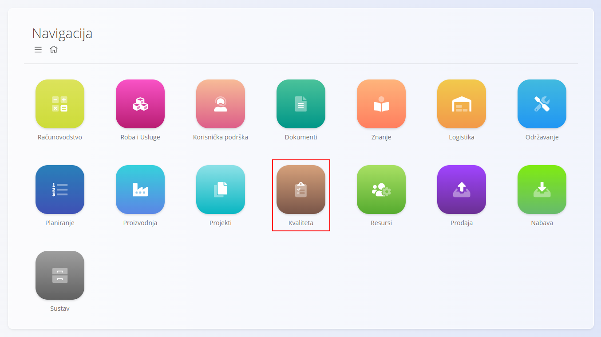
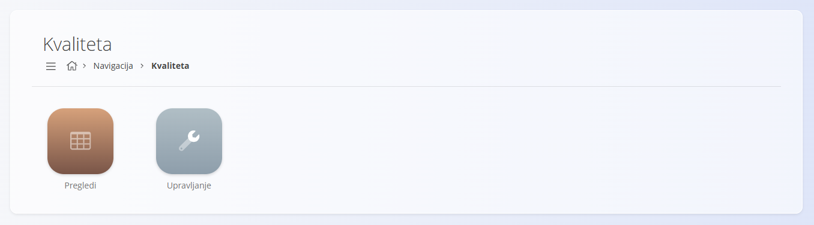
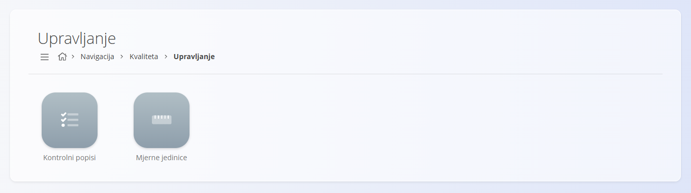
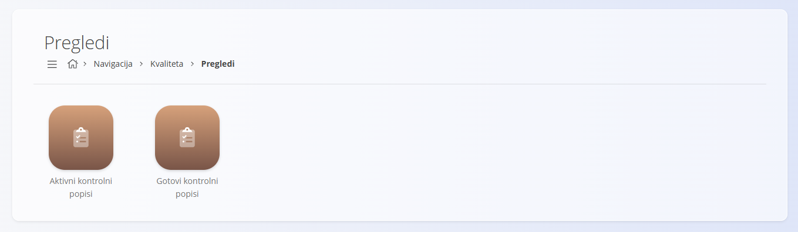

<!-- app_route: /sitemap/quality -->
<!-- app_label: Kvaliteta -->
<!-- canonical_source_url: https://github.com/Tom-PIT/Connected.Docs/blob/main/hr/Kvaliteta/README.md -->
<!-- canonical_source_title: Kvaliteta -->

# Kvaliteta

Domena **Kvaliteta** pruža centralno mjesto za upravljanje i pregled **kontrolnih popisa** koji se koriste u proizvodnji i održavanju. Omogućuje definiranje kontrolnih popisa, njihovo izvršavanje tijekom rada te pregled rezultata radi osiguranja kvalitete i sljedivosti.

Koristite ovu domenu za:

- Praćenje aktivnih izvršavanja kontrolnih popisa u proizvodnji i održavanju.
- Pregled i analizu dovršenih kontrolnih popisa.
- Upravljanje predlošcima kontrolnih popisa koji se koriste u svakodnevnom radu.

Za pristup domeni otvorite **Kvaliteta** u [navigaciji](../../Zajednicko/UI/Navigacija.md).

> [!NOTE]
> Dostupne domene ovise o konfiguraciji i poslovnom modelu pojedine tvrtke.

## Što sadrži domena Kvaliteta?

Domena je organizirana u dva funkcionalna područja:

- **Upravljanje** – definiranje i održavanje kontrolnih popisa.
- **Pregledi** – praćenje i analiza aktivnih i dovršenih izvršavanja kontrolnih popisa.

> [!TIP]
> Za detaljne upute pogledajte **[Izrada kontrolnog popisa](Upravljanje/KontrolniPopisiIzrada.md)**.

## Upravljanje

- [**Kontrolni popisi**](Upravljanje/KontrolniPopisi.md) – upravljanje predlošcima kontrolnih popisa, njihovim kontrolnim točkama i kriterijima provjere.
- [**Mjerne jedinice**](../../Zajednicko/Upravljanje/MjerneJedinice.md) – definiranje mjernih jedinica koje se koriste u brojčanim kontrolnim točkama (npr. °C, kg ili bar).

> [!TIP]
> Pregled svih šifrarnika dostupan je u **[Indeksu upravljanja](../../IndeksUpravljanja.md)**.

## Pregledi

Područje **Pregledi** omogućuje praćenje i analizu izvršavanja kontrolnih popisa.

- [**Aktivni kontrolni popisi**](Pregledi/AktivniKontrolniPopisi.md) – pregled svih kontrolnih popisa koji su trenutno u tijeku ili čekaju dovršetak. Omogućuje nastavak izvršavanja i pregled detalja pojedinog kontrolnog popisa.
- [**Gotovi kontrolni popisi**](Pregledi/GotoviKontrolniPopisi.md) – pregled dovršenih kontrolnih popisa s rezultatima, odgovornim korisnicima i detaljnim izvješćima. Omogućuje analizu uspješnosti te filtriranje rezultata za potrebe kontrole kvalitete i revizije.

