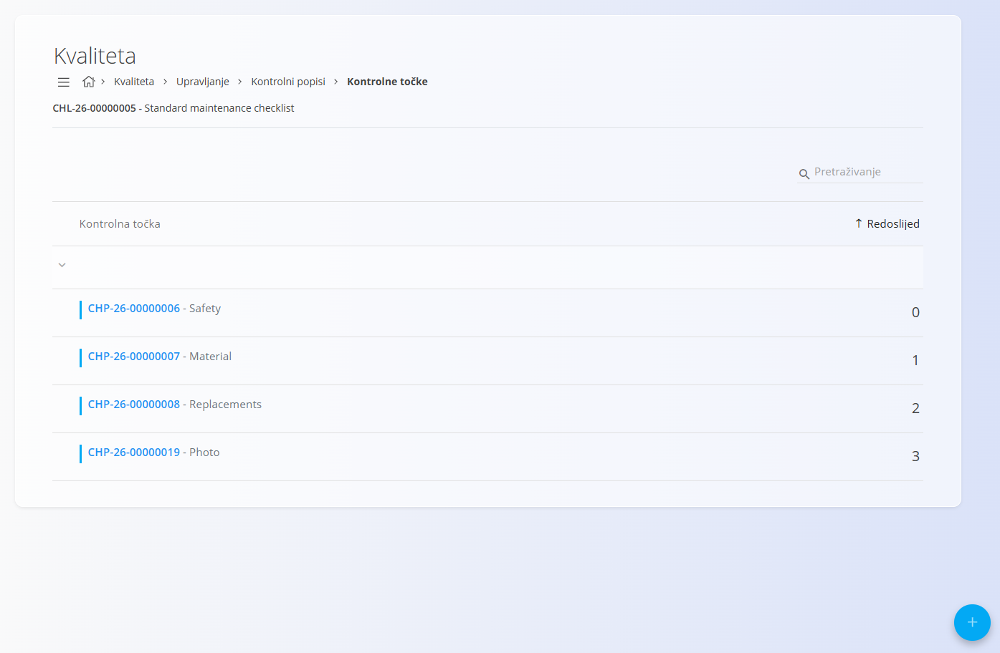
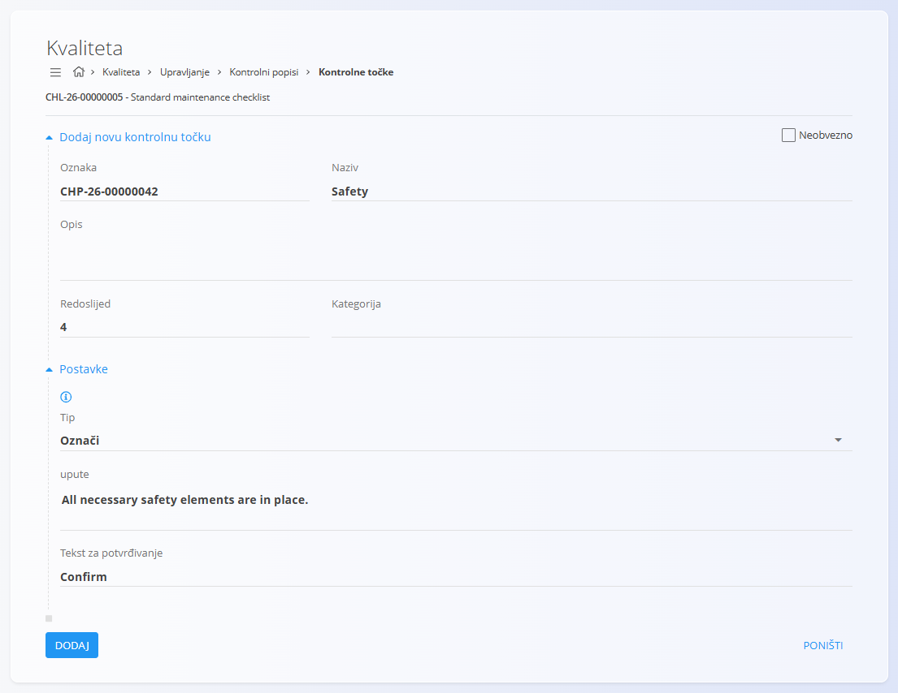
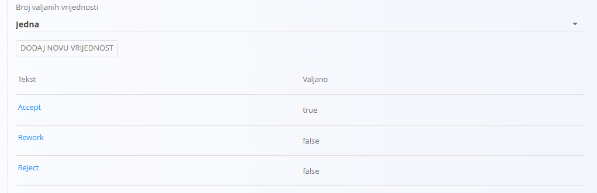
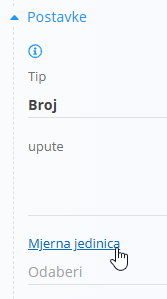

<!-- app_route: /management/check-lists -->
<!-- app_label: Kontrolne točke -->
<!-- canonical_source_url: https://github.com/Tom-PIT/Connected.Docs/blob/main/hr/Kvaliteta/Upravljanje/KontrolneTocke.md -->
<!-- canonical_source_title: Kontrolne točke -->

# Kontrolne točke

Kontrolne točke pripadaju određenom **[Kontrolnom popisu](KontrolniPopisi.md)** i definiraju pojedinačne korake, provjere ili kontrole koje operateri moraju izvršiti tijekom proizvodnje ili postupaka kontrole kvalitete. Time se osigurava dosljedno izvođenje procesa te prikupljaju strukturirani podaci za reviziju i izvještavanje.

Za pristup kontrolnim točkama otvorite **Proizvodnja / Upravljanje / Kontrolni popisi** i kliknite gumb **Kontrolne točke** željenog kontrolnog popisa.

> [!TIP]
> Za potpuni prikaz funkcionalnosti pogledajte video vodič **[Quality checkpoints](https://www.youtube.com/watch?v=EB7WktBCFC4)**.

> [!TIP]
> Za primjer izrade i korištenja kontrolnog popisa korak po korak pogledajte **[Izrada kontrolnih popisa](KontrolniPopisiIzrada.md)**.

## Shema

<strong>Dokument</strong>

| Polje | Opis |
|-------|------|
| [**Oznaka**](../../../Zajednicko/UI/OznakeDokumenata.md) | Automatski generirana jedinstvena oznaka kontrolne točke. |
| **Naziv** | Naziv kontrolne točke (obavezno). |
| **Opis** | Dodatni opis ili informacije o kontrolnoj točki. |
| **Redoslijed** | Redni broj koji određuje položaj kontrolne točke unutar kontrolnog popisa. |
| **Kategorija** | Kategorija za grupiranje ili filtriranje kontrolnih točaka. |
| **Neobvezno** | Označava može li se kontrolna točka preskočiti tijekom izvršavanja. |
| **Tip** | Određuje vrstu unosa koji operater mora izvršiti. |
| **Upute** | Upute prikazane operateru tijekom izvršavanja kontrolne točke. |

## Pregled popisa

Popis prikazuje sve kontrolne točke odabranog kontrolnog popisa, sortirane prema polju **Redoslijed**.

Za pretraživanje kontrolnih točaka prema nazivu ili oznaci koristite polje **Pretraživanje**.

## Izrada nove kontrolne točke

1. Kliknite [akcijski gumb](../../../Zajednicko/UI/AkcijskiGumb.md) u donjem desnom kutu.
2. Ispunite sljedeća polja:

    

    - **Naziv** – Naziv kontrolne točke.
    - **Opis** – Dodatni opis kontrolne točke.
    - **Redoslijed** – Određuje položaj kontrolne točke unutar kontrolnog popisa.
    - **Kategorija** – Po potrebi odaberite kategoriju.
    - **Neobvezno** – Označite ako izvršavanje kontrolne točke nije obavezno.
    - **Tip** – Odaberite vrstu unosa koju operater mora izvršiti.
    - **Upute** – Unesite upute za izvršavanje kontrolne točke.

3. Kliknite **Dodaj**.

> [!NOTE]
> Ovisno o odabranom **Tipu**, mogu se prikazati dodatna polja. Više informacija potražite u odjeljku [Posebnosti prema tipu](#posebnosti-prema-tipu).

## Uređivanje kontrolne točke

Za uređivanje postojeće kontrolne točke:

1. Odaberite kontrolnu točku s popisa.
2. Po potrebi izmijenite bilo koje polje, uključujući **Tip**, **Kategoriju** ili **Upute**.
3. Kliknite **Spremi**.

## Brisanje kontrolne točke

Kontrolnu točku možete obrisati na njezinoj stranici za uređivanje klikom na **Izbriši**, osim ako je to ograničeno konfiguracijom tijeka rada.

## Posebnosti prema tipu

Ovisno o odabranom **Tipu**, prikazuju se dodatna polja ili postavke.

### Tip: Označi

Kod tipa **Označi** prikazuje se dodatno polje:

| Atribut | Vrsta | Opis |
|---------|------|------|
| **Tekst za potvrđivanje** | Tekst | Tekst prikazan uz potvrdni okvir. |

### Tip: Popis

Kod tipa **Popis** prikazuju se dodatne postavke:

| Atribut | Vrsta | Opis |
|---------|------|------|
| **Broj valjanih vrijednosti** | Padajući popis | Određuje može li se odabrati **jedna** ili **više** valjanih vrijednosti. Ako je odabrana opcija **Jedna**, samo jedna vrijednost može biti označena kao valjana. Ako je odabrana opcija **Više**, više vrijednosti može biti označeno kao valjano. |

Vrijednosti popisa dodaju se klikom na **Dodaj novu vrijednost**.

Za svaku vrijednost potrebno je unijeti:

- **Tekst** – Tekst prikazan korisniku.
- **Valjano** – Označava smatra li se vrijednost valjanom.

Dodane vrijednosti prikazuju se u tablici.

### Tip: Broj

Kod tipa **Broj** prikazuju se dodatna polja:

| Atribut | Vrsta | Opis |
|---------|------|------|
| [**Mjerna jedinica**](../../../Zajednicko/Upravljanje/MjerneJedinice.md) | Padajući popis | Mjerna jedinica za unesenu vrijednost. |
| **Najmanja vrijednost** | Broj | Najmanja dopuštena vrijednost. |
| **Zadana vrijednost** | Broj | Zadana vrijednost kontrolne točke. |
| **Najveća vrijednost** | Broj | Najveća dopuštena vrijednost. |

> [!NOTE]
> Za lakše upravljanje mjernim jedinicama dostupna je poveznica na stranicu **[Mjerne jedinice](../../../Zajednicko/Upravljanje/MjerneJedinice.md)**.
>
> 