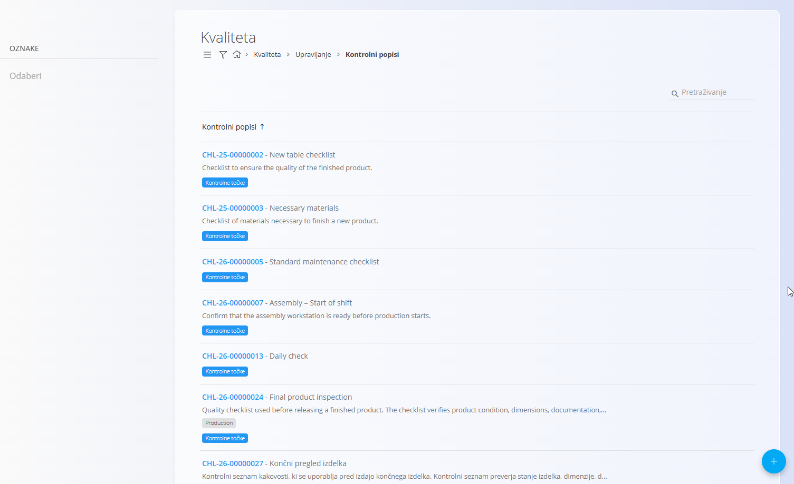
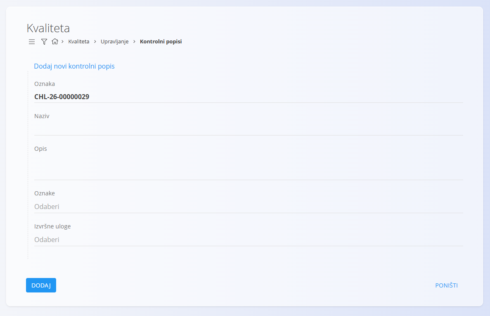
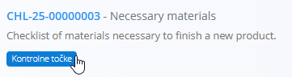

<!-- app_route: /management/check-lists -->
<!-- app_label: Kontrolni popisi -->
<!-- canonical_source_url: https://github.com/Tom-PIT/Connected.Docs/blob/main/hr/Kvaliteta/Upravljanje/KontrolniPopisi.md -->
<!-- canonical_source_title: Kontrolni popisi -->

# Kontrolni popisi

Kontrolni popisi koriste se u domenama **Proizvodnja** i **Održavanje** za definiranje strukturiranih popisa koji podržavaju proizvodne postupke i aktivnosti kontrole kvalitete. Na ovoj stranici možete izrađivati i organizirati kontrolne popise koji se koriste u proizvodnji i održavanju.

Pojedinačni koraci unutar kontrolnog popisa, odnosno **[Kontrolne točke](KontrolneTocke.md)**, uređuju se zasebno.

Za pristup ovoj stranici otvorite domenu **Proizvodnja** ili **Održavanje**, a zatim u [navigaciji](../../../Zajednicko/UI/Navigacija.md) odaberite **Upravljanje / Kontrolni popisi**.

> [!TIP]
> Za potpuni prikaz funkcionalnosti pogledajte video vodič **[Quality checklists](https://www.youtube.com/watch?v=EB7WktBCFC4)**.

> [!TIP]
> Za upute o izradi potpunog kontrolnog popisa s različitim vrstama kontrolnih točaka pogledajte **[Izrada kontrolnih popisa](KontrolniPopisiIzrada.md)**.

## Shema

<strong>Dokument</strong>

| Polje | Opis |
|-------|------|
| [**Oznaka**](../../../Zajednicko/UI/OznakeDokumenata.md) | Automatski generirana oznaka kontrolnog popisa (samo za čitanje). |
| **Naziv** | Naziv kontrolnog popisa (obavezno). |
| **Opis** | Kratki opis namjene kontrolnog popisa. |
| **Oznake** | Oznake za kategorizaciju ili grupiranje kontrolnih popisa (npr. Proizvodnja, Održavanje). |
| **Izvršne uloge** | Uloge koje određuju koja radna mjesta mogu izvršavati kontrolni popis (npr. operateri, tehničari održavanja). |
| **Privitci** | Dokumenti ili slike povezani s kontrolnim popisom. Ovaj odjeljak prikazuje se tek nakon izrade kontrolnog popisa. |

## Pregled popisa

Popis prikazuje sve kontrolne popise definirane u sustavu. Svaki redak prikazuje oznaku, naziv i opis kontrolnog popisa. Za pretraživanje po oznaci ili nazivu koristite polje **Pretraživanje**.

Svaki kontrolni popis sadrži gumb **Kontrolne točke** za upravljanje kontrolnim točkama tog popisa.

## Filtri

Na lijevoj strani nalazi se filtar **Oznake** koji omogućuje prikaz samo kontrolnih popisa povezanih s odabranim oznakama.

## Izrada novog kontrolnog popisa

1. Kliknite [akcijski gumb](../../../Zajednicko/UI/AkcijskiGumb.md) u donjem desnom kutu.
2. Ispunite sljedeća polja:

    

    - **Naziv** – Naziv kontrolnog popisa.
    - **Opis** – Kratki opis kontrolnog popisa.
    - **Oznake** – Odaberite jednu ili više oznaka za kategorizaciju kontrolnog popisa (npr. Proizvodnja, Održavanje).
    - **Izvršne uloge** – Odaberite radna mjesta koja mogu izvršavati ovaj kontrolni popis (npr. operateri, tehničari održavanja).

3. Kliknite **Dodaj**.

## Upravljanje kontrolnim točkama

Svaki kontrolni popis može sadržavati jednu ili više **kontrolnih točaka** koje definiraju pojedinačne korake ili provjere tijekom izvršavanja kontrolnog popisa.

Za upravljanje kontrolnim točkama:

1. Otvorite stranicu **Kontrolni popisi**.
2. Pronađite željeni kontrolni popis i kliknite **Kontrolne točke**.

    

Otvara se stranica **Kontrolne točke** na kojoj možete dodavati, uređivati, brisati i mijenjati redoslijed kontrolnih točaka.

Više informacija potražite u dokumentima **[Kontrolne točke](KontrolneTocke.md)** i **[Izrada kontrolnih popisa](KontrolniPopisiIzrada.md)**.

## Uređivanje kontrolnog popisa

Za uređivanje postojećeg kontrolnog popisa:

1. Kliknite željeni kontrolni popis na popisu.
2. Po potrebi izmijenite **Naziv**, **Opis**, **Oznake**, **Privitke** ili **Izvršne uloge**.
3. Kliknite **Spremi**.

## Brisanje kontrolnog popisa

Kontrolni popis možete obrisati na njegovoj stranici za uređivanje klikom na **Izbriši**. Nakon potvrde, kontrolni popis trajno se uklanja iz sustava.