<!-- app_route: /management/check-lists/create -->
<!-- app_label: Izrada kontrolnih popisa -->
<!-- canonical_source_url: https://github.com/Tom-PIT/Connected.Docs/blob/main/hr/Kvaliteta/Upravljanje/KontrolniPopisiIzrada.md -->
<!-- canonical_source_title: Izrada kontrolnih popisa -->

# Izrada kontrolnih popisa

Kontrolni popisi omogućuju dosljedno izvođenje proizvodnih i servisnih procesa prema unaprijed definiranim postupcima.

Ovaj vodič prikazuje kako izraditi kontrolni popis i konfigurirati različite vrste kontrolnih točaka koje operateri ispunjavaju tijekom izvršavanja procesa.

> [!TIP]
> Pišite jasne upute i odaberite odgovarajuće vrste kontrolnih točaka kako bi operateri jednostavno razumjeli i izvršili potrebne provjere. Jasne upute povećavaju dosljednost i smanjuju mogućnost pogrešaka.

## Korak 1: Izrada novog kontrolnog popisa

Otvorite **Kvaliteta / Upravljanje / Kontrolni popisi**.

1. Kliknite [akcijski gumb](../../../Zajednicko/UI/AkcijskiGumb.md).
2. Unesite **Naziv** kontrolnog popisa.
3. Po potrebi unesite **Opis**.
4. Odaberite jednu ili više **Oznaka**.
5. Po potrebi odaberite **Izvršne uloge** koje mogu izvršavati kontrolni popis.
6. Kliknite **Dodaj**.

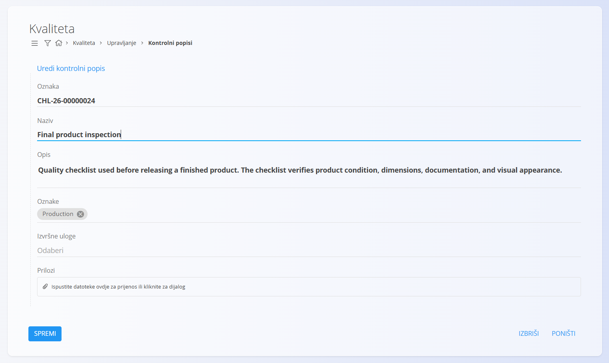

Kontrolni popis je sada izrađen i spreman za dodavanje kontrolnih točaka.

## Korak 2: Otvaranje stranice Kontrolne točke

Svaki kontrolni popis sastoji se od jedne ili više kontrolnih točaka.

Za upravljanje kontrolnim točkama:

1. Otvorite stranicu **Kontrolni popisi**.
2. Pronađite željeni kontrolni popis.
3. Kliknite **Kontrolne točke**.

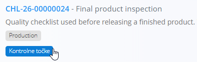

Otvara se stranica **Kontrolne točke**.

## Korak 3: Izrada prve kontrolne točke

Popis kontrolnih točaka prikazuje sve kontrolne točke odabranog kontrolnog popisa.

Kod novog kontrolnog popisa popis je u početku prazan.

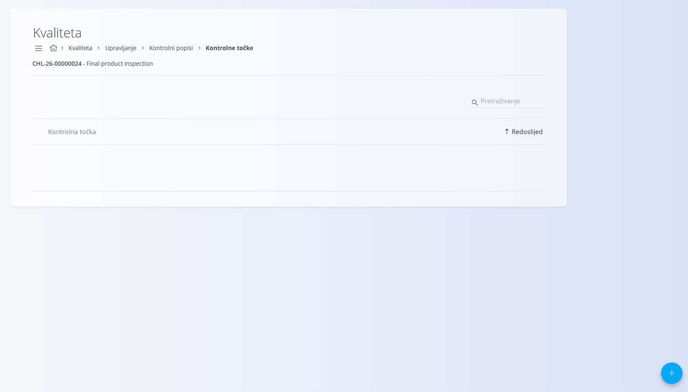

Za dodavanje kontrolne točke:

1. Kliknite [akcijski gumb](../../../Zajednicko/UI/AkcijskiGumb.md).
2. Unesite osnovne podatke:
    - **Naziv**
    - **Opis** (nije obavezno)
    - **Redoslijed**
    - **Kategorija** (nije obavezno)
    - **Neobvezno**
    - **Tip**
    - **Upute** (nije obavezno)
3. Kliknite **Dodaj**.

> [!NOTE]
> Polje **Redoslijed** određuje redoslijed prikaza kontrolnih točaka unutar kontrolnog popisa.

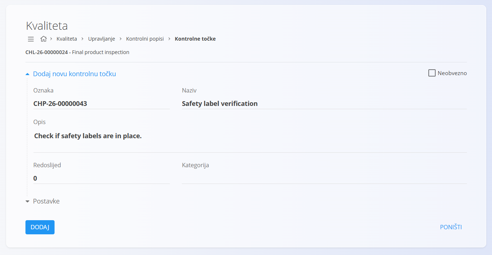

Nakon izrade kontrolne točke mogu se prikazati dodatne postavke, ovisno o odabranom **Tipu**.

## Korak 4: Dodavanje kontrolne točke tipa Označi

Kontrolne točke tipa **Označi** koriste se kada operater treba potvrditi da je određena radnja izvršena.

Primjeri:

- Provjera jesu li postavljene sigurnosne naljepnice.
- Provjera dovršene ambalaže.
- Provjera čišćenja stroja.

Prilikom izrade kontrolne točke:

- Unesite **Naziv**.
- Odaberite **Tip = Označi**.
- Unesite **Upute** i **Tekst za potvrđivanje**.

### Primjer

- **Naziv:** Provjera sigurnosnih naljepnica
- **Upute:** Provjerite jesu li sve obvezne sigurnosne naljepnice postavljene i jasno vidljive.
- **Tekst za potvrđivanje:** Potvrđujem da su sigurnosne naljepnice postavljene.

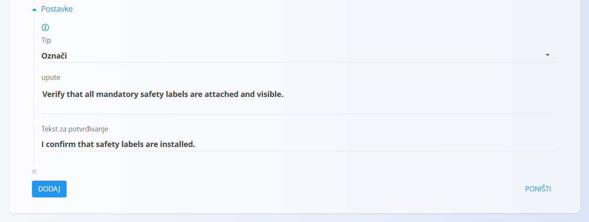

## Korak 5: Dodavanje kontrolne točke tipa Broj

Kontrolne točke tipa **Broj** omogućuju unos numeričkih vrijednosti.

Primjeri:

- Masa proizvoda
- Temperatura
- Duljina
- Debljina

Prilikom izrade kontrolne točke:

- Unesite **Naziv**.
- Odaberite **Tip = Broj**.
- Odaberite **Mjernu jedinicu**.
- Po potrebi definirajte **Najmanju**, **Zadanu** i **Najveću vrijednost**.

### Primjer

- **Naziv:** Masa proizvoda
- **Mjerna jedinica:** Kilogram
- **Najmanja vrijednost:** 4,8
- **Zadana vrijednost:** 5,0
- **Najveća vrijednost:** 5,2

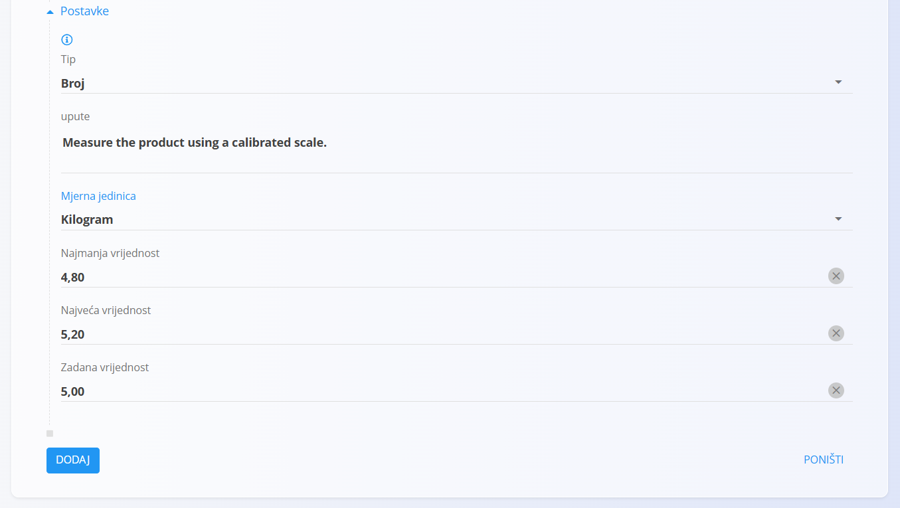

## Korak 6: Dodavanje kontrolne točke tipa Popis

Kontrolne točke tipa **Popis** omogućuju odabir unaprijed definiranih vrijednosti.

Prilikom izrade kontrolne točke:

- Unesite **Naziv**.
- Odaberite **Tip = Popis**.
- Odaberite može li biti valjana **Jedna** ili **Više** vrijednosti.
- Dodajte dostupne vrijednosti.

### Primjer

- **Naziv:** Kvaliteta površine
- **Broj valjanih vrijednosti:** Jedna
- **Vrijednosti:**
    - Prihvati — Valjano
    - Dorada — Nije valjano
    - Odbaci — Nije valjano

Na taj način samo valjana vrijednost označava uspješno izvršenu kontrolnu točku.

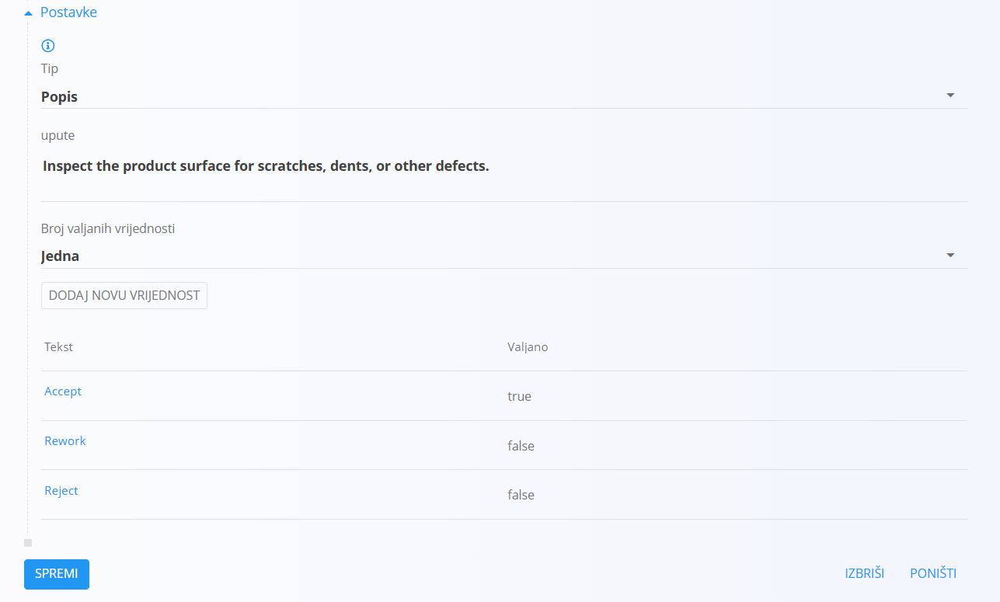

## Korak 7: Dodavanje kontrolne točke tipa Tekst

Kontrolne točke tipa **Tekst** omogućuju unos slobodnog teksta.

Primjeri:

- Opis nedostataka
- Dodatne informacije o mjerenju
- Komentari ili preporuke

Prilikom izrade kontrolne točke:

- Unesite **Naziv**.
- Odaberite **Tip = Tekst**.

### Primjer

- **Naziv:** Komentari kontrolora
- **Upute:** Zabilježite opažanja, odstupanja ili preporuke.
- **Zadana vrijednost:** Nisu uočeni nedostaci.

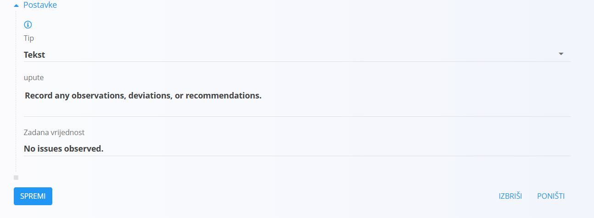

## Korak 8: Dodavanje kontrolne točke tipa Privitak

Kontrolne točke tipa **Privitak** zahtijevaju prijenos datoteke ili slike.

Primjeri:

- Fotografija proizvoda
- Izvještaj o kontroli
- Certifikat
- Potpisani dokument

Prilikom izrade kontrolne točke:

- Unesite **Naziv**.
- Odaberite **Tip = Privitak**.

### Primjer

- **Naziv:** Fotografija gotovog proizvoda
- **Upute:** Prenesite fotografiju gotovog proizvoda radi sljedivosti.

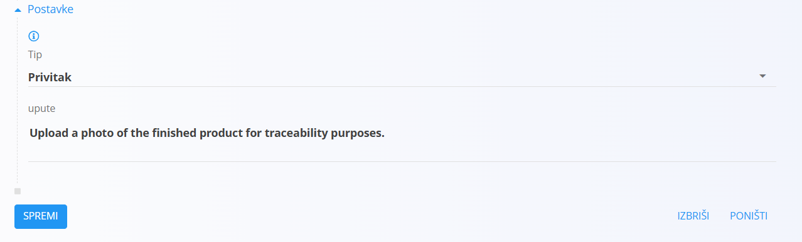

## Korak 9: Dodavanje kontrolnog popisa u proces

Nakon konfiguracije kontrolni se popis može dodijeliti verziji procesa.

Otvorite željenu **Verziju procesa** i odaberite kontrolni popis u odjeljku **Kvaliteta verzije**.

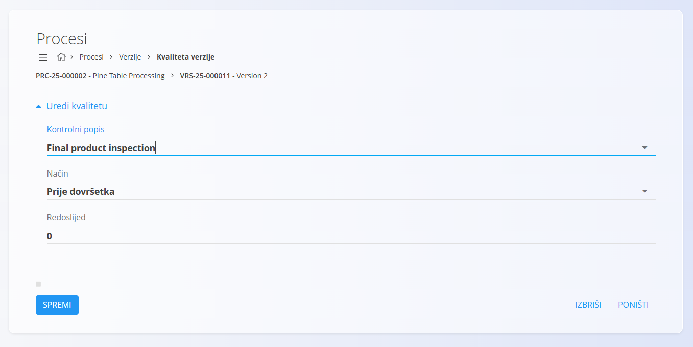

Tijekom izvršavanja procesa operater ispunjava sve kontrolne točke i unosi tražene podatke.

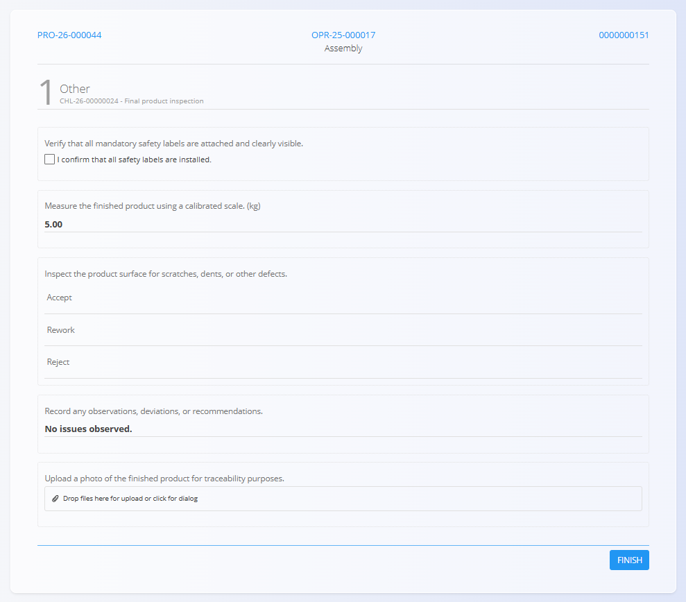

Rezultati se pohranjuju u sustav te su kasnije dostupni za pregled, sljedivost i reviziju.

## Sljedeći koraci

Za detaljnije informacije pogledajte:

- [**Kontrolni popisi**](KontrolniPopisi.md)
- [**Kontrolne točke**](KontrolneTocke.md)