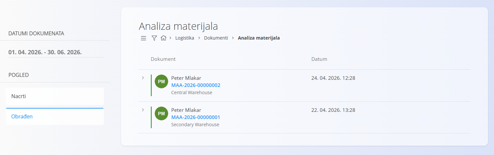
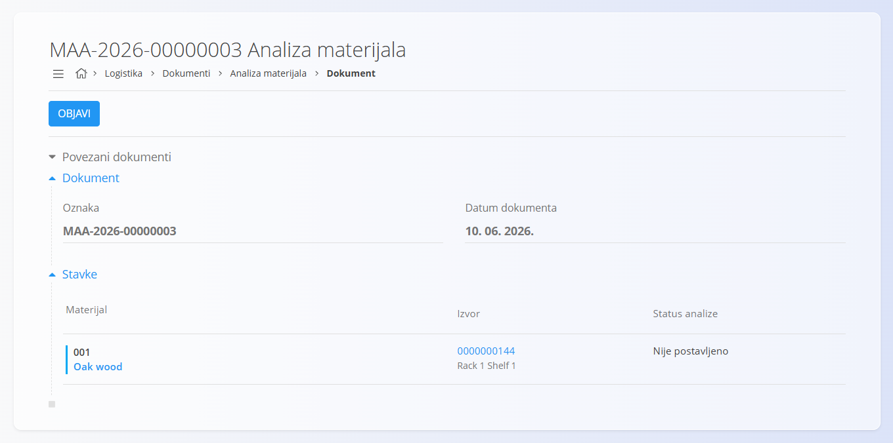
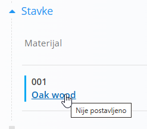
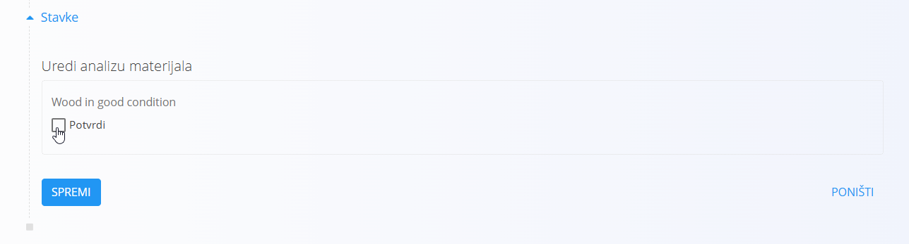
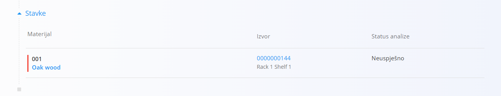
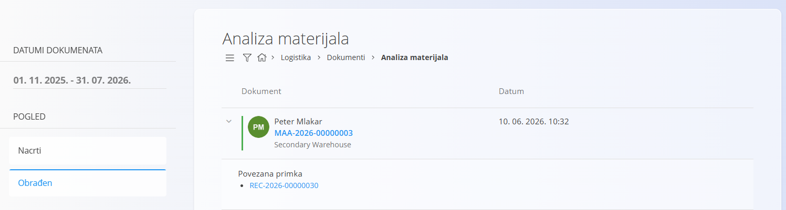

<!-- app_route: /warehouse/documents/material-analysis --> 
<!-- app_label: Analiza materijala --> 
<!-- canonical_source_url: https://github.com/Tom-PIT/Connected.Docs/blob/main/hr/Domene/Logistika/Dokumenti/AnalizaMaterijala.md --> 
<!-- canonical_source_title: Analiza materijala -->

# Analiza materijala

Dokumenti **Analize materijala** sadrže materijale koji su zaprimljeni i zahtijevaju analizu ili ispitivanje prema pravilima definiranim u **[Analizi materijala](../Upravljanje/UpravljanjeAnalizamaMaterijala.md)**. Na ovom zaslonu možete pregledati potrebne provjere, označiti materijale koji su uspješno prošli analizu te objaviti rezultate.

> [!NOTE]
> Dokumenti analize materijala automatski se stvaraju prilikom zaprimanja materijala za koje je analiza definirana u **[Analizi materijala](../Upravljanje/UpravljanjeAnalizamaMaterijala.md)**.

> [!TIP]
> Za potpuni prikaz rada pogledajte video **[Analiza materijala](https://www.youtube.com/watch?v=aJhceUVcusw)**.

Za pristup dokumentu **Analiza materijala** idite na **Logistika / Dokumenti / Analiza materijala** u [navigaciji](../../../Zajednicko/UI/Navigacija.md).

## Shema

| Polje | Opis |
|-------|------|
| [**Oznaka**](../../../Zajednicko/UI/OznakeDokumenata.md) | Sistemski generirana oznaka dokumenta analize materijala. |
| **Datum dokumenta** | Datum kreiranja dokumenta analize materijala. |
| [**Materijal**](../../RobaIUsluge/Materijali/README.md) | Materijal koji se analizira. |
| **Izvor** | Serijski broj zaprimljenog materijala. |
| **Status analize** | Status analize: **Nije postavljeno**, **Uspješno** ili **Neuspješno**. |

## Popis dokumenata analize materijala

Popis prikazuje sve dokumente analize materijala koji su automatski kreirani prilikom zaprimanja materijala za koje je definirana analiza. Za pronalaženje pojedinog dokumenta koristite pretraživanje ili filtre.

## Provesti analizu materijala

1. Kliknite dokument na popisu nacrta kako biste ga otvorili.

   

2. Kliknite materijal koji želite analizirati ako dokument sadrži više materijala.

   

3. Označite potvrdni okvir ako je materijal uspješno prošao analizu, a zatim kliknite **Spremi**.

   Status analize mijenja se u **Uspješno**, a materijal je na popisu označen zelenom bojom.

   

   - Ako materijal nije prošao analizu, ostavite potvrdni okvir neoznačen i kliknite **Spremi**. Status analize mijenja se u **Neuspješno**, a materijal je na popisu označen crvenom bojom. Nakon objave dokumenta prikazuje se kao neuspješan na popisu obrađenih dokumenata.

     

4. Nakon što su završene sve potrebne analize, kliknite **Objavi** kako biste dovršili dokument analize materijala. Dokument se premješta na popis obrađenih dokumenata.

   

## Izbrisati analizu materijala

Dokumente analize materijala nije moguće izbrisati.