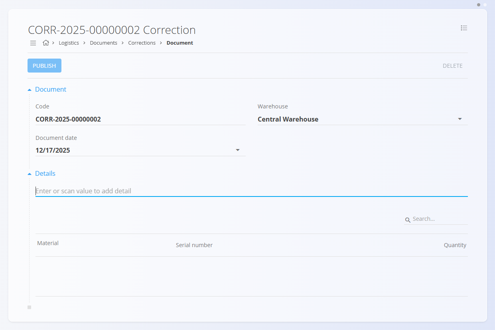
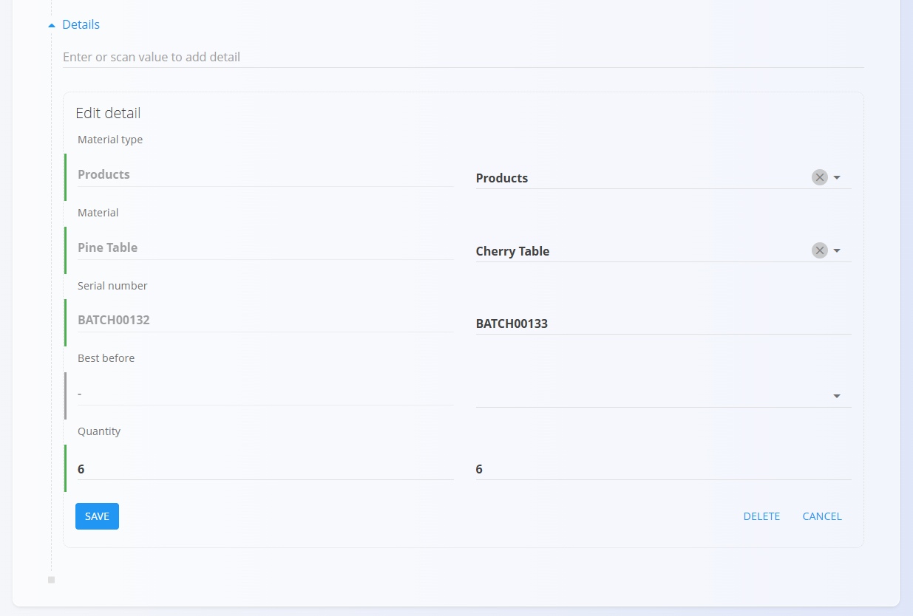

<!-- app_route: /warehouse/documents/corrections --> 
<!-- app_label: Corrections --> 
<!-- canonical_source_url: https://github.com/Tom-PIT/Connected.Docs/blob/main/hr/Domene/Logistika/Dokumenti/Corrections.md --> 
<!-- canonical_source_title: Corrections -->

# Corrections

**Corrections** su logistički dokumenti koji se koriste za usklađivanje stanja zaliha kada fizičko stanje ne odgovara stanju evidentiranom u sustavu (npr. razlike utvrđene tijekom brojanja, pogrešan materijal ili pogrešno označavanje). Objavom korekcije ažuriraju se zalihe u skladištu kako bi odražavale stvarne količine i svojstva materijala.

Koristite **Corrections** za:

- Povećanje ili smanjenje količine na zalihi za određene serijske brojeve ili artikle
- Ažuriranje svojstava, poput roka upotrebe, ako je materijal pogrešno označen
- Ispravljanje razlika u skladišnim lokacijama nakon fizičkog brojanja

> [!NOTE]
> **Corrections** utječu na stanje zaliha nakon objave. Sustav ažurira količine i svojstva materijala na temelju unesenih promjena.

Za pristup dokumentima **Corrections** idite na **Logistika / Dokumenti / Corrections** u [navigaciji](../../../Zajednicko/UI/Navigacija.md).

## Shema

<strong>Dokument</strong>

| Polje | Opis |
|-------|------|
| [**Oznaka**](../../../Zajednicko/UI/OznakeDokumenata.md) | Automatski generirana oznaka dokumenta. |
| **[Skladište](../Upravljanje/Skladista.md)** | Skladište na koje se korekcija odnosi (obavezno). |
| **Datum dokumenta** | Datum dokumenta korekcije. |

<strong>Stavke</strong>

Svaka stavka definira materijal i korekciju koja će se primijeniti.

| Polje | Opis |
|-------|------|
| **Tip materijala** | Kategorija materijala, npr. [Proizvodi](../../RobaIUsluge/Materijali/Proizvodi.md), [Poluproizvodi](../../RobaIUsluge/Materijali/Poluproizvodi.md), [Sirovine](../../RobaIUsluge/Materijali/Sirovine.md) ili [Repro materijali](../../RobaIUsluge/Materijali/ReproMaterijali.md). |
| **Materijal** | Odabrani materijal (npr. Pine table) iz kataloga [Imovine](../../RobaIUsluge/Materijali/Imovina.md). |
| **Serijski broj** | Serijski broj na koji se korekcija odnosi, ako materijal koristi serijske brojeve. |
| **Upotrebljivo najmanje do** | Rok upotrebe, ako je primjenjivo za kvarljive materijale. |
| **Skladišna lokacija** | Lokacija u skladištu (polica ili pozicija) na kojoj se materijal nalazi. Pogledajte [Lokacije](../Upravljanje/Lokacije.md). |
| **Količina** | Količina koja se ispravlja (ovisno o konfiguraciji unosi se konačna količina ili razlika). |

## Popis dokumenata Corrections

Popis prikazuje postojeće dokumente **Corrections** s mogućnošću filtriranja prema datumu, skladištu i statusu (Nacrt / Obrađeno). Dokumente možete pronaći pretraživanjem prema oznaci ili materijalu.

## Radnje

### Stvoriti dokument Corrections

Stvorite dokument **Corrections** kada se stvarno stanje zaliha razlikuje od stanja evidentiranog u sustavu.

1. Idite na **Logistika / Dokumenti / Corrections**.
2. Kliknite [akcijski gumb](../../../Zajednicko/UI/AkcijskiGumb.md) za stvaranje novog dokumenta u statusu **Nacrt**.

    

3. Ispunite odjeljak **Dokument**.

4. Dodajte stavke u odjeljak **Stavke**. U polje za unos upišite ili skenirajte **serijski broj**, **EAN** ili **naziv materijala**.
   - Sustav prikazuje **sve odgovarajuće materijale i serijske brojeve**. Ako postoji više rezultata, odaberite odgovarajući s popisa.
   - Uredite podatke o stavci te prema potrebi promijenite **Materijal**, **Serijski broj** ili **Količinu**.

   

5. Kliknite **Spremi** kako biste spremili stavku. Ponovite korak 4 za dodavanje dodatnih stavki.

6. Kliknite **Objavi** kako biste primijenili korekcije.

Objavom dokumenta ažurira se stanje zaliha kako bi odgovaralo stvarnim količinama i svojstvima materijala. Dokument se premješta u prikaz **Obrađeno**.

> [!IMPORTANT]
> Nakon objave stanje zaliha se ažurira. Količine se povećavaju ili smanjuju kako bi odgovarale korekciji, a podaci o serijskim brojevima i lokacijama također se ažuriraju.

## Urediti dokument Corrections

1. Kliknite **Oznaku** dokumenta kako biste ga otvorili.
2. Dok je dokument u statusu **Nacrt**, po potrebi izmijenite zaglavlje i stavke.
3. Kliknite **Spremi** kako biste spremili promjene.

## Izbrisati dokument Corrections

- Dokumente **Corrections** u statusu **Nacrt** možete izbrisati sa zaslona za uređivanje klikom na **Izbriši**. Nakon potvrde dokument se uklanja iz sustava bez utjecaja na stanje zaliha.
- Dokumenti **Corrections** u statusu **Obrađeno** ne mogu se izbrisati.