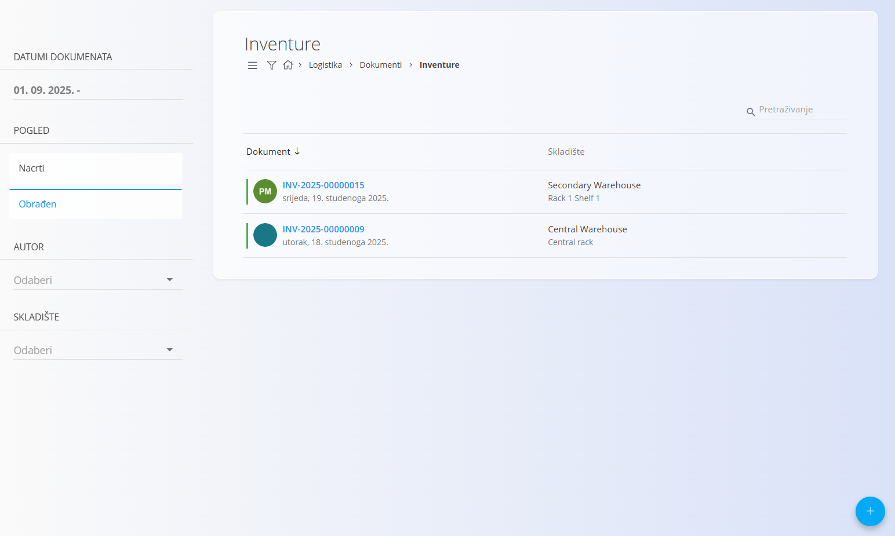
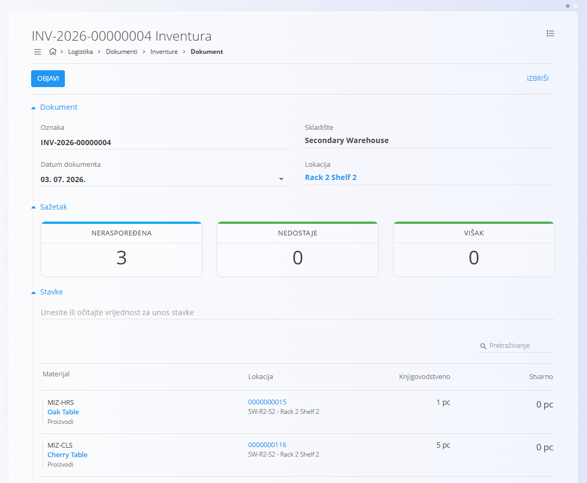
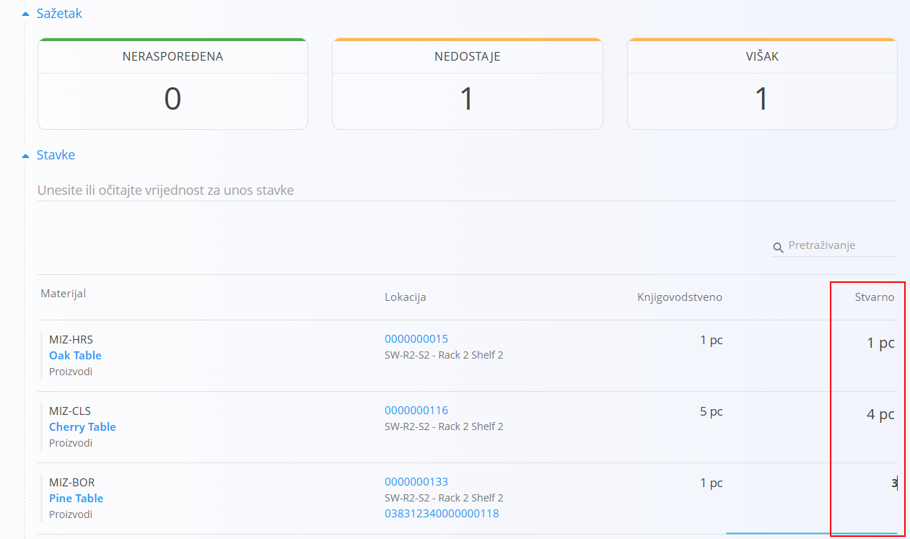

<!-- app_route: /warehouse/documents/inventories --> 
<!-- app_label: Inventure --> 
<!-- canonical_source_url: https://github.com/Tom-PIT/Connected.Docs/blob/main/hr/Domene/Logistika/Dokumenti/Inventure.md --> 
<!-- canonical_source_title: Inventure -->

# Inventure

Dokument **Inventura** koristi se za provjeru i usklađivanje količina zaliha na određenoj skladišnoj lokaciji. Uspoređuje **knjigovodstveno stanje** evidentirano u sustavu sa **stvarnim stanjem** utvrđenim fizičkim popisom. Ako se utvrde razlike, možete ažurirati količine i objaviti dokument kako biste uskladili stanje zaliha.

Inventura se provodi za pojedinu skladišnu lokaciju i prikazuje sve materijale pohranjene na toj lokaciji, zajedno s prikazom manjkova i viškova. Iz povezanih zaslona možete otvoriti **[Pogled na zalihe prema lokacijama](../Pogledi/PogledNaZalihePremaLokacijama.md)** ili **[Pogled na zalihe prema serijskom broju](../Pogledi/Zaliha.md#pogled-na-zalihe-prema-serijskom-broju)** kako biste provjerili kako je stanje zaliha nastalo. Minimalne i maksimalne granice prikazane u sažetku mogu se konfigurirati u šifrarniku **[Granice zalihe](../Upravljanje/GraniceZalihe.md)**.

> [!TIP]
> Za potpuni prikaz funkcionalnosti pogledajte video **[Inventory](https://www.youtube.com/watch?v=Rc4qqTdxKn8)**.

Za pristup dokumentu **Inventure** idite na **Logistika / Dokumenti / Inventure** u [navigaciji](../../../Zajednicko/UI/Navigacija.md).

## Shema

<strong>Dokument</strong>

| Polje | Opis |
|-------|------|
| [**Oznaka**](../../../Zajednicko/UI/OznakeDokumenata.md) | Jedinstvena oznaka inventurnog dokumenta koju automatski dodjeljuje sustav. |
| **Datum dokumenta** | Datum provođenja ili evidentiranja inventure. |
| [**Skladište**](../Upravljanje/Skladista.md) | Skladište u kojem se provodi inventura. |
| [**Lokacija**](../Upravljanje/Lokacije.md) | Lokacija unutar odabranog skladišta na kojoj se provodi inventura. |

<strong>Stavke</strong>

| Polje | Opis |
|-------|------|
| [**Materijal**](../../Sredstva/Materijali/README.md) | Materijal pohranjen na odabranoj lokaciji (proizvod, poluproizvod, sirovina ili repro materijal). |
| **Lokacija** | Lokacija na kojoj se provodi inventura. |
| **Knjigovodstveno** | Količina trenutno evidentirana u sustavu. |
| **Stvarno** | Fizički utvrđena količina. Ovo polje moguće je uređivati. |

## Pregled inventura

Stranica **Inventure** prikazuje sve inventurne dokumente.

Popis možete filtrirati pomoću lijevog panela:

- **Datumi dokumenata**
- **Pogled**
    - **Nacrti** — dokumenti koji još nisu objavljeni.
    - **Obrađeni** — objavljene inventure.
- **Autor**
- **Skladište**

Boja indikatora uz dokument označava njegov status:

- **Zelena** — obrađen dokument.
- **Siva** — nacrt.

Kliknite dokument za pregled njegovih pojedinosti.

## Akcije

### Izrada inventure

1. Kliknite [akcijski gumb](../../../Zajednicko/UI/AkcijskiGumb.md) za stvaranje nove inventure.

2. Odaberite **Skladište** i **Lokaciju**. Sustav automatski učitava sve materijale evidentirane na odabranoj lokaciji.

   

3. U odjeljku **Sažetak** prikazano je trenutno stanje inventure:

    - **Neraspoređeno** — materijali koji još nisu pregledani.
    - **Nedostaje** — materijali kod kojih je stvarna količina manja od knjigovodstvene.
    - **Višak** — materijali kod kojih je stvarna količina veća od knjigovodstvene.

4. U odjeljku **Stavke** provjerite svaki materijal i ažurirajte vrijednost u stupcu **Stvarno** tako da odgovara stvarnom stanju na lokaciji.

   Stupac **Knjigovodstveno** služi samo za pregled i nije ga moguće uređivati. Tijekom unosa vrijednosti podaci u odjeljku **Sažetak** automatski se ažuriraju.

   

   Za više informacija o radu sa stavkama pogledajte [**Stavke dokumenta**](../../../Zajednicko/Koncepti/StavkeDokumenta.md).

5. Nakon što su svi materijali pregledani i unesene stvarne količine, kartica **Neraspoređeno** postaje zelena i prikazuje vrijednost **0**.

6. Kliknite **Objavi** kako biste potvrdili inventuru. Sustav usklađuje stanje zaliha tako da knjigovodstvene količine prilagodi stvarno utvrđenom stanju.

Nova inventura najprije se prikazuje u prikazu **Nacrti**. Nakon objave prelazi u prikaz **Obrađeni**, a stanje zaliha automatski se usklađuje.

> [!NOTE]
> Vrijednosti prikazane u karticama **Nedostaje** i **Višak** predstavljaju broj različitih materijala kod kojih su utvrđena odstupanja. Ne prikazuju broj komada koji nedostaju ili su u višku.

## Uređivanje inventure

Kliknite oznaku dokumenta kako biste otvorili njegove pojedinosti.

Dok je inventura u statusu **Nacrt**, moguće je uređivati podatke zaglavlja i stvarne količine u stavkama. Iz izbornika je moguće ispisati dokument ili ga izvesti u PDF.

#### Napomene

Odjeljak **Napomene** služi za unos dodatnih informacija vezanih uz inventuru.

### Brisanje inventure

- Inventuru u statusu **Nacrt** moguće je izbrisati klikom na **Izbriši**. Nakon potvrde dokument se uklanja iz sustava bez utjecaja na stanje zaliha.
- Obrađene inventure nije moguće izbrisati niti stornirati.

## Izbornik

Izbornik sadrži dodatne akcije dostupne na ovoj stranici.

Dostupne su sljedeće akcije:

- **Ispis**
- **Izvoz u PDF**

Za više informacija pogledajte [**Radnje izbornika**](../../../Zajednicko/Koncepti/RadnjeIzbornika.md).