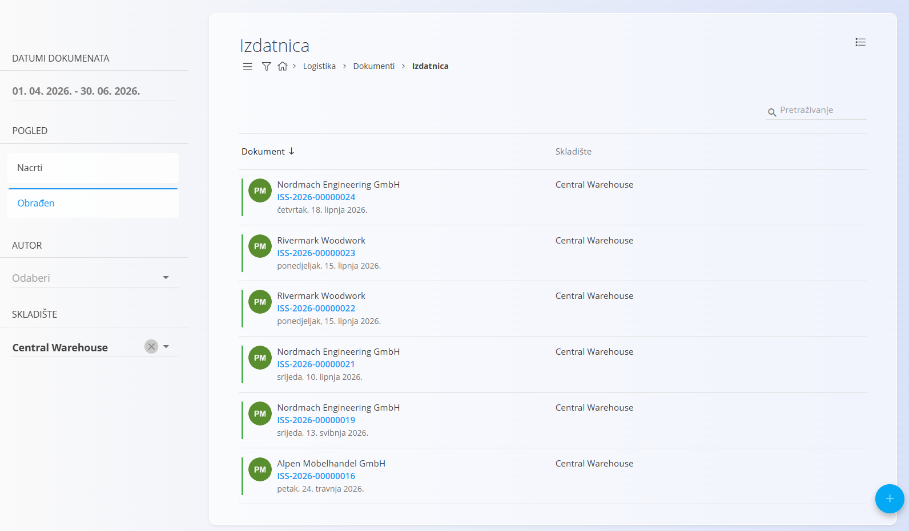
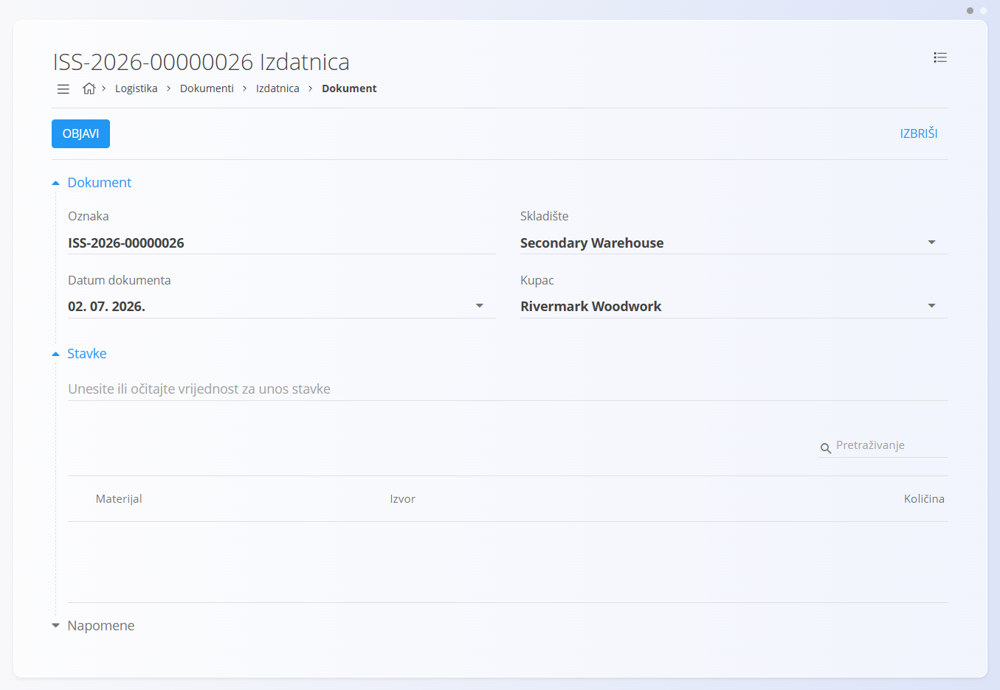
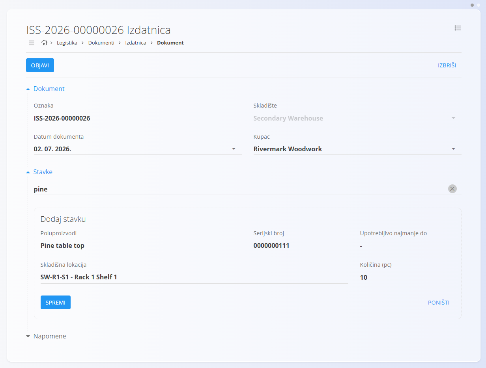
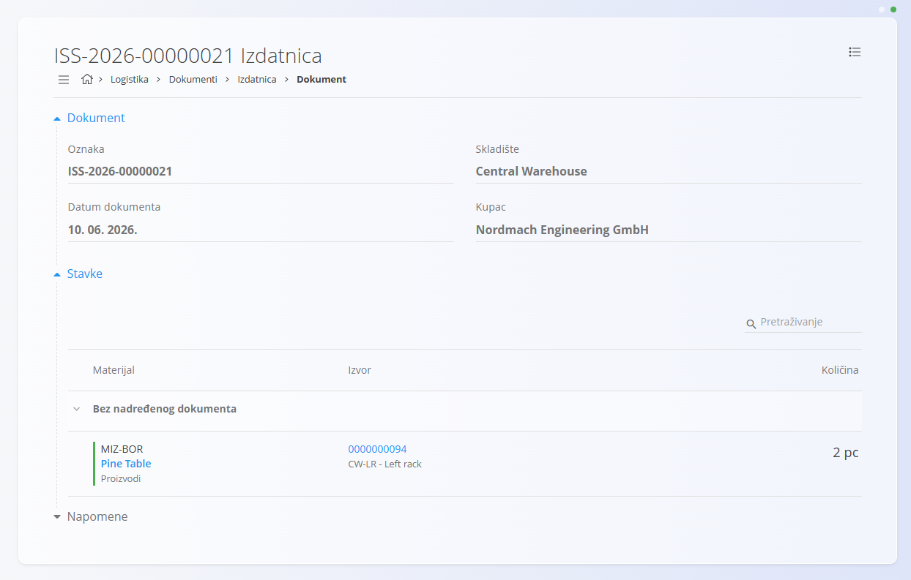

<!-- app_route: /warehouse/documents/issues --> 
<!-- app_label: Izdatnica --> 
<!-- canonical_source_url: https://github.com/Tom-PIT/Connected.Docs/blob/main/hr/Domene/Logistika/Dokumenti/Izdatnica.md --> 
<!-- canonical_source_title: Izdatnica -->

# Izdatnica

Dokument **Izdatnica** koristi se za evidentiranje izdavanja materijala iz skladišta, primjerice za isporuku kupcu. Kada proizvodi, poluproizvodi, sirovine ili repro materijali napuštaju skladište, izdatnica bilježi sve potrebne podatke o izdavanju i osigurava potpunu sljedivost.

Tijekom izdavanja odabirete ili skenirate materijal koji se izdaje, potvrđujete odgovarajući serijski broj te unosite količinu za izdavanje. Nakon objave dokumenta stanje zalihe automatski se ažurira.

> [!TIP]
> Za potpuni prikaz rada pogledajte video **[Issue](https://www.youtube.com/watch?v=SrVyblBiLmQ)**.

Za pristup dokumentu **Izdatnica** idite na **Logistika / Dokumenti / Izdatnica** u [navigaciji](../../../Zajednicko/UI/Navigacija.md).

## Shema

<strong>Dokument</strong>

| Polje | Opis |
|-------|------|
| [**Oznaka**](../../../Zajednicko/UI/OznakeDokumenata.md) | Jedinstvena oznaka dokumenta koju automatski dodjeljuje sustav. |
| **Datum dokumenta** | Datum izrade izdatnice. |
| [**Skladište**](../Upravljanje/Skladista.md) | Skladište iz kojeg se izdaje materijal (obavezno). |
| **Kupac** | Kupac kojem se izdaje materijal, odabire se iz [Poslovnog imenika](../../../Zajednicko/Upravljanje/PoslovniImenik.md) (obavezno). |
| **Napomene** | Dodatne napomene vezane uz dokument. |

<strong>Stavke</strong>

| Polje | Opis |
|-------|------|
| [**Materijal**](../../Sredstva/Materijali/README.md) | Materijal koji se izdaje ([proizvod](../../Sredstva/Materijali/Proizvodi.md), [poluproizvod](../../Sredstva/Materijali/Poluproizvodi.md), [sirovina](../../Sredstva/Materijali/Sirovine.md) ili [repro materijal](../../Sredstva/Materijali/ReproMaterijali.md)). |
| **Serijski broj** | Odabrani serijski broj materijala koji se izdaje. |
| **Upotrebljivo najmanje do** | Datum isteka roka trajanja, ako je definiran. |
| [**Skladišna lokacija**](../Upravljanje/Lokacije.md) | Lokacija na kojoj se nalazi odabrani materijal. |
| **Količina (kom)** | Količina koja se izdaje. |

## Popis izdatnica

Na stranici **Izdatnica** prikazani su svi dokumenti izdatnica. Dokument možete pronaći pomoću pretraživanja ili filtriranjem pomoću lijevog panela.

Dostupni su sljedeći filtri:

- **Datumi dokumenata**
- **Pogled**
    - **Nacrti** — dokumenti koji još nisu objavljeni.
    - **Obrađeni** — objavljeni dokumenti.
- **Autor**
- **Skladište**

Pokraj svakog dokumenta prikazan je indikator statusa:

- **Zelena** — obrađen dokument.
- **Siva** — nacrt.

Kliknite dokument za pregled njegovih pojedinosti.

## Akcije

### Izrada izdatnice

1. Kliknite [akcijski gumb](../../../Zajednicko/UI/AkcijskiGumb.md) za izradu novog dokumenta.
2. Odaberite **Skladište** i **Kupca**.

    

3. U polje za unos stavki upišite ili skenirajte serijski broj, EAN ili naziv materijala.
4. Sustav prikazuje odgovarajuće materijale i serijske brojeve.
5. Odaberite materijal.
6. Sustav automatski popunjava podatke o materijalu.

    

    Za više informacija o radu sa stavkama pogledajte [**Stavke dokumenta**](../../../Zajednicko/Koncepti/StavkeDokumenta.md).

7. Unesite **Količinu**.
8. Kliknite **Spremi**.
9. Po potrebi ponovite postupak za dodatne stavke.
10. Kliknite **Objavi**.

Nakon izrade dokument je dostupan u prikazu **Nacrti**. Nakon objave automatski prelazi u prikaz **Obrađeni**.

#### Privici

Odjeljak **Privici** omogućuje dodavanje datoteka povezanih s dokumentom, poput fotografija, PDF dokumenata ili druge prateće dokumentacije.

Za više informacija pogledajte [**Privici**](../../../Zajednicko/Koncepti/Privici.md).

#### Napomene

Odjeljak **Napomene** služi za unos dodatnih informacija vezanih uz dokument.

### Uređivanje izdatnice

Kliknite oznaku dokumenta za otvaranje njegovih pojedinosti.

Na zaslonu možete:

- pregledati podatke dokumenta
- pregledati stavke dokumenta
- uređivati dokumente u statusu **Nacrt**
- ispisati dokument
- izvesti dokument u PDF
- pregledavati obrađene dokumente

### Brisanje izdatnice

Izdatnicu u statusu **Nacrt** moguće je izbrisati samo ako ne sadrži nijednu stavku.

Ako dokument sadrži stavke:

1. Uklonite sve stavke dokumenta.
2. Kliknite **Izbriši**.

> [!NOTE]
> Obrađene izdatnice nije moguće izbrisati. Za poništavanje izdavanja koristite akciju **Storniraj izdatnicu**.

## Izbornik

Izbornik sadrži dodatne akcije dostupne na ovoj stranici.

Dostupne su sljedeće akcije:

- **Ispis**
- **Izvoz u PDF**
- **Izbriši sve stavke**
- **Storniraj izdatnicu**

Za više informacija pogledajte [**Akcije izbornika**](../../../Zajednicko/Koncepti/AkcijeIzbornika.md).
