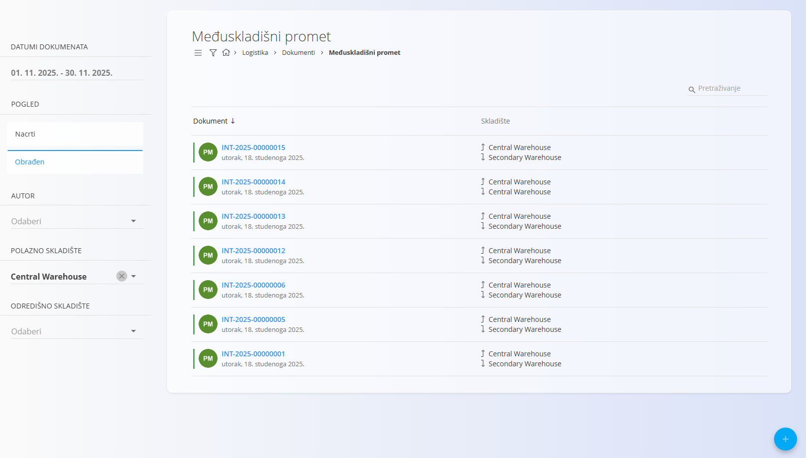
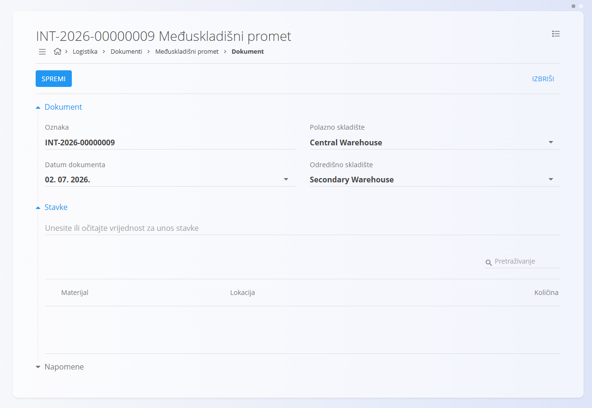
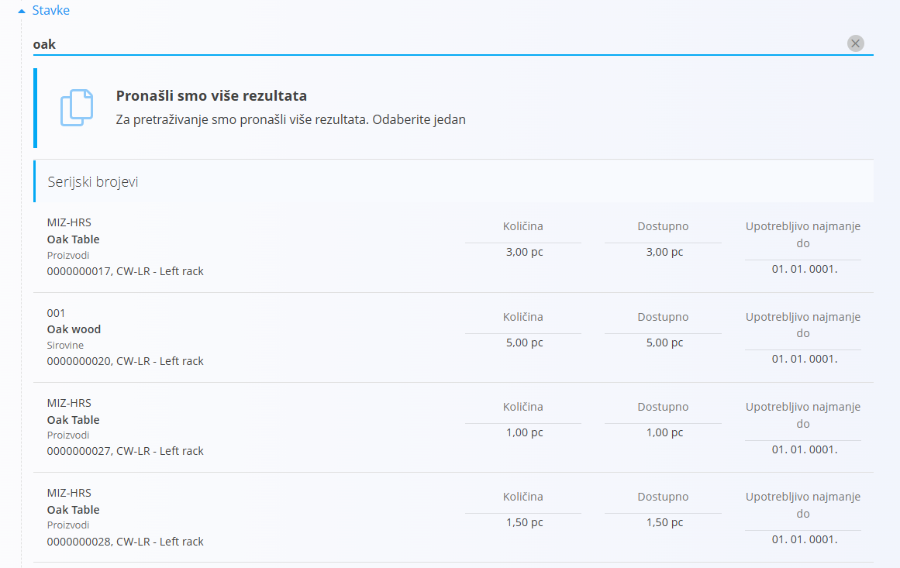
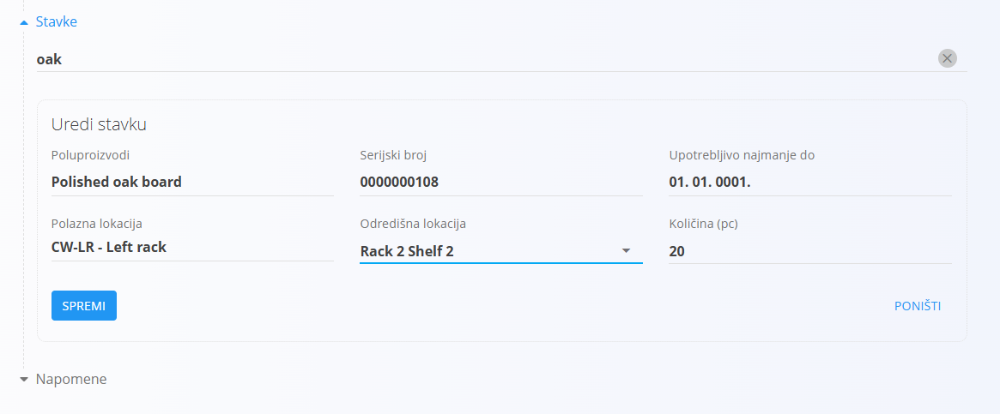

<!-- app_route: /warehouse/documents/inters --> 
<!-- app_label: Međuskladišni promet --> 
<!-- canonical_source_url: https://github.com/Tom-PIT/Connected.Docs/blob/main/hr/Domene/Logistika/Dokumenti/MeduskladisniPromet.md --> 
<!-- canonical_source_title: Međuskladišni promet -->

# Međuskladišni promet

Dokument **Međuskladišni promet** koristi se za prijenos materijala između skladišta. Omogućuje premještanje proizvoda, poluproizvoda, sirovina i repro materijala iz jednog skladišta u drugo uz automatsko ažuriranje stanja zaliha nakon objave dokumenta.

Tijekom prijenosa odabirete polazno i odredišno skladište, zatim skeniranjem ili pretraživanjem dodajete materijale koje želite premjestiti. Za svaku stavku možete odabrati odredišnu skladišnu lokaciju i količinu za prijenos.

> [!TIP]
> Za potpuni prikaz rada pogledajte video **[Inter warehouse](https://www.youtube.com/watch?v=xtyKDh7_qgI)**.

Za pristup dokumentu **Međuskladišni promet** idite na **Logistika / Dokumenti / Međuskladišni promet** u [navigaciji](../../../Zajednicko/UI/Navigacija.md).

## Shema

<strong>Dokument</strong>

| Polje | Opis |
|-------|------|
| [**Oznaka**](../../../Zajednicko/UI/OznakeDokumenata.md) | Jedinstvena oznaka dokumenta koju automatski dodjeljuje sustav. |
| **Datum dokumenta** | Datum prijenosa između skladišta. |
| [**Polazno skladište**](../Upravljanje/Skladista.md) | Skladište iz kojeg se materijal premješta (obavezno). |
| [**Odredišno skladište**](../Upravljanje/Skladista.md) | Skladište u koje se materijal premješta (obavezno). |
| **Napomene** | Dodatne napomene vezane uz dokument. |

<strong>Stavke</strong>

| Polje | Opis |
|-------|------|
| [**Materijal**](../../RobaIUsluge/Materijali/README.md) | Materijal koji se premješta ([proizvod](../../RobaIUsluge/Materijali/Proizvodi.md), [poluproizvod](../../RobaIUsluge/Materijali/Poluproizvodi.md), [sirovina](../../RobaIUsluge/Materijali/Sirovine.md) ili [repro materijal](../../RobaIUsluge/Materijali/PomocniProizvodi.md)). |
| **Serijski broj** | Serijski broj odabranog materijala. |
| **Upotrebljivo najmanje do** | Datum isteka roka trajanja, ako je definiran. |
| [**Polazna lokacija**](../Upravljanje/Lokacije.md) | Lokacija na kojoj se materijal trenutno nalazi. |
| [**Odredišna lokacija**](../Upravljanje/Lokacije.md) | Lokacija na koju će materijal biti premješten. |
| **Količina (kom)** | Količina koja se premješta. |

## Pregled međuskladišnih prijenosa

Na stranici **Međuskladišni promet** prikazani su svi dokumenti prijenosa između skladišta. Dokument možete pronaći pomoću pretraživanja ili filtriranjem pomoću lijevog panela.

Dostupni su sljedeći filtri:

- **Datumi dokumenata**
- **Pogled**
    - **Nacrti** — dokumenti koji još nisu objavljeni.
    - **Obrađeni** — objavljeni dokumenti.
- **Autor**
- **Polazno skladište**
- **Odredišno skladište**

Pokraj svakog dokumenta prikazan je indikator statusa:

- **Zelena** — obrađen dokument.
- **Siva** — nacrt.

Za svaki dokument prikazana su polazno i odredišno skladište.

Kliknite dokument za pregled njegovih pojedinosti.

## Akcije

### Izrada međuskladišnog prijenosa

1. Kliknite [akcijski gumb](../../../Zajednicko/UI/AkcijskiGumb.md) za izradu novog dokumenta.
2. Odaberite **Polazno skladište** i **Odredišno skladište**.

    

3. U odjeljku **Stavke** upišite ili skenirajte serijski broj, EAN ili naziv materijala.
4. Ako je pronađen samo jedan odgovarajući materijal, sustav automatski otvara obrazac za uređivanje stavke.
5. Ako je pronađeno više odgovarajućih materijala, prikazuje se popis rezultata.

    

6. Odaberite željeni materijal.
7. Sustav automatski popunjava podatke o materijalu.

    

8. Po potrebi promijenite **Odredišnu lokaciju** ili **Količinu**.
9. Kliknite **Spremi** za dodavanje stavke u dokument.
10. Po potrebi ponovite postupak za dodatne stavke.
11. Kliknite **Spremi** za spremanje dokumenta.
12. Kada je prijenos između skladišta izvršen, otvorite dokument i kliknite **Objavi**.

Nakon izrade dokument je dostupan u prikazu **Nacrti**. Nakon objave automatski prelazi u prikaz **Obrađeni**, a stanje zaliha u oba skladišta se ažurira.

#### Napomene

Odjeljak **Napomene** služi za unos dodatnih informacija vezanih uz dokument.

### Brisanje međuskladišnog prijenosa

Dokument u statusu **Nacrt** moguće je izbrisati samo ako ne sadrži nijednu stavku.

Ako dokument sadrži stavke:

1. Otvorite stavku.
2. Kliknite **Izbriši**.
3. Ponovite postupak za sve preostale stavke.
4. Nakon uklanjanja svih stavki kliknite **Izbriši** za brisanje dokumenta.

> [!NOTE]
> Obrađene dokumente nije moguće izbrisati.

## Izbornik

Izbornik sadrži dodatne akcije dostupne na ovoj stranici.

Dostupne su sljedeće akcije:

- **Ispis**
- **Izvoz u PDF**

Za više informacija pogledajte [**Akcije izbornika**](../../../Zajednicko/Koncepti/RadnjeIzbornika.md).