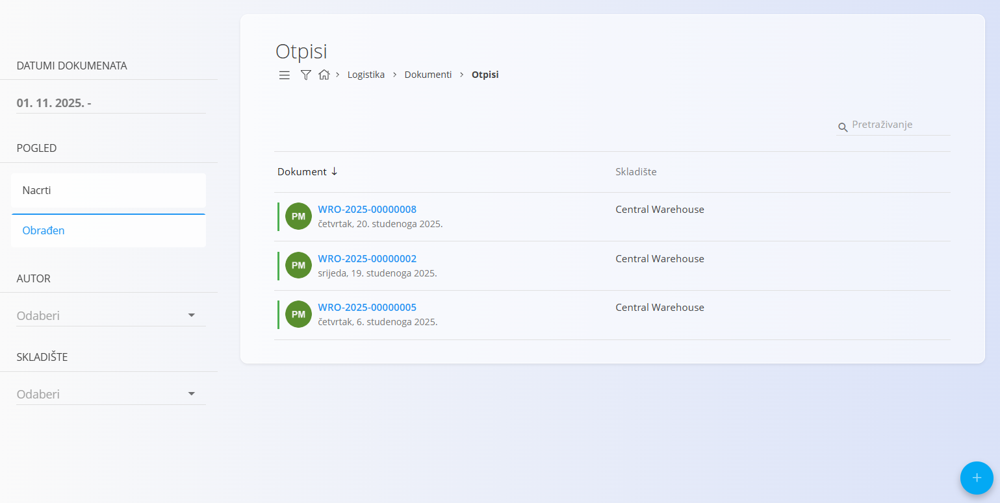
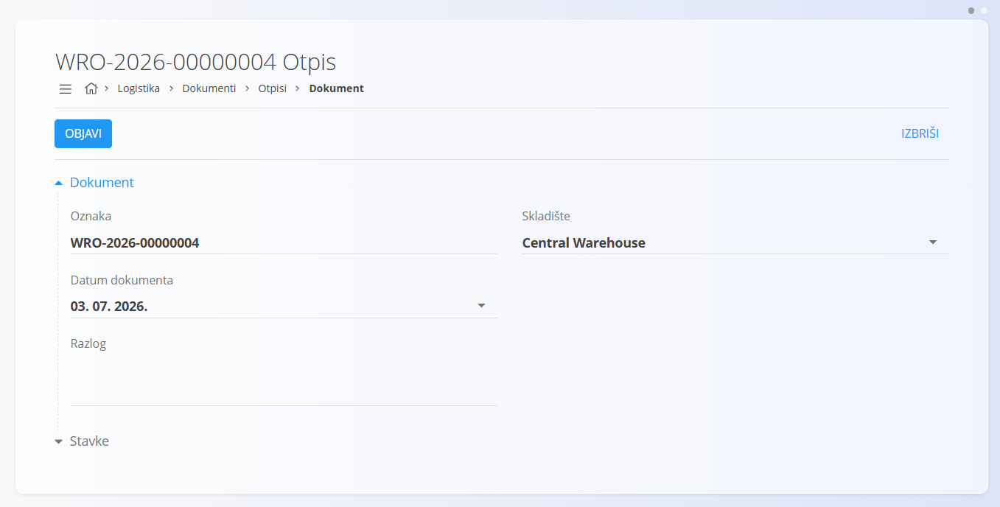
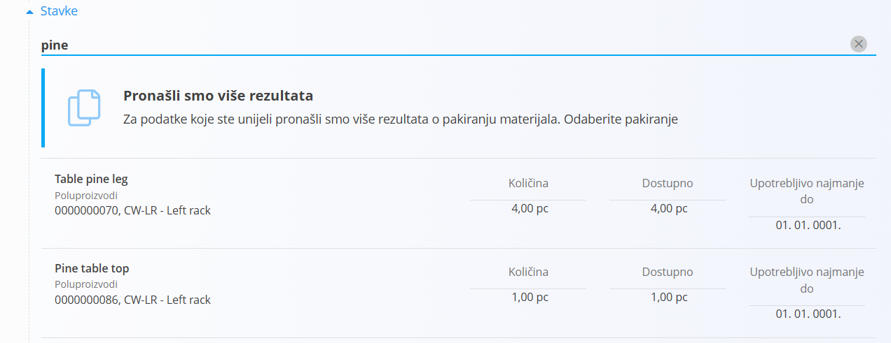
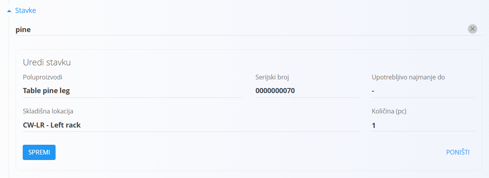

<!-- app_route: /warehouse/documents/writeoffs --> 
<!-- app_label: Otpisi --> 
<!-- canonical_source_url: https://github.com/Tom-PIT/Connected.Docs/blob/main/hr/Domene/Logistika/Dokumenti/Otpisi.md --> 
<!-- canonical_source_title: Otpisi -->

# Otpisi

Dokument **Otpis** koristi se za evidentiranje materijala koji se mora ukloniti sa zalihe jer je oštećen, izgubljen, istekao mu je rok trajanja ili se iz nekog drugog razloga više ne može koristiti. Tipični primjeri uključuju **oštećene proizvode**, **pokvarenu robu** ili **materijal oštećen tijekom rukovanja**. Otpis omogućuje unos razloga, odabir materijala i količine koju je potrebno ukloniti sa zalihe.

Otpisi izravno utječu na stanje zalihe. Ako je otpisana pogrešna količina, to se kasnije može ispraviti stvaranjem **djelomičnog ili potpunog storna** putem izbornika povezanih dokumenata. Također možete koristiti **[Pregled zalihe po materijalu](../Views/Stock.md#stock-view-by-material)** ili **[Pregled zalihe po serijskom broju](../Views/Stock.md#stock-view-by-serial-number)** kako biste provjerili kako je materijal došao do trenutnog stanja prije nego što izvršite otpis.

> [!TIP]
> Za cjelovit prikaz pogledajte video vodič **[Writeoffs](https://www.youtube.com/watch?v=_0jEGSTorsY)**.

Za pristup dokumentu **Otpisi** otvorite **Logistika / Dokumenti / Otpisi** u [navigaciji](../../../Zajednicko/UI/Navigacija.md).

## Shema

<strong>Dokument</strong>

| Polje | Opis |
|-------|------|
| [**Oznaka**](../../../Zajednicko/UI/OznakeDokumenata.md) | Jedinstvena oznaka dokumenta otpisa koju automatski generira sustav. |
| **Datum dokumenta** | Datum evidentiranja otpisa. |
| [**Skladište**](../Management/Warehouses.md) | Skladište iz kojeg se materijal otpisuje (obavezno). |
| **Razlog** | Razlog uklanjanja materijala sa zalihe (oštećenje, gubitak, istek roka trajanja i slično). |

<strong>Stavke</strong>

| Polje | Opis |
|-------|------|
| [**Materijal**](../../RobaIUsluge/Materijali/README.md) | Materijal koji se otpisuje ([proizvod](../../RobaIUsluge/Materijali/Proizvodi.md), [poluproizvod](../../RobaIUsluge/Materijali/Poluproizvodi.md), [sirovina](../../RobaIUsluge/Materijali/Sirovine.md) ili [pomoćni proizvodil](../../RobaIUsluge/Materijali/PomocniProizvodi.md)). |
| **Serijski broj** | Serijski broj odabrane jedinice. |
| **Upotrebljivo najmanje do** | Datum isteka roka trajanja, ako je primjenjivo. |
| [**Skladišna lokacija**](../Upravljanje/Lokacije.md) | Lokacija na kojoj se materijal nalazi. |
| **Količina (kom)** | Broj komada koji se otpisuje. Zadana vrijednost je ukupna raspoloživa količina na odabranoj lokaciji, ali je treba prilagoditi stvarnom broju komada koji se uklanja sa zalihe. |

## Popis dokumenata otpisa

Stranica **Otpisi** prikazuje sve dokumente otpisa. Pojedini dokument možete pronaći pomoću polja za pretraživanje ili filtrirati popis pomoću lijevog panela:

- **Datumi dokumenata**
- **Pogled**
  - *Nacrti* — dokumenti koji još nisu objavljeni
  - *Obrađeni* — objavljeni dokumenti otpisa
- **Autor**
- **Skladište**

Boja oznake prikazuje status dokumenta:

- **Zelena** — obrađen
- **Siva** — nacrt

Kliknite dokument kako biste otvorili njegove pojedinosti.

## Radnje

### Izrada dokumenta otpisa

1. Kliknite [akcijski gumb](../../../Zajednicko/UI/AkcijskiGumb.md) za izradu novog dokumenta otpisa.

   

2. Odaberite **Skladište** i po potrebi unesite **Razlog**.

3. U odjeljku **Stavke** skenirajte ili upišite **serijski broj**, **EAN** ili **naziv materijala**.
   - Ako postoji samo jedno podudaranje, sustav automatski popunjava podatke.
   - Ako postoji više podudaranja, prikazuje se popis za odabir.

     

4. Odaberite odgovarajuću stavku kako biste otvorili prozor **Uredi stavku**.

5. Prilagodite vrijednost **Količina (kom)** kako biste odredili broj oštećenih ili izgubljenih komada koji se otpisuju. Zadana vrijednost predstavlja ukupnu raspoloživu količinu.

   

   Više informacija o radu sa stavkama dokumenta potražite u dokumentu [**Stavke dokumenta**](../../../Zajednicko/Koncepcije/Stavke.md).

6. Kliknite **Spremi** za spremanje stavke. Po potrebi dodajte nove stavke ponavljanjem koraka 3.

7. Nakon što su sve stavke dodane i provjerene, kliknite **Objavi** kako biste dovršili otpis.

Objavljeni otpisi odmah ažuriraju stanje zalihe.

### Brisanje dokumenta otpisa

Nacrt dokumenta otpisa može se izbrisati na zaslonu za uređivanje, ali samo ako **ne sadrži nijednu stavku**.

Ako nacrt još uvijek sadrži stavke:

1. Kliknite serijski broj materijala kako biste otvorili prozor **Uredi stavku**.
2. Kliknite **Izbriši** kako biste uklonili stavku.
3. Ponovite postupak za sve preostale stavke.

Nakon što dokument više ne sadrži nijednu stavku, kliknite **Izbriši** za brisanje nacrta.

> [!NOTE]
> Obrađeni dokumenti **ne mogu se izbrisati**. Umjesto toga potrebno je izraditi [storno](Reversals.md).

## Izbornik

Izbornik sadrži dodatne radnje dostupne na ovoj stranici.

Dostupne radnje:

- **Kreiraj novi storno** (samo za obrađene dokumente)

Više informacija potražite u dokumentu [**Radnje izbornika**](../../../Zajednicko/Koncepcije/RadnjeIzbornika.md).