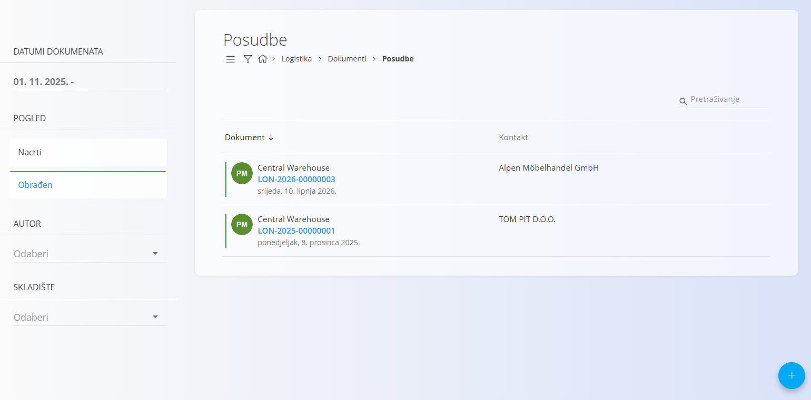
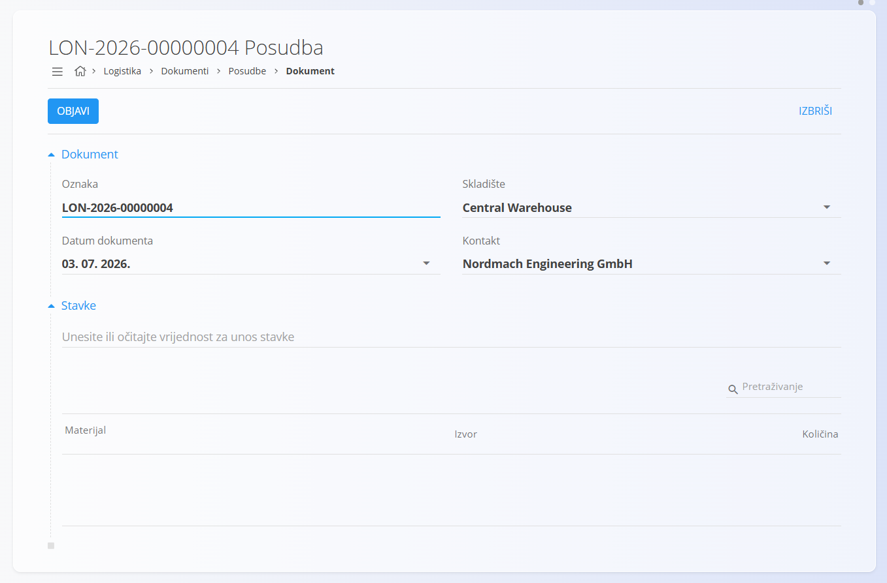
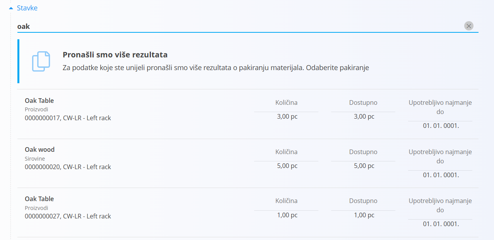
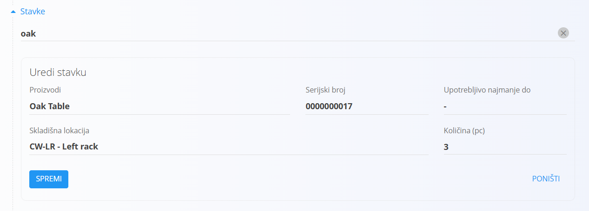
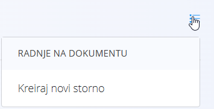

<!-- app_route: /warehouse/documents/loans --> 
<!-- app_label: Posudbe --> 
<!-- canonical_source_url: https://github.com/Tom-PIT/Connected.Docs/blob/main/hr/Domene/Logistika/Dokumenti/Posudbe.md --> 
<!-- canonical_source_title: Posudbe -->

# Posudbe

Dokument **Posudba** koristi se za evidentiranje materijala koji se privremeno posuđuje, primjerice opreme posuđene kupcu, alata koji se koristi izvan lokacije ili proizvoda danih na ispitivanje.

Kada se materijal posudi, postaje **rezerviran** i nije dostupan za druge procese sve dok se posudba ne stornira (povrat).

> [!TIP]
> Za cjelovit prikaz pogledajte video vodič **[Loans](https://www.youtube.com/watch?v=V0QfOaBJ4Rk)**.

Za pristup dokumentu **Posudbe** otvorite **Logistika / Dokumenti / Posudbe** u [navigaciji](../../../Zajednicko/UI/Navigacija.md).

## Shema

<strong>Dokument</strong>

| Polje | Opis |
|-------|------|
| [**Oznaka**](../../../Zajednicko/UI/OznakeDokumenata.md) | Jedinstvena oznaka dokumenta posudbe koju automatski generira sustav. |
| **Datum dokumenta** | Datum izrade dokumenta posudbe. |
| [**Skladište**](../Upravljanje/Skladista.md) | Skladište iz kojeg se materijal posuđuje (obavezno). |
| **Kontakt** | Kupac ili partner kojem se materijal posuđuje, odabran iz [Poslovnog imenika](../../../Zajednicko/Upravljanje/PoslovniImenik.md) (obavezno). |
| **Napomene** | Dodatne napomene vezane uz posudbu. |

<strong>Stavke</strong>

| Polje | Opis |
|-------|------|
| [**Materijal**](../../RobaIUsluge/Materijali/README.md) | Materijal koji se posuđuje (proizvod, sirovina, poluproizvod, repromaterijal i slično). |
| **Serijski broj** | Odabrani serijski broj za serijalizirani materijal. |
| **Upotrebljivo najmanje do** | Datum isteka roka trajanja, ako je primjenjivo. |
| [**Skladišna lokacija**](../Upravljanje/Lokacije.md) | Lokacija s koje se materijal preuzima. |
| **Količina (kom)** | Količina koja se posuđuje. Prije spremanja potrebno je unijeti odgovarajuću vrijednost. |

## Popis dokumenata posudbe

Stranica **Posudbe** prikazuje sve dokumente posudbe. Pojedini dokument možete pronaći pomoću polja za pretraživanje ili filtrirati popis pomoću lijevog panela:

- **Datumi dokumenata**
- **Pogled**
    - *Nacrti* — dokumenti koji još nisu objavljeni
    - *Obrađeni* — objavljeni dokumenti posudbe
- **Autor**
- **Skladište**

Boja oznake prikazuje status dokumenta:

- **Zelena** — obrađen
- **Siva** — nacrt

Kliknite dokument kako biste otvorili njegove pojedinosti.

## Radnje

### Izrada nove posudbe

1. Kliknite [akcijski gumb](../../../Zajednicko/UI/AkcijskiGumb.md) za izradu novog dokumenta posudbe te odaberite **Skladište** i **Kontakt**.

   

2. U odjeljku **Stavke** skenirajte ili upišite **serijski broj**, **EAN** ili **naziv materijala**.

   Sustav prikazuje:

   - točna podudaranja
   - sve materijale koji odgovaraju unesenom pojmu
   - ako postoji više podudaranja, prikazuje se popis za odabir

   

3. Odaberite odgovarajući materijal.

   Sustav automatski popunjava poznate podatke (materijal, serijski broj i skladišnu lokaciju).

4. Unesite **Količinu** koju želite posuditi.

   Količina se unosi u prozoru **Uredi stavku**.

   

   Više informacija o radu sa stavkama dokumenta potražite u dokumentu [**Stavke dokumenta**](../../../Zajednicko/Koncepti/Stavke.md).

5. Kliknite **Spremi** za spremanje stavke.

   Po potrebi ponovite postupak za dodavanje dodatnih stavki.

6. Kliknite **Objavi** za dovršetak dokumenta.

   Nakon objave dokument prelazi u status **Obrađen** i prikazuje se u prikazu *Obrađeni*.

Nakon objave svi materijali u posudbi postaju **rezervirani** i nisu dostupni za druge procese.

### Povrat posudbe (storno)

Kada kupac vrati posuđeni materijal, potrebno je izraditi **storno** iz izbornika dokumenta.

Otvorite **izbornik** (ikona u gornjem desnom kutu) i odaberite **Kreiraj novi storno**.

Otvara se dokument storna kojim se materijal vraća na zalihu. Više informacija potražite u dokumentu **[Storna](Storno.md)**.

Za više informacija o radnjama izbornika pogledajte dokument [**Radnje izbornika**](../../../Zajednicko/Koncepti/RadnjeIzbornika.md).

### Uređivanje dokumenta posudbe

Kliknite oznaku dokumenta na popisu kako biste otvorili njegove pojedinosti.

Na zaslonu dokumenta dostupno je:

- odjeljak **Dokument** s osnovnim podacima
- odjeljak **Stavke** sa svim posuđenim materijalima
- uređivanje dokumenata u statusu **Nacrt**
- pregled dokumenata u statusu **Obrađen** (osim izrade storna)
- ispis i izvoz putem izbornika

### Brisanje dokumenta posudbe

Dokument posudbe u statusu **Nacrt** može se izbrisati samo ako **ne sadrži nijednu stavku**.

Za brisanje:

1. Otvorite svaku stavku.
2. Kliknite **Izbriši** u prozoru **Uredi stavku**.
3. Nakon uklanjanja svih stavki kliknite **Izbriši** u zaglavlju dokumenta.

> [!NOTE]
> Dokumenti u statusu **Obrađen** **ne mogu se izbrisati**. Umjesto toga potrebno je izraditi **storno**.

