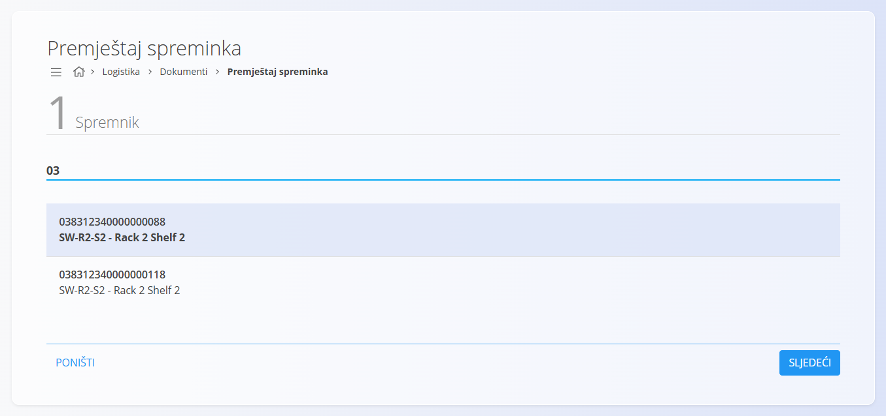
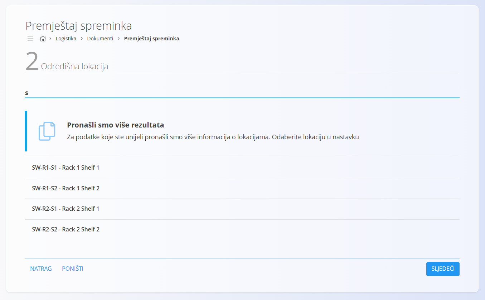
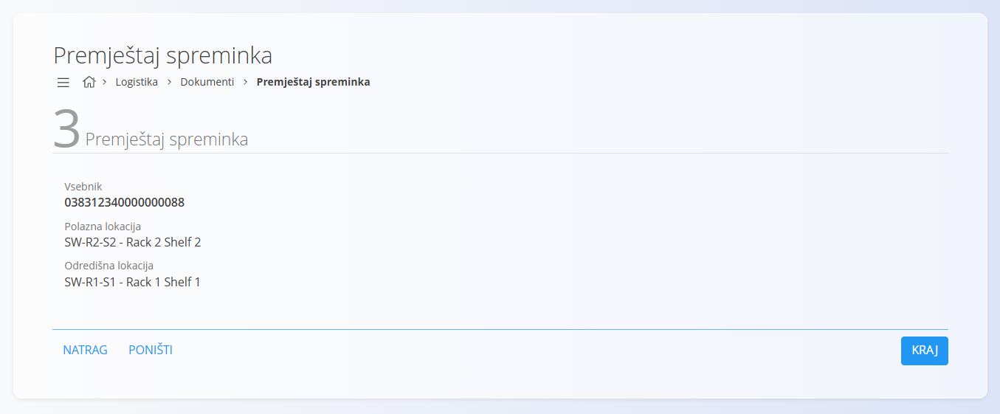

<!-- app_route: /warehouse/documents/container-move --> 
<!-- app_label: Premještaj spreminka --> 
<!-- canonical_source_url: https://github.com/Tom-PIT/Connected.Docs/blob/main/sl/Domene/Logistika/Dokumenti/PremjestajSpreminka.md --> 
<!-- canonical_source_title: Premještaj spreminka -->

# Premještaj spreminka

Zaslon **Premještaj spreminka** omogućuje brzo premještanje cijelog spreminka s jedne skladišne lokacije na drugu. Postupak je namijenjen brzom radu pomoću skeniranja ili unosa oznake spreminka, bez potrebe za otvaranjem dokumenta.

Premještanjem spreminka premještaju se i sve stavke koje se u njemu nalaze.

> [!NOTE]
> Premještanjem spreminka sustav automatski premješta sve stavke iz spreminka na novu skladišnu lokaciju.

> [!TIP]
> Za demonstraciju postupka pogledajte video **[Move container](https://www.youtube.com/watch?v=r_H76lJd7XY)**.

Za pristup dokumentu **Premještaj spreminka** idite na **Logistika / Dokumenti / Premještaj spreminka** u [navigaciji](../../../Zajednicko/UI/Navigacija.md).

## Premještanje spreminka

### Preduvjeti

Prije premještanja:

- definirajte [**Lokacije**](../Upravljanje/Lokacije.md)
- provjerite da spremnik postoji i ima barkod, EAN ili drugu oznaku koja se može skenirati

### Korak 1 — Odabir spremnika

Unesite ili skenirajte oznaku spremnika.

Ako je pronađeno više spremnika, odaberite odgovarajući.

Ako lokacija spremnika nije poznata, moguće ju je odabrati ručno.

### Korak 2 — Odabir odredišne lokacije

Unesite ili skenirajte odredišnu lokaciju.

Ako je pronađeno više rezultata, odaberite odgovarajuću lokaciju.

> [!TIP]
> Za brži rad preporučuje se korištenje barkodova lokacija.

### Korak 3 — Potvrda premještanja

Provjerite podatke o premještanju i kliknite **Kraj**.

Nakon potvrde:

- spremink se premješta na novu lokaciju
- sve stavke u spreminku premještaju se zajedno sa spreminkom
- premještanje je evidentirano u sustavu i vidljivo u dokumentima **[Međuskladišni promet](MedjuskladisniPromet.md)**