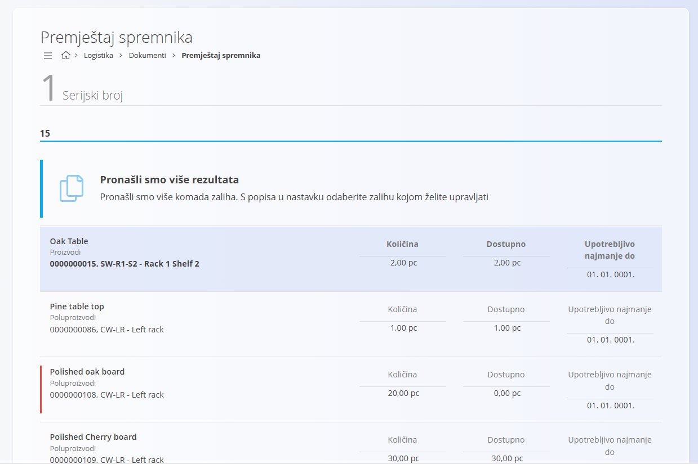
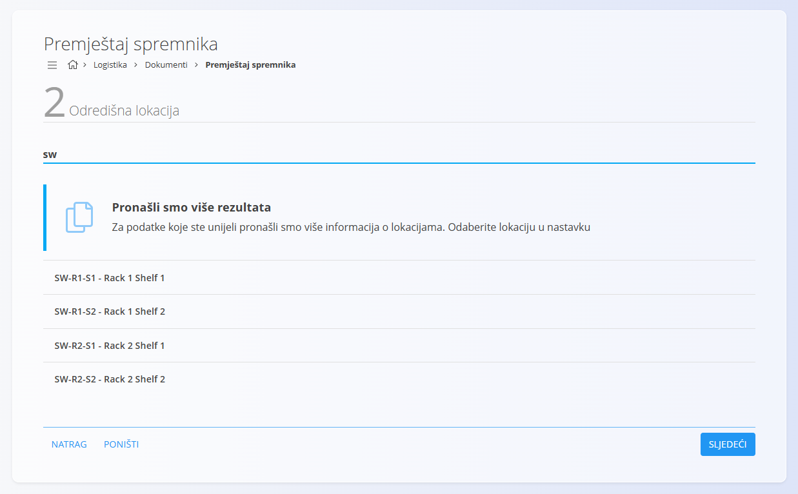
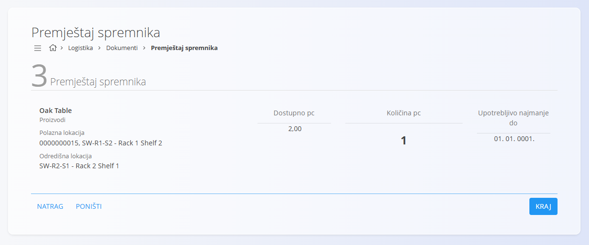
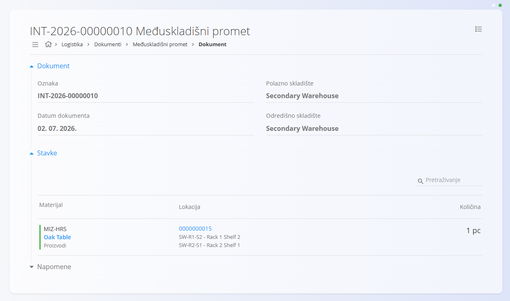

<!-- app_route: /warehouse/documents/inter-move --> 
<!-- app_label: Move serialPremještaj spremnika --> 
<!-- canonical_source_url: https://github.com/Tom-PIT/Connected.Docs/blob/main/hr/Domene/Logistika/Dokumenti/PremjestajSpremnika.md --> 
<!-- canonical_source_title: Premještaj spremnika -->

# Premještaj spremnika

**Premještaj spremnika** omogućuje brzo premještanje pojedine stavke zalihe (identificirane serijskim brojem) s jedne skladišne lokacije na drugu. Namijenjen je svakodnevnim skladišnim operacijama, poput reorganizacije skladišta, pripreme robe ili ispravljanja pogrešno spremljenih artikala.

Za razliku od dokumenta [**Međuskladišni promet**](MedjuskladisniPromet.md), ovaj postupak služi isključivo za premještanje pojedinačne stavke između skladišnih lokacija.

Za pregled trenutnog stanja zalihe ili povijesti premještanja možete otvoriti [**Pogled na zalihe prema materijalu**](../Views/Zaliha.md#pogled-na-zalihe-prema-materijalu) ili [**Pogled na zalihe prema serijskom broju**](../Views/Zaliha.md#pogled-na-zalihe-prema-serijskom-broju).

> [!TIP]
> Za demonstraciju postupka pogledajte video **[Move serial number](https://www.youtube.com/watch?v=dy1u6sKmdMg)**.

Za pristup dokumentu **Premještaj spremnika** idite na **Logistika / Dokumenti / Premještaj spremnika** u [navigaciji](../../../Zajednicko/UI/Navigacija.md).

## Premještanje spremnika

### Korak 1 — Odabir serijskog broja

Unesite ili skenirajte **serijski broj**, **EAN** ili naziv materijala.

- Ako je pronađena samo jedna odgovarajuća stavka, sustav automatski nastavlja na sljedeći korak.
- Ako je pronađeno više odgovarajućih stavki, potrebno je odabrati željenu stavku.

Kliknite **Sljedeći** za nastavak.

### Korak 2 — Odabir odredišne lokacije

Unesite naziv, oznaku ili dio naziva odredišne skladišne lokacije.

Ako je pronađeno više lokacija, odaberite odgovarajuću.

Kliknite **Sljedeći** za nastavak.

### Korak 3 — Potvrda premještanja

U posljednjem koraku prikazuju se podaci o premještanju:

- **Materijal**
- **Polazna lokacija**
- **Odredišna lokacija**
- **Dostupna količina**
- **Količina** za premještanje
- **Upotrebljivo najmanje do**

Po potrebi promijenite količinu koja će biti premještena te kliknite **Kraj**.

## Završetak premještanja

Nakon završetka postupka:

- količina se odmah premješta na odredišnu lokaciju
- ponovno se otvara prvi korak kako biste mogli nastaviti s premještanjem drugih stavki
- sustav automatski kreira dokument [**Međuskladišni promet**](MedjuskladisniPromet.md).

