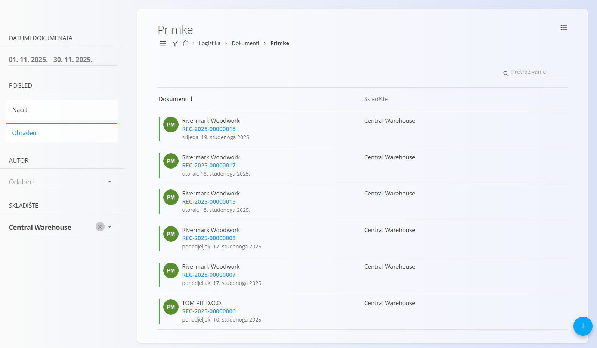
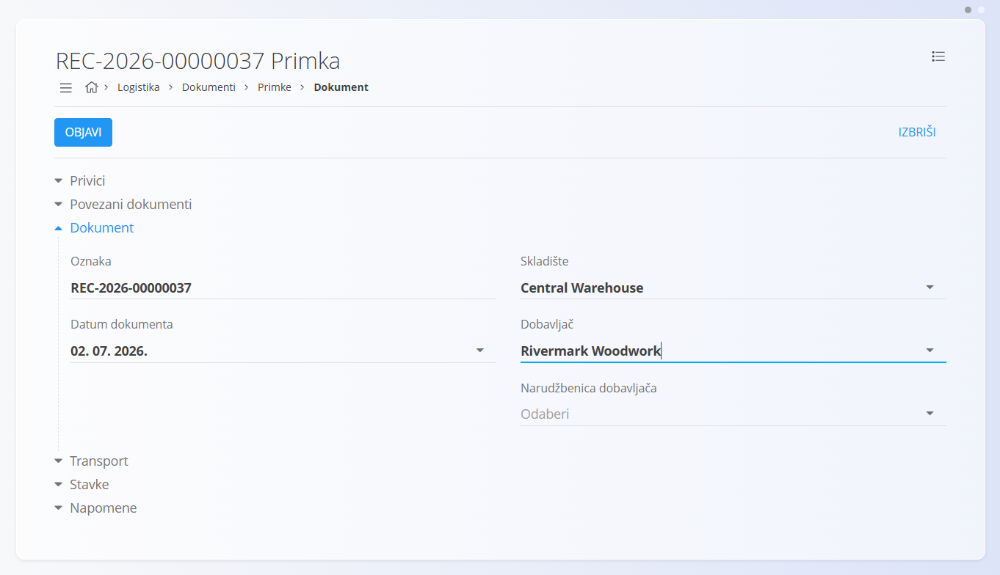
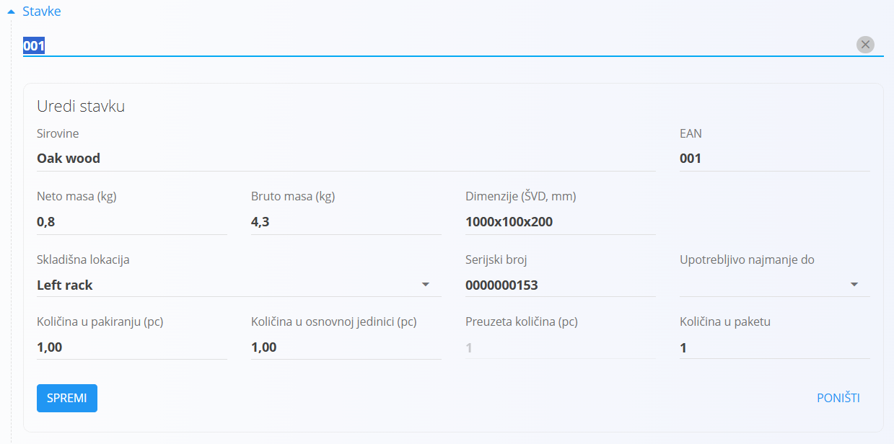
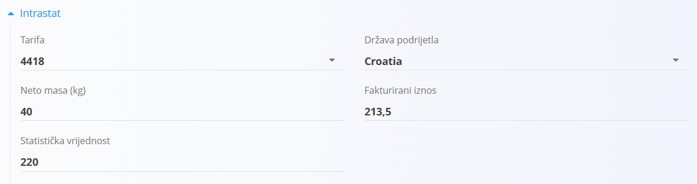
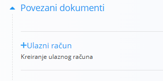
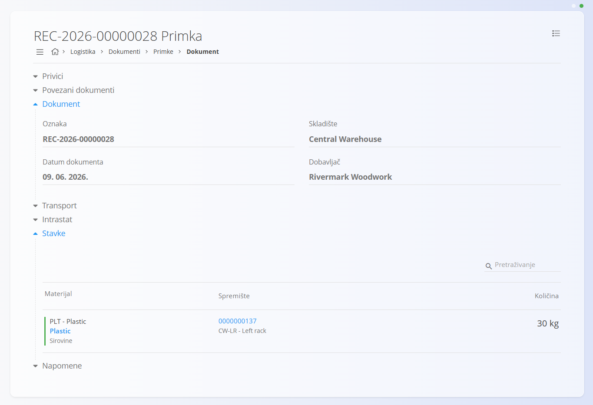

<!-- app_route: /warehouse/documents/receives -->
<!-- app_label: Primke -->
<!-- canonical_source_url: https://github.com/Tom-PIT/Connected.Docs/blob/main/hr/Domene/Logistika/Dokumenti/Primke.md --> 
<!-- canonical_source_title: Primke -->

# Primke

Dokument **Primka** koristi se za evidentiranje dolaska materijala u skladište. Kada roba fizički stigne od dobavljača ili s druge lokacije, kreira se dokument primke kojim se evidentira zaprimanje robe u sustavu. Primjeri uključuju zaprimanje:

- [**Proizvoda**](../../RobaIUsluge/Materijali/Proizvodi.md)
- [**Poluproizvoda**](../../RobaIUsluge/Materijali/Poluproizvodi.md)
- [**Repro materijala**](../../RobaIUsluge/Materijali/ReproMaterijali.md)
- [**Sirovina**](../../RobaIUsluge/Materijali/Sirovine.md)

Postupak zaprimanja bilježi ključne informacije poput materijala, [pakiranja](../../RobaIUsluge/Materijali/Pakiranja.md), količine, serijskih brojeva, roka upotrebe i [skladišne lokacije](../Upravljanje/Lokacije.md). Time se osigurava točnost stanja zaliha i potpuna sljedivost materijala od trenutka ulaska u skladište.

> [!TIP]
> Za cjeloviti prikaz rada pogledajte video vodič [**Primka**](https://www.youtube.com/watch?v=oTOYD-nlCqE).

Za pristup primkama otvorite **Logistika / Dokumenti / Primke** u [navigaciji](../../../Zajednicko/UI/Navigacija.md).

## Shema

<strong>Dokument</strong>

| Polje | Opis |
|-------|------|
| [**Oznaka**](../../../Zajednicko/UI/OznakeDokumenata.md) | Jedinstvena oznaka dokumenta koju automatski dodjeljuje sustav. |
| **Datum dokumenta** | Datum fizičkog zaprimanja robe. |
| [**Skladište**](../Upravljanje/Skladista.md) | Skladište u koje se roba zaprima (obavezno). |
| **Dobavljač** | Dobavljač od kojeg se roba zaprima, odabire se iz [Poslovnog adresara](../../../Zajednicko/Upravljanje/PoslovniAdresar.md) (obavezno). |
| [**Narudžbenica dobavljača**](../../Nabava/Dokumenti/NarudzbeniceDobavljaca.md) | (Neobavezno) Povezana narudžbenica dobavljača. |
| **Napomene** | Dodatne napomene vezane uz dokument. |

<strong>Transport i Intrastat</strong>

| Polje | Opis |
|------|------|
| [**Uvjeti isporuke**](../../../Zajednicko/Upravljanje/UvjetiIsporuke.md) | Uvjeti isporuke dogovoreni s dobavljačem (primjerice Costs and freight). |
| [**Način transporta**](../../../Zajednicko/Upravljanje/NaciniTransporta.md) | Način prijevoza kojim je roba dostavljena (primjerice cestovni prijevoz). |
| [**Država slanja**](../../../Zajednicko/Upravljanje/Drzave.md) | Država iz koje je roba otpremljena. Vrijednost se obično preuzima iz Intrastat konfiguracije materijala. |
| [**Vrsta posla**](../../Racunovodstvo/Upravljanje/Intrastat/VrstePoslova.md) | Klasifikacija vrste transakcije za Intrastat izvještavanje. |
| [**Mjesto isporuke**](../../Racunovodstvo/Upravljanje/Intrastat/MjestaIsporuke.md) | Mjesto isporuke prema Intrastat pravilima. |

<strong>Stavke</strong>

| Polje | Opis |
|-------|------|
| [**Materijal**](../../Imovina/Materijali/README.md) | Materijal koji se zaprima (proizvod, poluproizvod, sirovina ili repro materijal). |
| **EAN** | Barkod pakiranja ili jedinice. |
| **Neto masa / Bruto masa (kg)** | Masa materijala ili pakiranja. |
| **Dimenzije (ŠVD, mm)** | Širina, visina i dubina pakiranja. |
| [**Skladišna lokacija**](../Upravljanje/Lokacije.md) | Lokacija na koju će materijal biti smješten. |
| **Serijski broj** | Serijski broj materijala. |
| **Upotrebljivo najmanje do** | Rok trajanja materijala. |
| **Količina u pakiranju (pc)** | Količina koju sadrži jedno pakiranje. |
| **Količina u osnovnoj jedinici (pc)** | Količina izražena u osnovnoj mjernoj jedinici materijala. |
| **Preuzeta količina (pc)** | Stvarna zaprimljena količina. |
| **Količina u paketu** | Broj zaprimljenih paketa. |

<strong>Stavke – Intrastat</strong>

Ovaj odjeljak prikazuje se kada je Intrastat omogućen i kada je dobavljač iz druge države članice Europske unije.

| Polje | Opis |
|-------|------|
| [**Tarifa**](../../Racunovodstvo/Upravljanje/Intrastat/Tarife.md) | Intrastat tarifna oznaka materijala. |
| **Država podrijetla** | Država u kojoj je roba proizvedena. |
| **Neto masa (kg)** | Neto masa za Intrastat izvještavanje. |
| **Fakturirani iznos** | Vrijednost robe za statističko izvještavanje. |
| **Statistička vrijednost** | Dodatna statistička vrijednost propisana zakonskim zahtjevima. |

## Popis primki

Na zaslonu **Primke** prikazane su sve primke. Dokumente možete pronaći pretraživanjem ili pomoću filtera na lijevoj strani:

- **Datumi dokumenata**
- **Pogled**
    - **Nacrti** — dokumenti koji još nisu objavljeni
    - **Obrađen** — objavljeni dokumenti
- **Autor**
- **Skladište**

Boja indikatora uz dokument označava njegov status:

- **Zelena** — obrađen
- **Siva** — nacrt

Kliknite dokument za otvaranje njegovih pojedinosti.

## Radnje

### Kreiranje primke

Za kreiranje nove primke:

1. Kliknite [akcijski gumb](../../../Zajednicko/UI/AkcijskiGumb.md) i odaberite **Dobavljača**.

    

2. Skenirajte ili ručno unesite **EAN oznaku pakiranja**. Sustav prikazuje odgovarajuće materijale i njihove serijske brojeve.

3. Sustav automatski popunjava sve dostupne podatke u odjeljku **Stavke**.

    

4. Po potrebi prilagodite količine, skladišne lokacije ili druge podatke.

    Za informacije o radu sa stavkama pogledajte [**Stavke dokumenta**](../../../Zajednicko/Koncepti/StavkeDokumenta.md).

5. Kliknite **Spremi** za spremanje stavke. Po potrebi dodajte nove stavke.

6. Kliknite **Objavi** za objavu dokumenta.

Nova primka najprije se prikazuje u prikazu **Nacrti**. Nakon objave prelazi u prikaz **Obrađen**.

#### Transport i Intrastat

Kada je **Intrastat** postavljen na **Obveznik** u **Sustav / Konfiguracija / Intrastat**, u dokumentu se prikazuju dodatni odjeljci.

- **Transport** – podaci o načinu dostave robe.
- **Intrastat** – podaci potrebni za Intrastat izvještavanje.

> [!NOTE]
> Pojedine Intrastat vrijednosti preuzimaju se iz šifrarnika materijala (Intrastat konfiguracije), poput države podrijetla ili vrste posla. Ta polja ovise o unaprijed definiranim matičnim podacima.

#### Intrastat polja u stavkama

Kada je Intrastat omogućen, a odabrani dobavljač dolazi iz druge države članice Europske unije, u svakoj stavci dokumenta prikazuju se dodatna Intrastat polja.

Ta se polja koriste za Intrastat statističko izvještavanje.

#### Privici

Odjeljak **Privici** omogućuje dodavanje i upravljanje datotekama povezanima s dokumentom, poput fotografija, PDF-ova, certifikata ili druge dokumentacije.

Za više informacija pogledajte [**Privici**](../../../Zajednicko/Koncepti/Privici.md).

#### Povezani dokumenti

Objavljene primke sadrže dodatni odjeljak **Povezani dokumenti**. Ovaj odjeljak prikazuje dokumente koji se mogu kreirati na temelju primke.

Za primke je moguće kreirati **Ulazni račun**, čime se podaci iz primke prenose u novi dokument ulaznog računa.

Za više informacija pogledajte dokument [**Ulazni računi**](../../Racunovodstvo/Dokumenti/UlazniRacuni.md).

#### Napomene

Odjeljak **Napomene** služi za unos dodatnih informacija vezanih uz dokument. Napomene ostaju spremljene zajedno s dokumentom.

### Uređivanje primke

Kliknite oznaku dokumenta kako biste otvorili njegove pojedinosti. Možete:

- pregledati odjeljak **Dokument**
- pregledati **Stavke**
- uređivati dokumente u statusu **Nacrt**
- ispisati ili izvesti dokument

> [!NOTE]
> Dokumenti u statusu **Obrađen** dostupni su samo za pregled, osim kreiranja storna.

### Brisanje primke

Dokument u statusu **Nacrt** moguće je izbrisati samo ako ne sadrži nijednu stavku. Ako dokument sadrži stavke, najprije koristite opciju **Izbriši sve stavke** iz **Izbornika**.

Za brisanje pojedine stavke:

1. Kliknite serijski broj materijala.
2. Kliknite **Izbriši**.
3. Ponovite postupak za sve preostale stavke.

Nakon što dokument više ne sadrži nijednu stavku, kliknite **Izbriši**.

> [!NOTE]
> Dokumente u statusu **Obrađen** nije moguće izbrisati. Umjesto toga potrebno je kreirati [**Storno**](Storna.md).

## Izbornik

Izbornik sadrži dodatne radnje dostupne na ovoj stranici.

Dostupne radnje:

- **Ispis**
- **Izvoz u PDF**
- **Izbriši sve stavke** (samo za nacrte)
- **Storniraj primku** (samo za obrađene dokumente)

Za više informacija pogledajte [**Radnje izbornika**](../../../Zajednicko/Koncepti/RadnjeIzbornika.md).