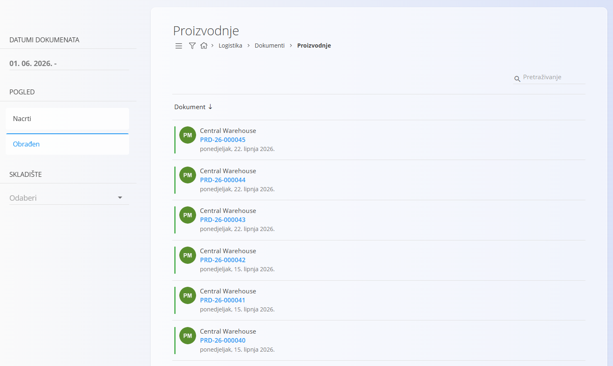
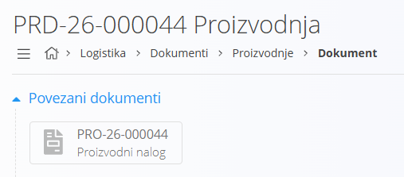
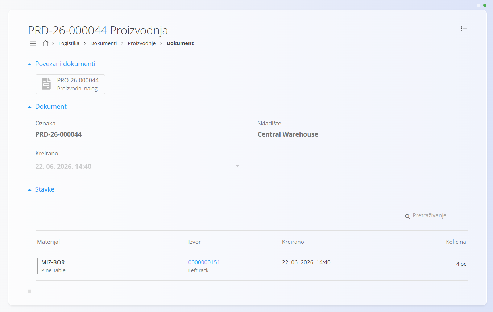

<!-- app_route: /production/documents/productions --> 
<!-- app_label: Proizvodnje --> 
<!-- canonical_source_url: https://github.com/Tom-PIT/Connected.Docs/blob/main/hr/Domene/Logistika/Dokumenti/Proizvodnje.md --> 
<!-- canonical_source_title: Proizvodnje -->

# Proizvodnje

Dokument **Proizvodnja** evidentira artikle proizvedene tijekom izvršavanja **proizvodnog naloga**. Dokumenti proizvodnje stvaraju se automatski iz modula **[Izvedba](../../Proizvodnja/Dokumenti/Izvedba.md)** kada proizvodni radnik evidentira proizvedene količine. Time se povećava stanje zaliha proizvedenih artikala i osigurava njihova sljedivost.

Za evidentiranje proizvedenih količina pogledajte **[Izvedba](../../Proizvodnja/Dokumenti/Izvedba.md)** (Izlazi). Izlazi su izravno povezani s ovom stranicom: evidentiranjem proizvedenih artikala tijekom proizvodnje automatski se stvara odgovarajući dokument **Proizvodnja** u logistici. Za definiranje izlaza na procesu pogledajte **[Izlazi](../../Proizvodnja/Upravljanje/Izlazi.md)**.

Za pristup dokumentima **Proizvodnje** idite na **Logistika / Dokumenti / Proizvodnje** u [navigaciji](../../../Zajednicko/UI/Navigacija.md).

## Shema

<strong>Dokument</strong>

| Polje | Opis |
|-------|------|
| [**Oznaka**](../../../Zajednicko/UI/OznakeDokumenata.md) | Jedinstvena oznaka dokumenta proizvodnje (automatski generira sustav). |
| **Kreirano** | Datum i vrijeme stvaranja dokumenta. |
| [**Skladište**](../Upravljanje/Skladista.md) | Skladište u koje su evidentirani proizvedeni artikli. |

<strong>Stavke</strong>

| Polje | Opis |
|-------|------|
| [**Materijal**](../../RobaIUsluge/Materijali/README.md) | Proizvedeni materijal (najčešće [proizvod](../../RobaIUsluge/Materijali/Proizvodi.md) ili [poluproizvod](../../RobaIUsluge/Materijali/Poluproizvodi.md)). |
| **Količina** | Evidentirana proizvedena količina. |

## Popis dokumenata proizvodnje

Stranica **Proizvodnje** prikazuje sve dokumente proizvodnje stvorene tijekom izvođenja proizvodnje. Popis možete filtrirati prema:

- **Datumima dokumenata**
- **Prikazu**
  - **Nacrt** — proizvodnja je još u tijeku
  - **Obrađeno** — završeni dokument proizvodnje
- **Skladištu**

## Radnje

Dokumenti **Proizvodnja** ne stvaraju se ručno na ovoj stranici (nije dostupan [akcijski gumb](../../../Zajednicko/UI/AkcijskiGumb.md)). Sustav ih automatski stvara iz modula **[Izvedba](../../Proizvodnja/Dokumenti/Izvedba.md)** tijekom evidentiranja proizvedenih količina na proizvodnom nalogu.

Tijek rada:

- Kada proizvodni radnik započne evidentiranje proizvedenih količina, sustav automatski stvara dokument **Proizvodnja** u statusu **Nacrt**.
- Kada se postupak **[Izvedba](../../Proizvodnja/Dokumenti/Izvedba.md)** dovrši, dokument prelazi u status **Obrađeno** te je dostupan za pregled.

### Pregledati dokument proizvodnje

Kliknite **Oznaku** dokumenta proizvodnje kako biste otvorili njegove pojedinosti.

#### Povezani dokumenti

Ako je proizvodnja nastala iz proizvodnog naloga, odjeljak **Povezani dokumenti** prikazuje poveznicu na odgovarajući **[Proizvodni nalog](../../Proizvodnja/Dokumenti/ProizvodniNalozi.md)**.

#### Dokument i stavke

Odjeljak **Stavke** prikazuje sve proizvedene materijale zajedno s evidentiranim količinama.

### Izbrisati dokument proizvodnje

Dokumenti **Proizvodnja** ne mogu se izbrisati kako bi se osigurala potpuna sljedivost proizvedenih artikala.

## Izbornik

Izbornik sadrži dodatne radnje dostupne na ovoj stranici.

Dostupne radnje:

- **Stvori novo storno** (samo za dokumente u statusu **Obrađeno**)

Za više informacija pogledajte [**Radnje izbornika**](../../../Zajednicko/Koncepti/RadnjeIzbornika.md).