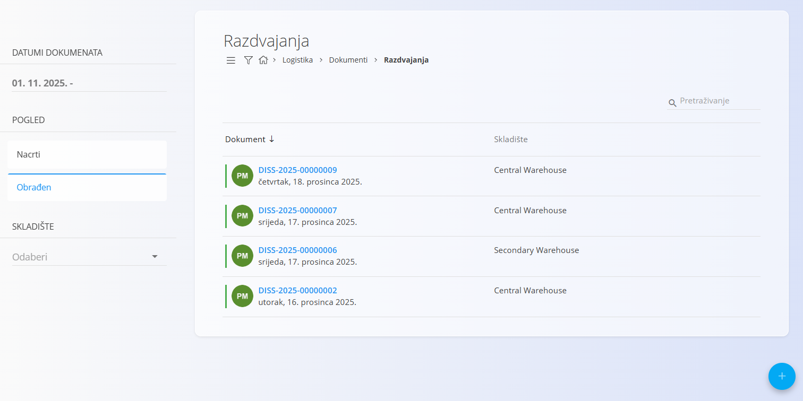
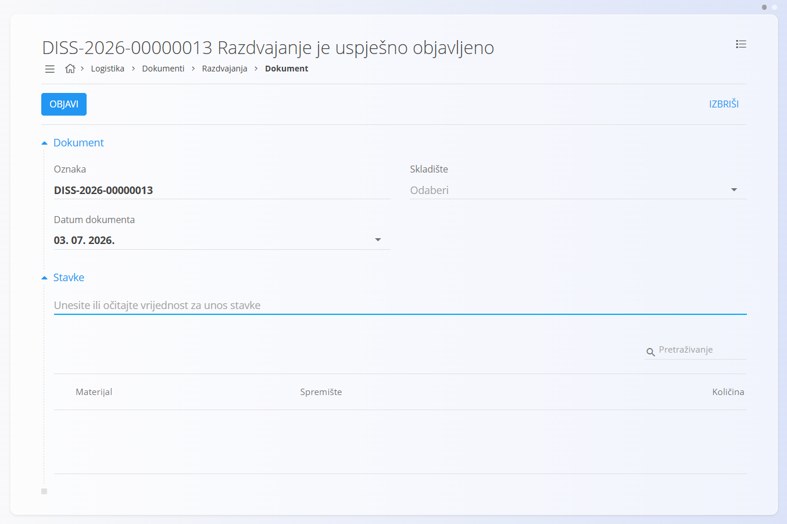
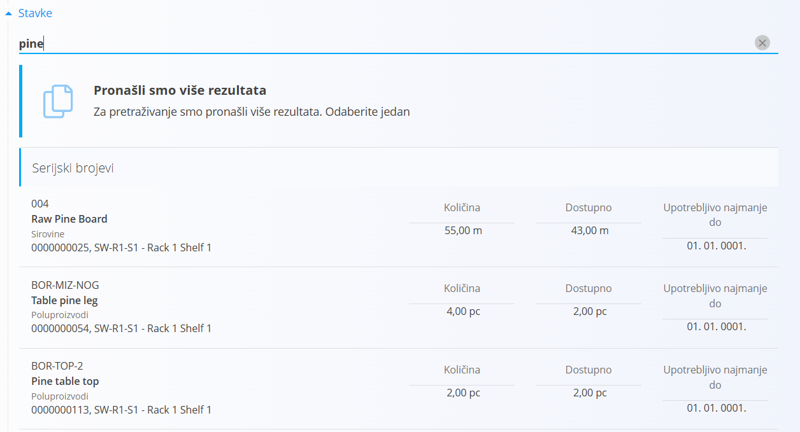
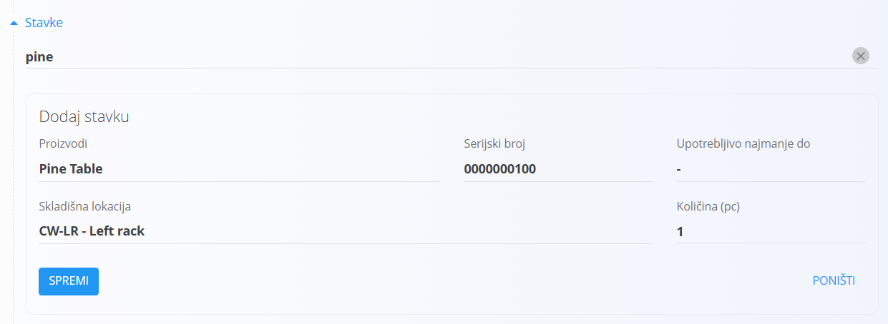
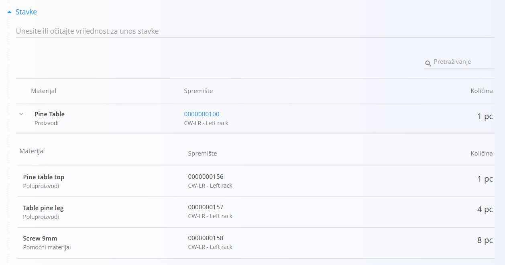

<!-- app_route: /warehouse/documents/disassemblies --> 
<!-- app_label: Razdvajanja --> 
<!-- canonical_source_url: https://github.com/Tom-PIT/Connected.Docs/blob/main/hr/Domene/Logistika/Dokumenti/Razdvajanja.md --> 
<!-- canonical_source_title: Razdvajanja -->

# Razdvajanja

**Razdvajanja** su logistički dokumenti koji se koriste za rastavljanje **setova (složenih materijala)** na njihove pojedinačne komponente. Omogućuju sljedivost, ispravno ažuriranje zaliha i dostupnost pojedinih dijelova za daljnju proizvodnju, nabavu ili prodaju.

Koristite **Razdvajanja** kada zaprimite ili skladištite setove (pakirane materijale), ali njihove komponente želite koristiti ili prodavati zasebno. Objavom dokumenta **Razdvajanje** smanjuje se količina seta na zalihi, a povećavaju se količine njegovih komponenti prema strukturi definiranoj na setu.

> [!NOTE]
> - Objavom dokumenta stanje zaliha se ažurira: količina seta se smanjuje, a njegove komponente postaju dostupne na zalihi.
> - Prije izrade dokumenta **Razdvajanje** potrebno je definirati strukturu seta u šifrarniku **[Setovi](../../RobaIUsluge/Materijali/Setovi.md)**.

Za pristup dokumentima **Razdvajanja** idite na **Logistika / Dokumenti / Razdvajanja** u [navigaciji](../../../Zajednicko/UI/Navigacija.md).

## Primjer

Zaprimili ste blagovaonski set koji se sastoji od jednog stola i četiri stolice te je evidentiran kao jedan proizvod. Ako želite koristiti ili prodavati stol i stolice zasebno, izradite dokument **Razdvajanje**. Nakon objave količina seta se smanjuje, a stol i stolice pojavljuju se kao zasebni artikli na zalihi.

## Shema

<strong>Dokument</strong>

| Polje | Opis |
|-------|------|
| [**Oznaka**](../../../Zajednicko/UI/OznakeDokumenata.md) | Automatski generirana oznaka dokumenta. |
| **Datum dokumenta** | Datum dokumenta razdvajanja. |
| **[Skladište](../Upravljanje/Skladista.md)** | Skladište u kojem se provodi razdvajanje (obavezno). |

<strong>Stavke</strong>

| Polje | Opis |
|-------|------|
| **[Set](../../RobaIUsluge/Materijali/Setovi.md)** | Set (složeni materijal) koji se razdvaja. |
| **Količina** | Broj setova koji će se razdvojiti. |
| **Serijski broj** | Serijski broj seta, ako je primjenjivo. |
| **Upotrebljivo najmanje do** | Rok upotrebe, ako je primjenjivo. |
| **Skladišna lokacija** | Lokacija na kojoj se nalazi set. Pogledajte [Lokacije](../Upravljanje/Lokacije.md). |

## Popis dokumenata Razdvajanja

Popis prikazuje postojeće dokumente **Razdvajanja** s mogućnošću filtriranja prema datumu, skladištu i statusu (Nacrt / Obrađeno). Dokumente možete pronaći pretraživanjem prema oznaci ili materijalu.

## Radnje

### Stvoriti dokument Razdvajanje

Stvorite dokument **Razdvajanje** kako biste rastavili set na njegove komponente.

1. Idite na **Logistika / Dokumenti / Razdvajanja**.

2. Kliknite [akcijski gumb](../../../Zajednicko/UI/AkcijskiGumb.md) za stvaranje novog dokumenta u statusu **Nacrt**.

    

3. Ispunite odjeljak **Dokument**.

4. Dodajte stavke u odjeljak **Stavke**. U polje za unos upišite ili skenirajte **serijski broj**, **EAN** ili **naziv materijala**.

   - Sustav prikazuje **sve odgovarajuće materijale i serijske brojeve**. Ako postoji više rezultata, odaberite odgovarajući set.

   

   - Unesite **Količinu** setova koje želite razdvojiti.

   

5. Kliknite **Spremi** kako biste spremili stavku. Ponovite korak 4 za dodavanje dodatnih stavki.

   Nakon spremanja stavke kliknite strelicu za proširenje retka kako biste prikazali komponente koje će biti izdvojene iz seta te njihove izračunate količine.

   

6. Kliknite **Objavi** kako biste dovršili razdvajanje. Dokument se premješta u prikaz **Obrađeno**.

> [!IMPORTANT]
> Objavom dokumenta količina seta se smanjuje, a količine svih njegovih komponenti povećavaju se prema definiranoj strukturi seta. Ako je određena skladišna lokacija, komponente će biti evidentirane na toj lokaciji.

### Alternativni način stvaranja (iz dokumenta Primke)

Ako ste već objavili dokument **[Primke](Primke.md)**, dokument **Razdvajanje** možete stvoriti izravno iz njega:

1. Otvorite objavljeni dokument **Primke**.
2. Odaberite **Povezani dokumenti → + Razdvajanje**.

Sustav automatski stvara novi dokument **Razdvajanje** sa stavkama preuzetima iz dokumenta primke.

## Urediti dokument Razdvajanje

1. Kliknite **Oznaku** dokumenta kako biste ga otvorili.
2. Dok je dokument u statusu **Nacrt**, po potrebi izmijenite zaglavlje i stavke.
3. Kliknite **Spremi** kako biste spremili promjene.

## Izbrisati dokument Razdvajanje

- Dokumente **Razdvajanja** u statusu **Nacrt** možete izbrisati sa zaslona za uređivanje klikom na **Izbriši**. Nakon potvrde dokument se uklanja iz sustava bez utjecaja na stanje zaliha.
- Dokumenti **Razdvajanja** u statusu **Obrađeno** ne mogu se izbrisati.

## Izbornik

Izbornik sadrži dodatne radnje dostupne na ovoj stranici.

Dostupne radnje:

- **Ispis naljepnica serijskih brojeva**

Za više informacija pogledajte [**Radnje izbornika**](../../../Zajednicko/Koncepti/RadnjeIzbornika.md).