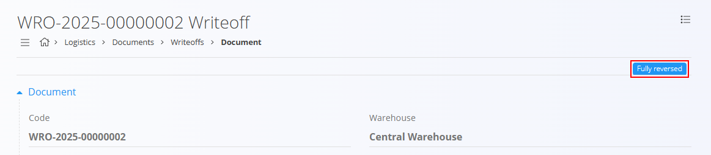
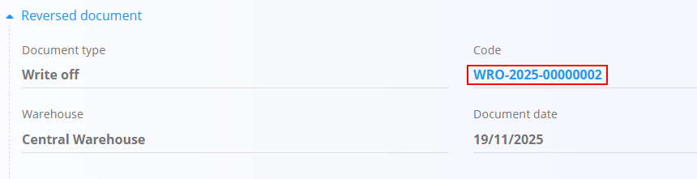
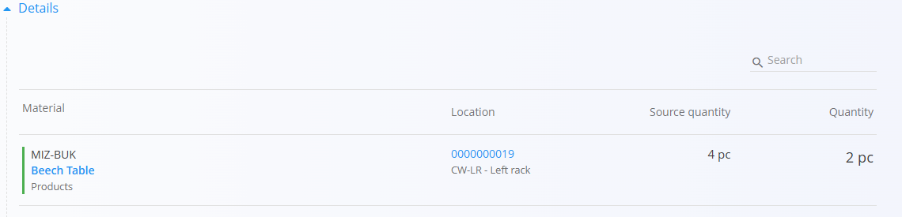

<!-- app_route: /warehouse/documents/reversals --> 
<!-- app_label: Reversals --> 
<!-- canonical_source_url: https://github.com/Tom-PIT/Connected.Docs/blob/main/en/Domains/Logistics/Documents/Reversals.md --> 
<!-- canonical_source_title: Reversals -->

# Reversals

A **Reversal** document is used to undo the effect of another committed document. It allows you to correct mistakes or adjust stock levels when a previously committed movement needs to be reversed. You can reverse only committed documents, and only through their **Menu → Create a new reversal** option. Reversals cannot be created directly from the Reversals list.

Reversals adjust stock depending on the type of document being reversed:
- Reversing a **[Writeoff](Writeoffs.md)** returns items to stock.
- Reversing a **[Receive](Receives.md)** removes items again (as if they were returned to the vendor).
- Reversing an **[Issue](Issues.md)** restores goods that were previously delivered to a customer.

Reversals can be **full** or **partial**, depending on the quantity you enter. Reversal documents themselves **cannot** be reversed.

> [!TIP]
> For a full demonstration, see the **[Reversal](https://www.youtube.com/watch?v=yfGNARBWm7Q)** video tutorial.

To access Reversals, go to **Logistics / Documents / Reversals** in the [navigation](../../../Zajednicko/UI/Navigacija.md).

## How reversals work

A reversal cancels the effect of an existing committed document without deleting or modifying the original document.

When a reversal is published:

- The original document remains unchanged.
- A reversal document is created and linked to the original document.
- Opposite stock or financial effects are applied.
- The original document is marked as partially or fully reversed.

Together, the original document and its reversal result in a net effect of zero.

Different document types produce different effects when reversed.

Examples:

- Logistics documents reverse stock movements.
- Financial documents reverse financial values.
- Credit notes reverse the effect of the original credit transaction.

## Schema

<strong>Reversed document section</strong>

| Field | Description |
|-------|-------------|
| **Document type** | Type of document being reversed ([receive](Receives.md), [issue](Issues.md), [writeoff](Writeoffs.md), [inter warehouse](InterWarehouse.md)). |
| [**Code**](../../../Zajednicko/UI/OznakeDokumenata.md) | Identifier of the reversed document (clickable). |
| [**Warehouse**](../Management/Warehouses.md) | Warehouse where the original document was executed. |
| **Document date** | Date of the original document. |

<strong>Document</strong>

| Field | Description |
|-------|-------------|
| [**Code**](../../../Zajednicko/UI/OznakeDokumenata.md) | System-generated reversal document number. |
| **Document date** | Date of the reversal (editable). |

<strong>Details</strong>

| Field | Description |
|-------|-------------|
| [**Material**](../../Assets/Materials/README.md) | Material being reversed ([product](../../Assets/Materials/Products.md), [semi product](../../Assets/Materials/SemiProducts.md), [raw material](../../Assets/Materials/RawMaterials.md), or [repro material](../../Assets/Materials/ReproMaterials.md)). |
| [**Location**](../Management/Locations.md) | Storage location of the reversed stock. |
| **Source quantity** | Quantity originally processed in the reversed document. |
| **Quantity (pc)** | Quantity to reverse — **editable**, used for partial or full reversal. |

## List of reversal documents

The **Reversals** page displays all reversal documents. You can filter the list using:

- **Document dates**
- **View**  
  - *Drafts* — reversal documents created but not yet published  
  - *Committed* — confirmed reversal documents  
- **Author**
- **Warehouse**

Each row includes:

- The reversal document  
- The reversed document (with document type)

Color indicators:

- **Green** — committed  
- **Gray** — draft

## Actions

### Create a reversal

Reversal documents **cannot** be created manually from the **Reversals** page. They are created only from the source document through these steps:

#### Step 1 — Start the reversal  
Open the committed document you want to reverse. Open the **menu** and select **Create a new reversal**.

#### Step 2 — Edit reversal quantities  
A draft reversal document is generated automatically.

Each material line displays:

- **Source quantity**  
- **Editable quantity** field  

Examples:

- Original writeoff: **4 pc** → enter **4** for full reversal  
- Enter **2** → partial reversal  

If saved but not published → it appears in **Drafts**

#### Step 3 — Publish  
Click **Publish** to confirm the reversal.

If you don’t publish immediately:

- The reversal appears in **Drafts**
- The original document shows **Reversal in progress**

Once published:

- Stock levels are updated  
- The reversed document shows **Partially reversed** or **Fully reversed**  
- The reversal moves to **Committed**

Tags displayed on the original document:

- **Reversal in progress** — when a reversal draft exists  
- **Partially reversed** — only part of the quantity was reversed  
- **Fully reversed** — the document has been completely reversed  

### Edit a reversal document

Click a reversal document to open in the list to review its details.

Published reversals **cannot** be edited. Draft reversals can be edited, but keep in mind that they may affect the original document’s status (e.g., if you change the quantity, the original document may switch between *Reversal in progress*, *Partially reversed*, or *Fully reversed*).

A reversed document contains:

#### Reversed document section  
Displays information about the document being reversed and a link to open it.

#### Document section  
Shows reversal code and date.

#### Detail section  
Lists affected materials, their locations, original quantities, and reversed quantities.

### Delete a reversal document

On the edit screen, click **Delete** to remove a **draft** reversal document. After confirmation, the document is removed from the system without affecting inventory or the original document.

Committed reversals **cannot** be deleted.

