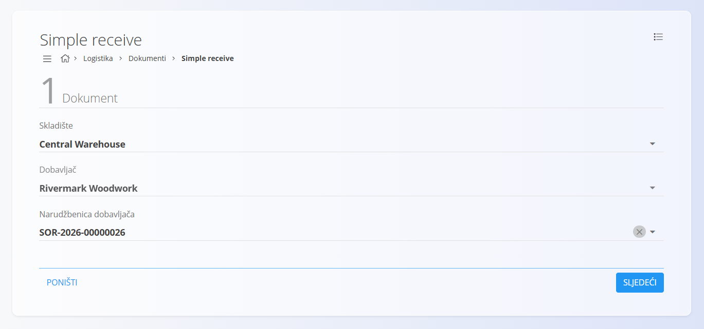
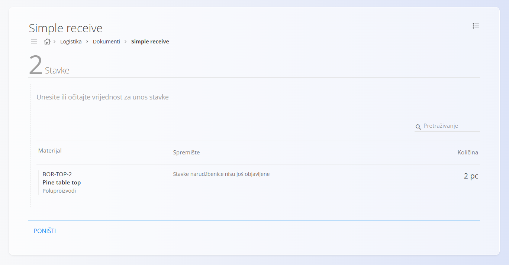
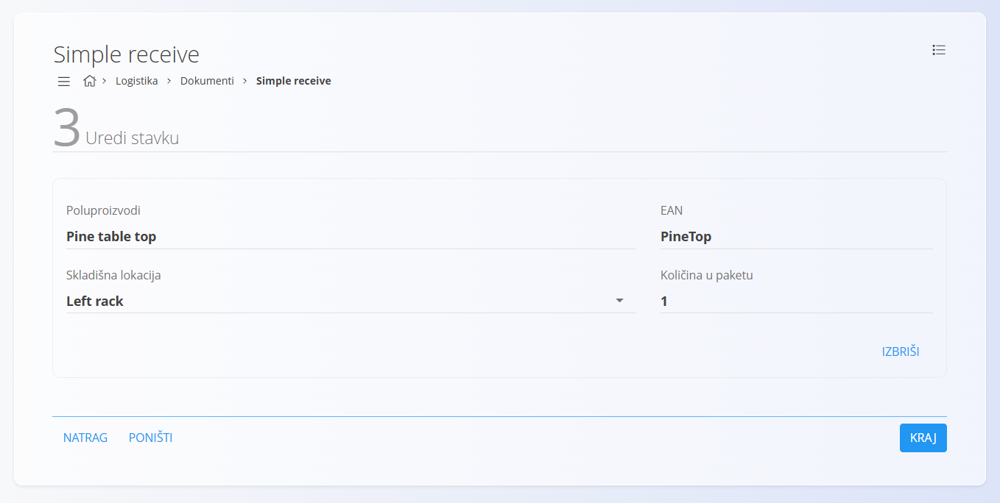

<!-- app_route: /warehouse/documents/simple-receive --> 
<!-- app_label: Simple receive --> 
<!-- canonical_source_url: https://github.com/Tom-PIT/Connected.Docs/blob/main/hr/Domene/Logistika/Dokumenti/SimpleReceive.md --> 
<!-- canonical_source_title: Simple receive -->

# Simple receive

**Simple receive** omogućuje brzo zaprimanje materijala na temelju postojeće [**Narudžbenice dobavljača**](../../Nabava/Dokumenti/NarudzbeniceDobavljaca.md). Korisnika vodi kroz tri jednostavna koraka: odabir podataka dokumenta, potvrdu stavki narudžbenice i uređivanje pojedine stavke prije završetka postupka.

Simple receive namijenjen je brzom zaprimanju robe kada materijal stiže prema narudžbenici, bez potrebe za naprednim mogućnostima zaprimanja.

Za pristup dokumentu **Simple receive** idite na **Logistika / Dokumenti / Simple receive** u [navigaciji](../../../Zajednicko/UI/Navigacija.md).

## Pregled

Simple receive sastoji se od tri koraka:

1. **Dokument** — odabir skladišta, dobavljača i narudžbenice dobavljača.
2. **Stavke** — odabir stavki koje će biti zaprimljene.
3. **Uredi stavku** — pregled i potvrda podataka za svaku stavku.

Nakon završetka postupka sustav automatski kreira standardni dokument [**Primka**](Primke.md).

## Izrada Simple receive dokumenta

### Korak 1 — Dokument

U prvom koraku odabirete osnovne podatke dokumenta.

Dostupna su sljedeća polja:

- **Skladište** — skladište u koje će materijal biti zaprimljen.
- **Dobavljač** — automatski se popunjava nakon odabira narudžbenice, ali ga je moguće promijeniti.
- **Narudžbenica dobavljača** — unesite ili skenirajte oznaku narudžbenice.

Kliknite **Sljedeći** za nastavak.

### Korak 2 — Stavke

U drugom koraku prikazuju se sve stavke odabrane narudžbenice koje još nisu zaprimljene.

Za dodavanje stavke:

1. Upišite ili skenirajte EAN, serijski broj ili naziv materijala.
2. Ako je pronađena jedna odgovarajuća stavka, sustav automatski otvara sljedeći korak.
3. Ako je pronađeno više rezultata, odaberite odgovarajuću stavku.

### Korak 3 — Uredi stavku

U posljednjem koraku potvrđujete podatke odabrane stavke.

Za svaku stavku možete pregledati ili promijeniti:

- **Skladišnu lokaciju**
- **Količinu u paketu**

Po potrebi stavku možete ukloniti klikom na **Izbriši**.

Kliknite **Kraj** za završetak postupka.

## Završetak zaprimanja

Nakon završetka postupka:

- sustav automatski kreira standardni dokument [**Primka**](Primke.md)
- zaprimljene količine evidentiraju se na zalihu
- narudžbenica dobavljača ažurira se sa zaprimljenim količinama.

Za naprednije mogućnosti zaprimanja, poput rada sa serijskim brojevima, rokovima trajanja, pakiranjima ili prilozima, pogledajte dokument [**Primke**](Primke.md).

## Izbornik

Izbornik sadrži dodatne akcije dostupne na ovoj stranici.

Dostupne su sljedeće akcije:

- **Objavi**

Za više informacija pogledajte [**Akcije izbornika**](../../../Zajednicko/Koncepti/AkcijeIzbornika.md).