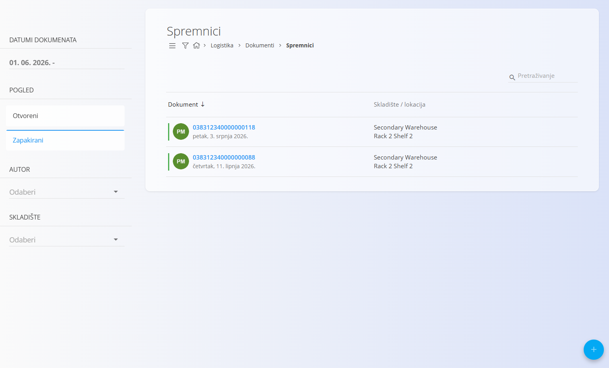
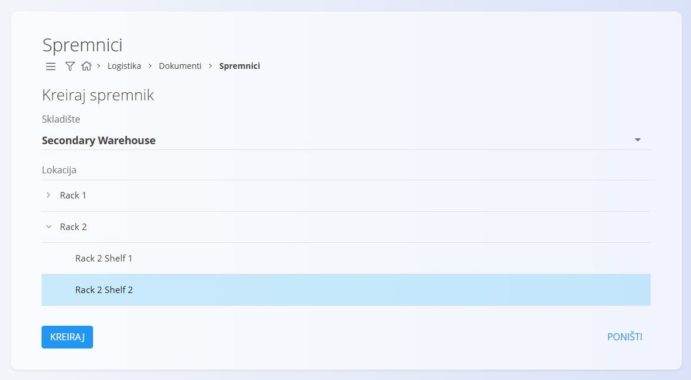
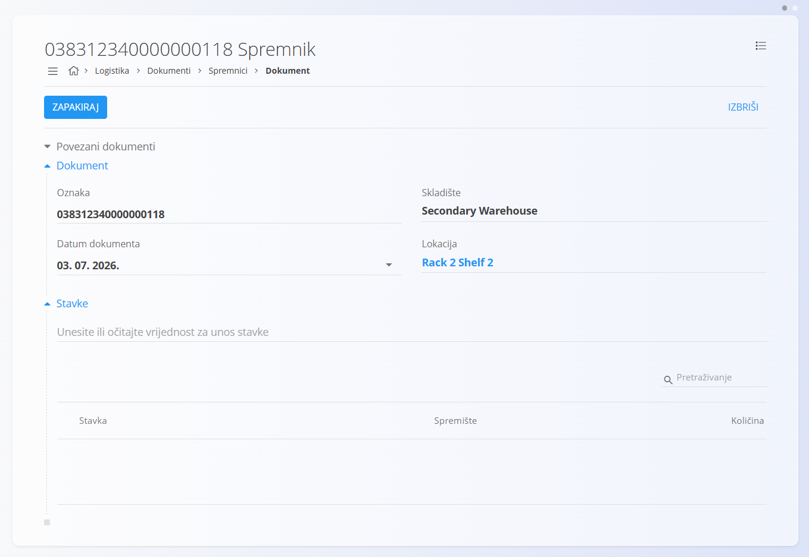
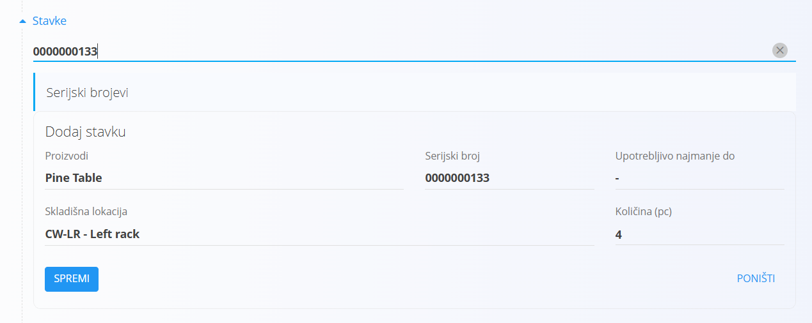
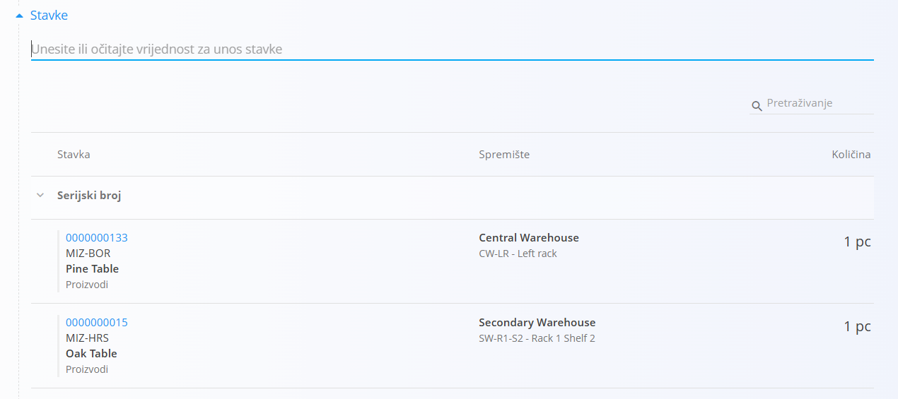
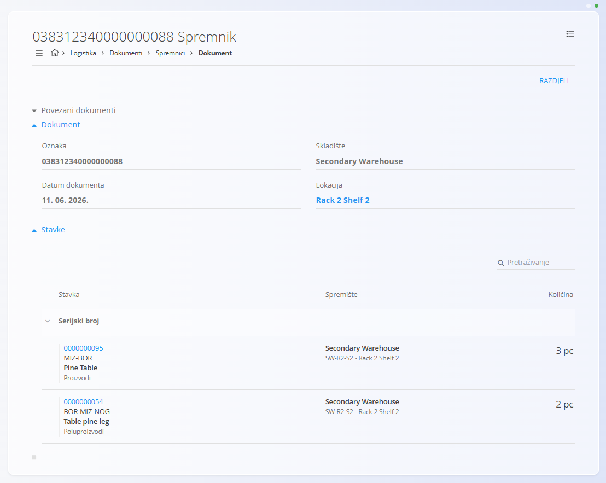

<!-- app_route: /warehouse/documents/containers --> 
<!-- app_label: Spremnici --> 
<!-- canonical_source_url: https://github.com/Tom-PIT/Connected.Docs/blob/main/hr/Domene/Logistika/Dokumenti/Spremnici.md --> 
<!-- canonical_source_title: Spremnici -->

# Spremnici

Spremnik grupira jednu ili više stavki pod jedinstvenim serijskim kodom (najčešće SSCC – Serial Shipping Container Code). Na taj način moguće je zapakirati, premještati i skenirati cijeli spremnik bez potrebe za pojedinačnim rukovanjem svakom stavkom.

Stavke spremljene u spremnik rezervirane su za taj spremnik i ne mogu se koristiti u drugim skladišnim transakcijama dok se spremnik ne raspakira ili se stavke iz njega ne uklone.

> [!TIP]
> Za demonstraciju postupka pogledajte video **[Containers](https://www.youtube.com/watch?v=2V9K1jTsyQI)**.

Za pristup dokumentu **Spremnici** idite na **Logistika / Dokumenti / Spremnici** u [navigaciji](../../../Zajednicko/UI/Navigacija.md).

## Pregled spremnika

Stranica **Spremnici** prikazuje sve dokumente spremnika.

Dostupni su sljedeći filtri:

- **Datumi dokumenta**
- **Pogled** (Otvoreni, Zapakirani)
- **Skladište**
- **Autor**

## Kreiranje spremnika

Za kreiranje novog spremnika:

1. Kliknite [akcijski gumb](../../../Zajednicko/UI/AkcijskiGumb.md).
2. Odaberite skladište i lokaciju.

    

3. Kliknite **Kreiraj**.

4. Otvara se novi dokument spremnika.

    

5. Po potrebi promijenite **Datum dokumenta**.

6. U odjeljku **Stavke** unesite ili skenirajte **serijski broj**, **EAN** ili naziv materijala.

    Ako je pronađeno više rezultata, odaberite odgovarajuću stavku.

    

7. Odaberite količinu i kliknite **Spremi**.

    Po potrebi ponovite postupak za dodatne stavke.

    

8. Kada su dodane sve stavke, kliknite **Zapakiraj**.

Spremnik prelazi u status **Zapakiran** te je spreman za daljnje skladišne operacije.

> [!NOTE]
> Stavke u zapakiranom spremniku rezervirane su za taj spremnik. Ipak, sustav omogućuje korištenje djelomične količine iz spremnika bez potrebe za njegovim raspakiravanjem.

## Korištenje spremnika

Zapakirani spremnici mogu se koristiti u različitim skladišnim procesima:

- tijekom [**Izdatnica**](Izdatnica.md) skeniranjem spremnika moguće je:
    - dodati cijeli sadržaj spremnika
    - koristiti samo dio količine
- tijekom [**Primki**](Primke.md) moguće je zaprimiti cijeli spremnik
- tijekom [**Međuskladišnog prometa**](MeduskladisniPromet.md) ili [**Premještaja spremnika**](PremjestajSpremnika.md) moguće je premjestiti cijeli spremnik jednim skeniranjem
- stanje spremnika može se provjeriti u [**Pogledu zalihe**](../Pogledi/Zaliha.md) ili [**Pogledu zalihe po lokacijama**](../Pogledi/PogledNaZalihePremaLokacijama.md)

## Pregled spremnika

Dokument spremnika prikazuje:

- oznaku spremnika
- skladište
- datum dokumenta
- lokaciju
- zapakirane stavke
- serijske brojeve
- količine

> [!TIP]
> - Kliknite poveznicu **Lokacija** za otvaranje [**Pogleda zalihe po lokacijama**](../Pogledi/PogledNaZalihePremaLokacijama.md) s prikazom odabrane lokacije.
> - Kliknite serijski broj stavke za otvaranje [**Pogleda zalihe prema serijskom broju**](../Pogledi/Zaliha.md#pogled-na-zalihe-prema-serijskom-broju).

## Korištenje djelomične količine

Iz zapakiranog spremnika moguće je koristiti samo dio količine.

Pri tome:

- spremnik ostaje zapakiran
- preostala količina ostaje u spremniku
- oduzima se samo iskorištena količina

Sustav evidentira spremnik, količinu, dokument, datum i korisnika.

Djelomična količina podržana je u:

- [**Izdatnicama**](Izdatnica.md)
- [**Međuskladišnom prometu**](MeduskladisniPromet.md)
- [**Potrošnji**](Potrosnje.md)

## Brisanje spremnika

- Dokument spremnika u statusu **Otvoren** može se obrisati klikom na **Izbriši**.
- Zapakirani spremnici ne mogu se obrisati. Prije brisanja potrebno ih je raspakirati.

## Izbornik

Izbornik omogućuje dodatne radnje nad spremnikom.

Dostupne radnje:

- **Ispis** — ispisuje SSCC oznaku spremnika.
- **Izvoz u PDF** — izvozi SSCC oznaku spremnika u PDF.

Za više informacija pogledajte [**Radnje izbornika**](../../../Zajednicko/Koncepti/RadnjeIzbornika.md).