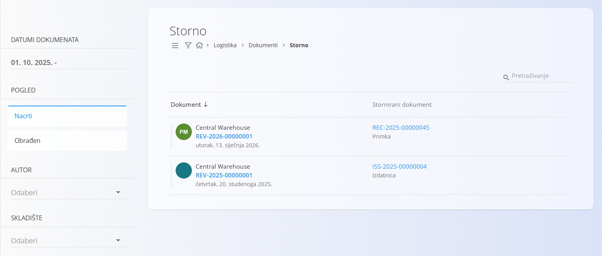
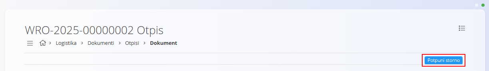
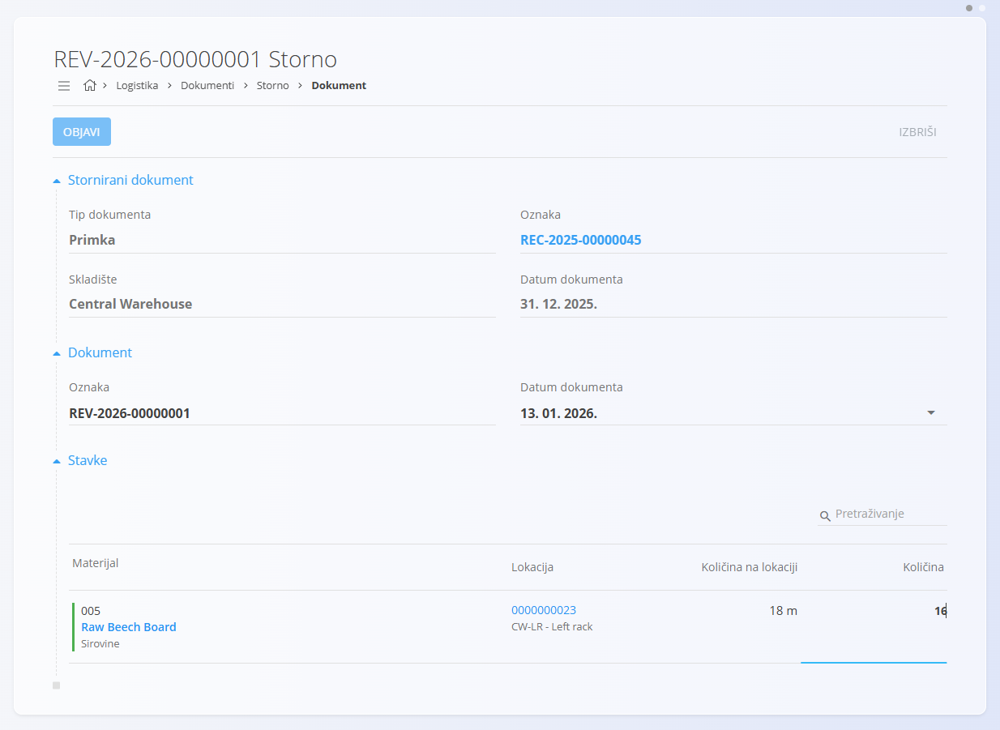
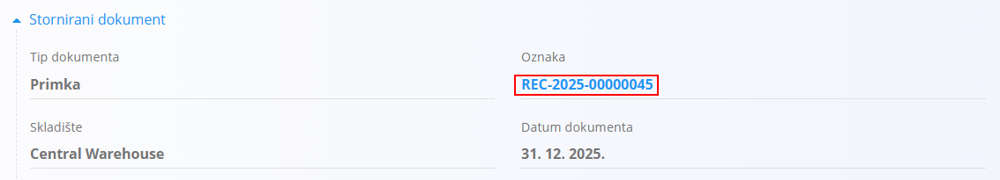
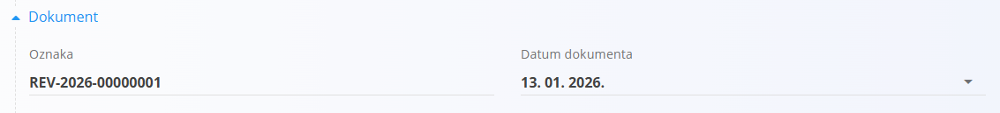
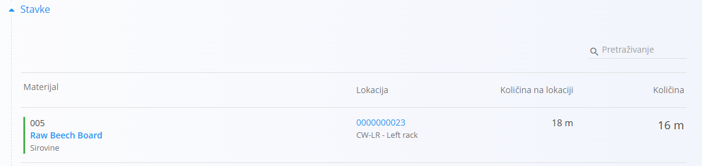

<!-- app_route: /warehouse/documents/reversals --> 
<!-- app_label: Storno --> 
<!-- canonical_source_url: https://github.com/Tom-PIT/Connected.Docs/blob/main/hr/Domene/Logistika/Dokumenti/Storno.md --> 
<!-- canonical_source_title: Storno -->

# Storno

Dokument **Storno** koristi se za poništavanje učinka drugog obrađenog dokumenta. Omogućuje ispravljanje pogrešaka ili usklađivanje stanja zaliha kada je potrebno poništiti prethodno obrađeno skladišno kretanje.

Storno se može kreirati samo za obrađene dokumente putem opcije **Izbornik → Kreiraj novi storno**. Dokumente storna nije moguće kreirati izravno sa zaslona **Storno**.

Storno utječe na stanje zaliha ovisno o vrsti dokumenta koji se poništava:

- Storno dokumenta **[Otpis](Otpisi.md)** vraća materijale na zalihu.
- Storno dokumenta **[Primka](Primke.md)** uklanja prethodno zaprimljene materijale.
- Storno dokumenta **[Izdatnica](Izdatnica.md)** vraća prethodno izdane materijale na zalihu.

Storno može biti **potpuni** ili **djelomični**, ovisno o unesnoj količini. Dokumente storna nije moguće ponovno stornirati.

> [!TIP]
> Za potpuni prikaz rada pogledajte video **[Storno](https://www.youtube.com/watch?v=yfGNARBWm7Q)**.

Za pristup dokumentu **Storno** idite na **Logistika / Dokumenti / Storno** u [navigaciji](../../../Zajednicko/UI/Navigacija.md).

## Kako funkcionira storno

Storno poništava učinak postojećeg obrađenog dokumenta bez izmjene ili brisanja izvornog dokumenta.

Nakon objave storna:

- izvorni dokument ostaje nepromijenjen
- kreira se dokument storna povezan s izvornim dokumentom
- primjenjuju se suprotni skladišni ili financijski učinci
- izvorni dokument označava se kao djelomično ili potpuno storniran.

Zajedno, izvorni dokument i dokument storna imaju ukupni učinak jednak nuli.

Vrsta učinka ovisi o vrsti dokumenta koji se stornira.

Primjeri:

- logistički dokumenti poništavaju skladišna kretanja
- financijski dokumenti poništavaju financijske vrijednosti
- odobrenja poništavaju učinak izvorne financijske transakcije.

## Shema

<strong>Stornirani dokument</strong>

| Polje | Opis |
|-------|------|
| **Tip dokumenta** | Vrsta dokumenta koji se stornira ([Primka](Primke.md), [Izdatnica](Izdatnica.md), [Otpis](Otpisi.md) ili [Međuskladišni promet](MeduskladisniPromet.md)). |
| [**Oznaka**](../../../Zajednicko/UI/OznakeDokumenata.md) | Oznaka storniranog dokumenta (poveznica). |
| [**Skladište**](../Upravljanje/Skladista.md) | Skladište u kojem je izvršen izvorni dokument. |
| **Datum dokumenta** | Datum izvornog dokumenta. |

<strong>Dokument</strong>

| Polje | Opis |
|-------|------|
| [**Oznaka**](../../../Zajednicko/UI/OznakeDokumenata.md) | Sistemski generirana oznaka dokumenta storna. |
| **Datum dokumenta** | Datum dokumenta storna. |

<strong>Stavke</strong>

| Polje | Opis |
|-------|------|
| [**Materijal**](../../RobaIUsluge/Materijali/README.md) | Materijal koji se stornira ([**Proizvodi**](../../RobaIUsluge/Materijali/Proizvodi.md), [**Poluproizvodi**](../../RobaIUsluge/Materijali/Poluproizvodi.md), [**Sirovine**](../../RobaIUsluge/Materijali/Sirovine.md) ili [**Pomoćni proizvodi**](../../RobaIUsluge/Materijali/PomocniProizvodi.md)). |
| [**Lokacija**](../Upravljanje/Lokacije.md) | Lokacija na kojoj se nalazi materijal koji se stornira. |
| **Količina na lokaciji** | Trenutna količina materijala na odabranoj lokaciji. |
| **Količina** | Količina koja će biti stornirana. Za potpuni storno unesite izvornu količinu, a za djelomični storno manju količinu. |

## Popis dokumenata storna

Zaslon **Storno** prikazuje sve dokumente storna.

Popis možete filtrirati prema:

- **Datum dokumenta**
- **Pogled**
    - **Nacrti** – dokumenti storna koji još nisu objavljeni
    - **Obrađeni** – objavljeni dokumenti storna
- **Autor**
- **Skladište**

Svaki red prikazuje:

- dokument storna
- stornirani dokument i njegovu vrstu.

Boje statusa:

- **Zelena** – obrađen
- **Siva** – nacrt

## Kreirati storno

Dokumente storna nije moguće kreirati ručno sa zaslona **Storno**.

1. Otvorite obrađeni dokument koji želite stornirati.

2. U **izborniku** odaberite **Kreiraj novi storno**.

   

3. Sustav automatski kreira nacrt dokumenta storna.

   

4. Za svaku stavku unesite količinu koju želite stornirati.

   - Unesite izvornu količinu za **potpuni storno**.
   - Unesite manju količinu za **djelomični storno**.

5. Kliknite **Objavi**.

Ako dokument spremite, ali ga ne objavite:

- prikazuje se na popisu **Nacrti**
- izvorni dokument dobiva oznaku **Storno u tijeku**.

Nakon objave:

- stanje zaliha se ažurira
- izvorni dokument dobiva oznaku **Djelomični storno** ili **Potpuni storno**
- dokument se premješta na popis **Obrađeni**.

Moguće oznake izvornog dokumenta:

- **Storno u tijeku**
- **Djelomični storno**
- **Potpuni storno**

## Urediti storno

Otvorite dokument storna s popisa kako biste pregledali njegove podatke.

Objavljene dokumente storna nije moguće uređivati.

Nacrte je moguće uređivati, ali promjena količina može promijeniti status izvornog dokumenta.

Dokument storna sadrži sljedeće odjeljke:

### Stornirani dokument

Prikazuje podatke o dokumentu koji se stornira te poveznicu za njegovo otvaranje.

### Dokument

Prikazuje oznaku i datum dokumenta storna.

### Stavke

Prikazuje materijale, njihove lokacije, količine na lokaciji i količine koje će biti stornirane.

## Izbrisati storno

Na zaslonu za uređivanje kliknite **Izbriši** kako biste obrisali dokument storna koji je još u statusu **Nacrt**.

Nakon potvrde dokument se briše bez utjecaja na stanje zaliha ili izvorni dokument.

Objavljene dokumente storna nije moguće izbrisati.