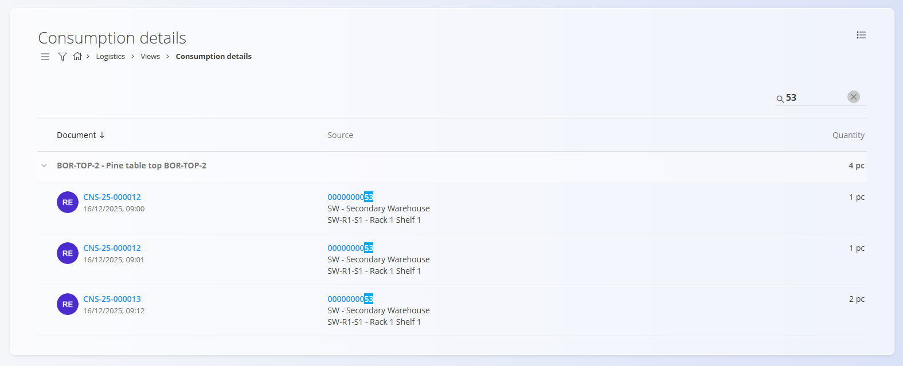

<!-- app_route: /warehouse/views/consumption-details -->
<!-- app_label: Consumption details -->
<!-- canonical_source_url: https://github.com/Tom-PIT/Connected.Docs/blob/main/hr/Domene/Logistika/Pogledi/ConsumptionDetails.md -->
<!-- canonical_source_title: Consumption details -->

# Consumption details

Stranica **Consumption details** pruža analitički pregled svih **materijala utrošenih tijekom proizvodnje** u odabranom vremenskom razdoblju. Umjesto prikaza pojedinačnih dokumenata potrošnje, stranica grupira **utrošene materijale** te prikazuje **u kojim su [dokumentima potrošnje](../../Proizvodnja/Dokumenti/Potrosnje.md)** korišteni i **s kojih skladišnih lokacija** su preuzeti.

Za pristup ovoj stranici otvorite **Logistika / Pogledi / Consumption details** u [navigaciji](../../../Zajednicko/UI/Navigacija.md).

## Popis potrošnje

Popis prikazuje **sve utrošene materijale**, grupirane po materijalu. Za svaki materijal prikazana je **ukupna utrošena količina** u odabranom vremenskom razdoblju.

Proširite red materijala kako biste pregledali pojedinačne dokumente potrošnje koji čine ukupnu količinu.

### Struktura

Popis je organiziran na sljedeći način:

- **Materijal** – utrošeni materijal i ukupna utrošena količina
    - **Dokument potrošnje** – pojedinačni zapis potrošnje u proizvodnji
        - **Izvor** – skladište i lokacija s koje je materijal preuzet
        - **Količina** – količina utrošena u tom dokumentu

Za svaki dokument potrošnje prikazani su:

- **Broj dokumenta** – otvara odgovarajući [dokument potrošnje](../../Proizvodnja/Dokumenti/Potroseno.md). Isti dokument dostupan je i iz povezanog [proizvodnog naloga](../../Proizvodnja/Dokumenti/ProizvodniNalozi.md) u odjeljku **Povezani dokumenti**.
- **Datum i vrijeme**
- **Izvor** – skladište i lokacija
- **Utrošena količina**

## Navigacija prema lokaciji

Stupac **Izvor** prikazuje:

- **Skladište**
- **Točnu skladišnu lokaciju**

Klikom na naziv lokacije otvara se **[Pogled na zalihe prema lokacijama](PogledNaZalihePremaLokacijama.md)** za odabranu lokaciju. Na taj način možete pregledati stanje zaliha i ostale materijale pohranjene na toj lokaciji.

## Filtri

Lijeva bočna traka sadrži sljedeći filtar:

- **Datumi dokumenata** – prikazuje samo dokumente potrošnje unutar odabranog vremenskog razdoblja.

Nakon promjene razdoblja popis se automatski osvježava.

## Pretraživanje

Polje za pretraživanje u gornjem desnom kutu omogućuje brzo pronalaženje podataka.

Pretraživanje obuhvaća:

- Šifre materijala
- Nazive materijala
- Brojeve dokumenata
- Šifre serijskih brojeva
- Šifre skladišta i lokacija

To omogućuje brzo pronalaženje potrošnje povezane s određenim materijalom, dokumentom ili skladišnom lokacijom.

## Namjena

Stranica **Consumption details** koristi se za:

- Analizu potrošnje materijala u proizvodnji
- Praćenje s kojih su lokacija materijali preuzeti
- Analizu utrošenih količina po materijalu
- Provjeru skladišnih kretanja povezanih s proizvodnjom

Ova stranica služi isključivo za pregled podataka te nije moguće stvarati, uređivati ili brisati dokumente.

> [!NOTE]
> - Količine su prikazane u osnovnoj mjernoj jedinici materijala.
> - Na popisu su prikazani samo materijali koji su stvarno utrošeni u proizvodnji.
> - Materijali izdani iz skladišta (npr. za prodaju) nisu prikazani na ovoj stranici. Za njihov pregled koristite **[Issue details](IssueDetails.md)**.

## Povezane stranice

- **[Proizvodni nalozi](../../Proizvodnja/Dokumenti/ProizvodniNalozi.md)** – pregled proizvodnih naloga koji generiraju potrošnju materijala
- **[Potrošnja](../../Proizvodnja/Dokumenti/Potrosnje.md)** – unos i pregled dokumenata potrošnje
- **[Pogled na zalihe prema lokacijama](PogledNaZalihePremaLokacijama.md)** – pregled zaliha na pojedinoj skladišnoj lokaciji
- **[Pogled na zalihe prema materijalu](Zaliha.md#pogled-na-zalihe-prema-materijalu)** – pregled stanja i kretanja zaliha po materijalu