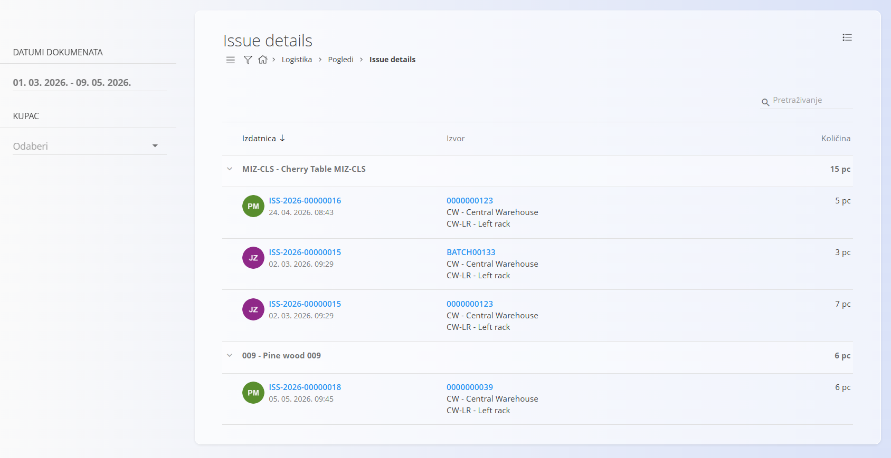
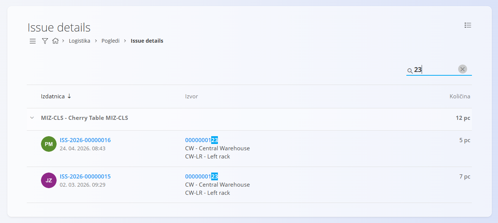

<!-- app_route: /warehouse/views/issue-details -->
<!-- app_label: Issue details -->
<!-- canonical_source_url: https://github.com/Tom-PIT/Connected.Docs/blob/main/hr/Domene/Logistika/Pogledi/IssueDetails.md -->
<!-- canonical_source_title: Issue details -->

# Issue details

Stranica **Issue details** pruža analitički pregled svih **materijala i gotovih proizvoda izdanih sa zalihe** u odabranom vremenskom razdoblju. Umjesto prikaza pojedinih izdatnica, stranica grupira izdane stavke i prikazuje **iz kojih su [izdatnica](../Documents/Izdatnica.md)** izdane te **s kojih skladišnih lokacija**.

Za pristup ovoj stranici otvorite **Logistika / Pogledi / Issue details** u [navigaciji](../../../Zajednicko/UI/Navigacija.md).

## Popis izdanih stavki

Popis prikazuje **sve izdane materijale i proizvode**, grupirane po stavci. Za svaku stavku prikazana je **ukupna izdana količina** u odabranom vremenskom razdoblju.

Proširite stavku kako biste pregledali pojedinačne izdatnice koje čine ukupnu količinu.

### Struktura

Popis je organiziran na sljedeći način:

- **Stavka** – materijal ili proizvod i ukupna izdana količina
    - **Izdatnica** – pojedinačno izdavanje
        - **Izvor** – skladište i lokacija s koje je materijal izdan
        - **Količina** – količina izdana na toj izdatnici

Za svaku izdatnicu prikazani su:

- **Broj dokumenta** – otvara odgovarajuću [izdatnicu](../Documents/Izdatnica.md)
- **Datum i vrijeme izdavanja**
- **Izvor** – skladište i lokacija
- **Izdana količina**

## Navigacija prema lokaciji

Stupac **Izvor** prikazuje:

- **Skladište**
- **Točnu skladišnu lokaciju**

Klikom na naziv lokacije otvara se **[Pogled na zalihe prema lokacijama](PogledNaZalihePremaLokacijama.md)** za odabranu lokaciju. Na taj način možete pregledati trenutno stanje zaliha i ostale materijale pohranjene na toj lokaciji.

## Filtri

Lijeva bočna traka sadrži sljedeće filtre:

- **Datumi dokumenata** – prikazuje samo izdatnice unutar odabranog razdoblja
- **Kupac** – prikazuje samo izdatnice za odabranog kupca

## Pretraživanje

Polje za pretraživanje u gornjem desnom kutu omogućuje brzo pronalaženje podataka.

Pretraživanje obuhvaća:

- Šifre materijala
- Nazive materijala
- Brojeve izdatnica
- Šifre serijskih brojeva
- Šifre skladišta i lokacija

## Namjena

Stranica **Issue details** koristi se za:

- Analizu materijala i proizvoda izdanih sa zalihe
- Praćenje iz kojih su lokacija izdane pojedine stavke
- Analizu izdanih količina po materijalu
- Provjeru izlaza robe iz skladišta

Ova stranica služi isključivo za pregled podataka te nije moguće stvarati, uređivati ili brisati dokumente.

> [!NOTE]
> - Količine su prikazane u osnovnoj mjernoj jedinici materijala ili proizvoda.
> - Stranica prikazuje samo izdavanja sa zalihe.
> - Potrošnja materijala u proizvodnji prikazana je na stranici **[Consumption details](ConsumptionDetails.md)**.