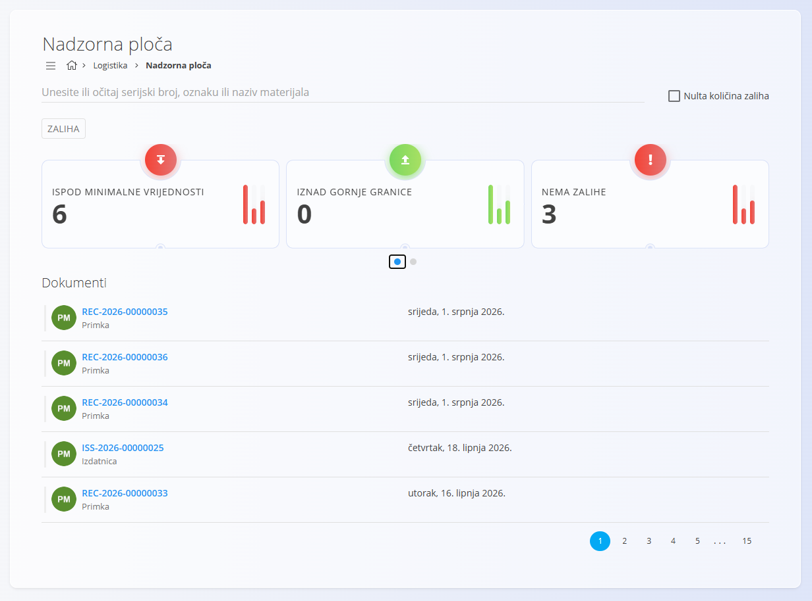
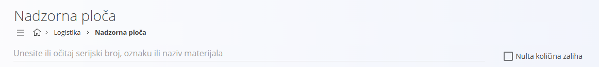
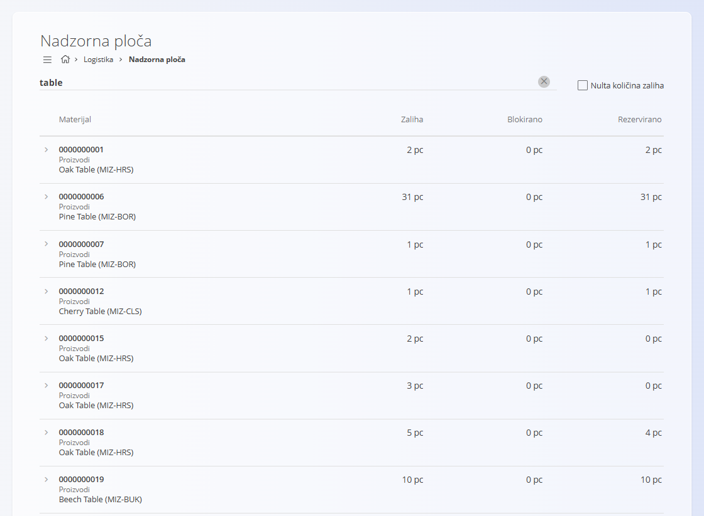

<!-- app_route: /warehouse/index -->
<!-- app_label: Nadzorna ploča -->
<!-- canonical_source_url: https://github.com/Tom-PIT/Connected.Docs/blob/main/hr/Domene/Logistika/Upravljanje/NadzornaPloca.md -->
<!-- canonical_source_title: Nadzorna ploča -->

# Nadzorna ploča

**Nadzorna ploča** pruža brz pregled trenutačnog stanja zaliha svih materijala. Ističe važne informacije, kao što su materijali koji su **ispod minimalne količine**, **iznad maksimalne količine**, **bez zalihe** ili **ispod blokirane količine**. Na taj način možete brzo prepoznati potencijalne probleme i pravovremeno poduzeti odgovarajuće radnje.

Materijal možete pretražiti izravno s nadzorne ploče te otvoriti njegov [**Zaliha**](Zaliha.md) kako biste vidjeli stanje zalihe, lokacije, kretanja i serijske brojeve.

Minimalne i maksimalne granice definiraju se u popisu **[Granice zalihe](../Upravljanje/GraniceZalihe.md)**.

> [!TIP]
>
> Za potpuni prikaz funkcionalnosti pogledajte video **[Pregled nadzorne ploče](https://www.youtube.com/watch?v=mEU18GmypkY)**.

Za pristup ovom dokumentu idite na **Logistika / Nadzorna ploča** u [navigaciji](../../../Zajednicko/UI/Navigacija.md).

## Pokazatelji zalihe

Nadzorna ploča prikazuje četiri glavna pokazatelja. Klikom na bilo koji pokazatelj popis ispod prikazuje samo materijale koji odgovaraju odabranom stanju. Ako nije odabran nijedan pokazatelj, prikazuju se posljednji logistički dokumenti.

### Ispod minimalne količine

Prikazuje materijale čija je količina zalihe manja od definirane **minimalne količine**.

Minimalne vrijednosti definiraju se u popisu **[Granice zalihe](../Upravljanje/GraniceZalihe.md)**.

### Iznad maksimalne količine

Prikazuje materijale čija je količina zalihe veća od definirane **maksimalne količine**.

Maksimalne vrijednosti definiraju se u popisu **[Granice zalihe](../Upravljanje/GraniceZalihe.md)**.

### Nema zalihe

Prikazuje materijale koji trenutno nemaju raspoložive zalihe.

### Ispod blokirane količine

Prikazuje materijale kod kojih je raspoloživa količina manja od blokirane količine.

## Pretraživanje i skeniranje

Materijal možete pronaći unosom njegovog **serijskog broja**, **šifre** ili **naziva** u polje za pretraživanje.

Opcija **Nulta količina zaliha** uključuje u rezultate i materijale koji nemaju zalihe.

Pritisnite **Enter** ili kliknite **Zaliha** za prikaz rezultata pretraživanja. Ako je polje za pretraživanje prazno, gumb otvara [**Zaliha**](Zaliha.md).

Prikazuje se popis materijala sa sljedećim stupcima:

- **Materijal**
- **Zaliha**
- **Blokirano**
- **Rezervirano**

## Popis materijala

Ispod pokazatelja prikazuje se popis materijala koji odgovaraju trenutno odabranom pokazatelju. Popis sadrži:

- tip materijala
- naziv materijala ili proizvoda
- trenutno stanje zalihe ili minimalnu/maksimalnu vrijednost

Polje za pretraživanje na desnoj strani omogućuje dodatno filtriranje prikazanih stavki.

> [!NOTE]
>
> Kliknite materijal kako biste otvorili [**Zaliha**](Zaliha.md#pregled-zalihe-prema-materijalu).