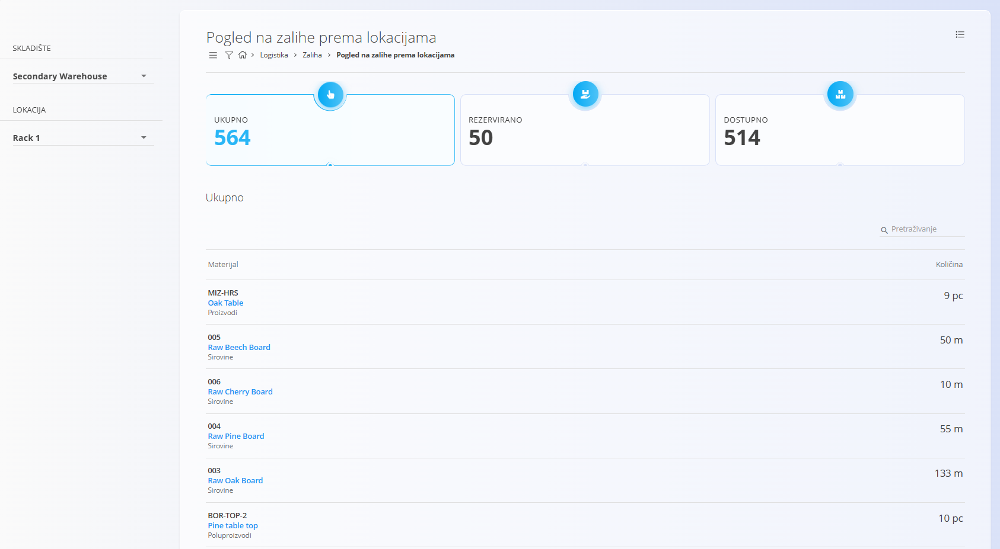
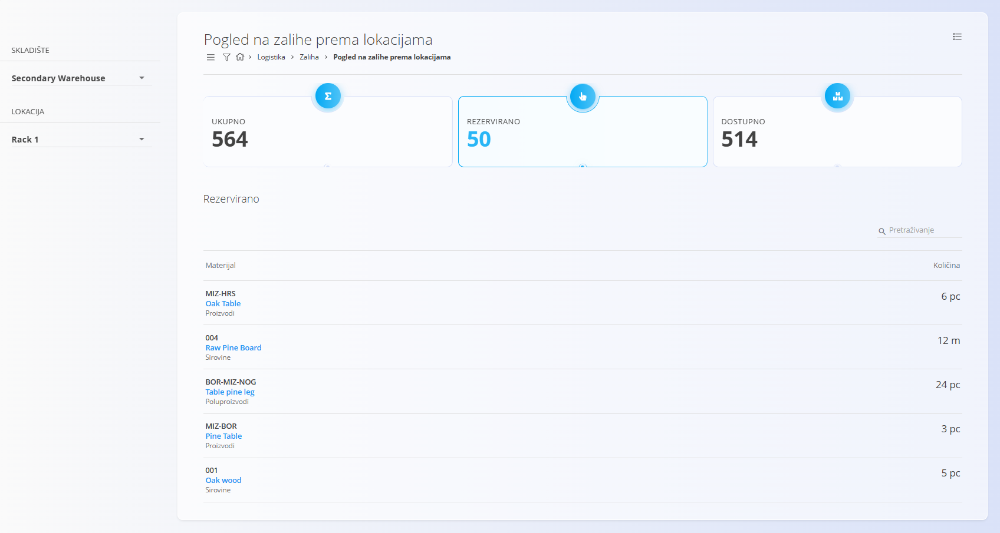
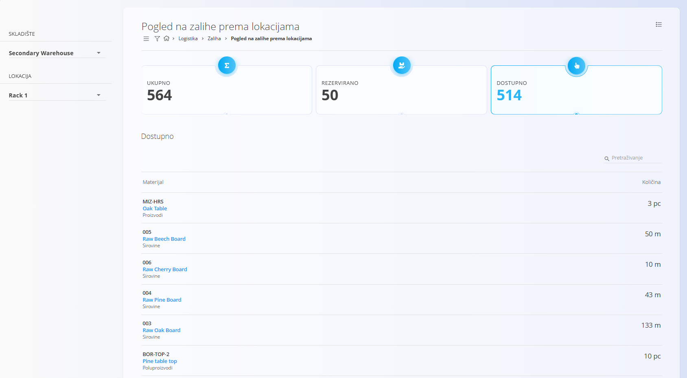
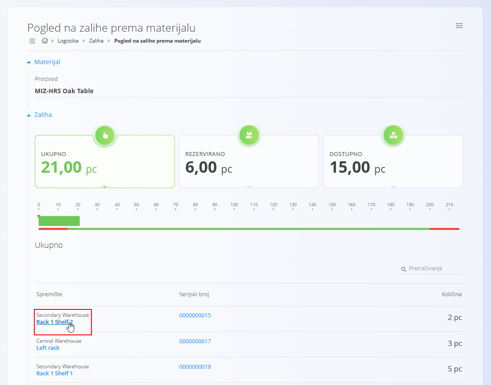

<!-- app_route: /warehouse/stock/location -->
<!-- app_label: Pogled na zalihe prema lokacijama -->
<!-- canonical_source_url: https://github.com/Tom-PIT/Connected.Docs/blob/main/hr/Domene/Logistika/Upravljanje/PogledNaZalihePremaLokacijama.md -->
<!-- canonical_source_title: Pogled na zalihe prema lokacijama -->

# Pogled na zalihe prema lokacijama

Stranica **Pogled na zalihe prema lokacijama** prikazuje sav materijal pohranjen na određenoj [lokaciji](../Upravljanje/Lokacije.md). Omogućuje jasan pregled ukupne, rezervirane i dostupne količine na odabranoj lokaciji te olakšava provjeru rasporeda zaliha unutar skladišta.

Iz ovog pregleda možete otvoriti povezane prikaze, kao što su **[Pogled na zalihe prema materijalu](Zaliha.md#pogled-na-zalihe-prema-materijalu)** ili **[Pogled na zalihe prema serijskom broju](Zaliha.md#pogled-na-zalihe-prema-serijskom-broju)**, kako biste detaljnije pregledali pojedini materijal ili serijski broj. Minimalne i maksimalne granice zalihe definiraju se u šifrarniku **[Granice zalihe](../Upravljanje/GraniceZalihe.md)**, dok se ukupno stanje zaliha može pratiti na stranici **[Nadzorna ploča](NadzornaPloca.md)**.

> [!TIP]
> Za potpuni prikaz funkcionalnosti pogledajte video **[Pogled na zalihe prema lokacijama](https://www.youtube.com/watch?v=_3bZBZ89hds)**.

Za pristup ovoj stranici otvorite **Logistika / Zaliha / Pogled na zalihe prema lokacijama** u [navigaciji](../../../Zajednicko/UI/Navigacija.md) ili kliknite **naziv lokacije** u drugim pregledima zaliha, primjerice u **Pogledu na zalihe prema materijalu**.

## Pregled

Stranica se sastoji od:

- birača **skladišta**
- birača **lokacije**
- tri pokazatelja:
    - **Ukupno**
    - **Rezervirano**
    - **Dostupno**
- popisa materijala pohranjenih na odabranoj lokaciji

## Odabir skladišta i lokacije

Na lijevoj strani odaberite:

- **Skladište**
- **Lokaciju** unutar odabranog skladišta

Nakon odabira lokacije sustav učitava pripadajuće stanje zalihe.

## Pokazatelji

Na vrhu stranice prikazana su tri pokazatelja:

- **Ukupno**
- **Rezervirano**
- **Dostupno**

Klikom na bilo koji pokazatelj filtrira se popis materijala tako da prikazuje samo stavke koje pripadaju odabranoj kategoriji.

### Ukupno

Prikazuje **ukupnu količinu** svih materijala pohranjenih na odabranoj lokaciji.

### Rezervirano

Prikazuje **količinu rezerviranu** za otvorene [izdatnice](../Dokumenti/Izdatnica.md) ili [međuskladišne prijenose](../Dokumenti/MeduskladisniPromet.md).

### Dostupno

Prikazuje **količinu dostupnu** za izdavanje ili premještanje.

Vrijednost se izračunava kao:

**Ukupno − Rezervirano**

## Popis materijala

Ispod pokazatelja nalazi se popis svih materijala pohranjenih na odabranoj lokaciji.

Za svaki materijal prikazani su:

- **Šifra i naziv materijala**
- **Vrsta materijala**
- **Količina**

Na vrhu popisa nalazi se polje za pretraživanje koje omogućuje brzo pronalaženje željenog materijala.

Klikom na **naziv materijala** otvara se **[Pogled na zalihe prema materijalu](Zaliha.md#pogled-na-zalihe-prema-materijalu)**.

## Otvaranje pregleda iz drugih stranica

Ovu stranicu možete otvoriti i klikom na **naziv lokacije** u drugim pregledima zaliha.

Primjerice, u **Pogledu na zalihe prema materijalu** kliknite naziv lokacije kako biste otvorili pregled za tu lokaciju.

