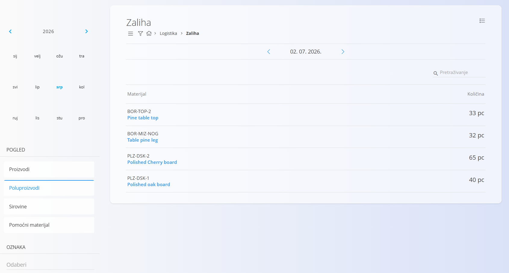
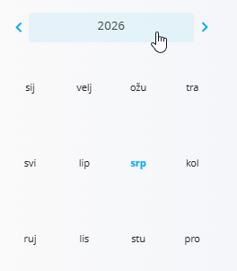
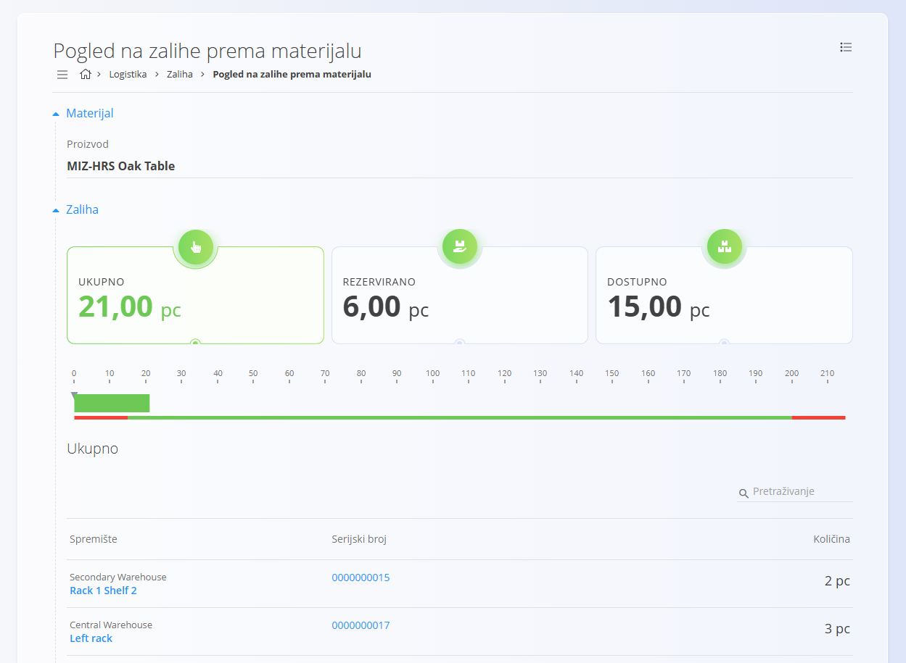
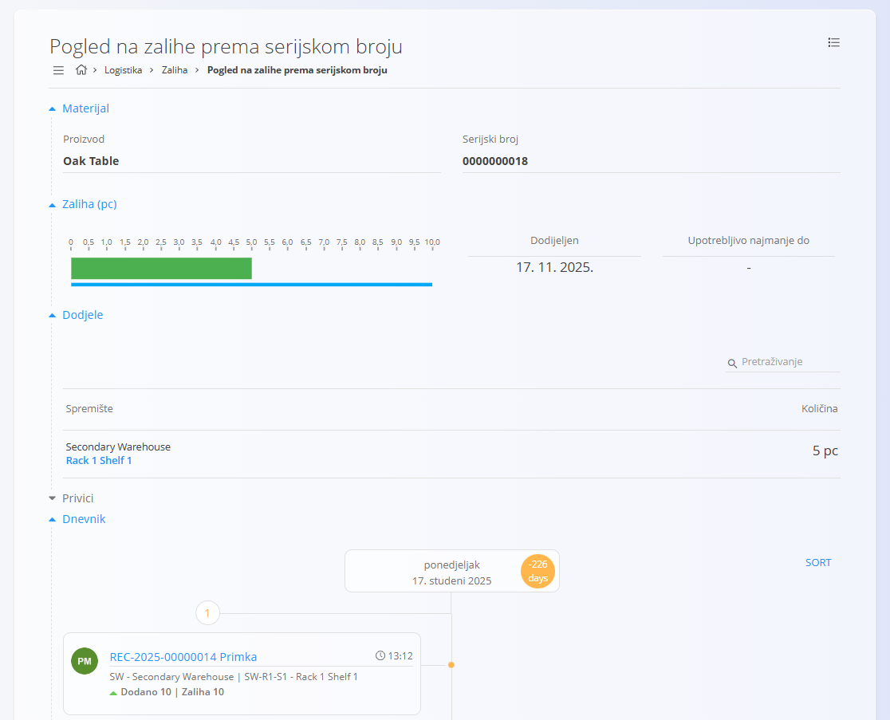

<!-- app_route: /warehouse/stock/index -->
<!-- app_label: Zaliha -->
<!-- canonical_source_url: https://github.com/Tom-PIT/Connected.Docs/blob/main/hr/Domene/Logistika/Upravljanje/Zaliha.md -->
<!-- canonical_source_title: Zaliha -->

# Zaliha

Stranica **Zaliha** pruža potpuni pregled količina materijala u sustavu. Prikazuje koliko je materijala dostupno, rezervirano ili blokirano te omogućuje brzo pronalaženje bilo kojeg materijala pomoću pretraživanja i sortiranja. Ovdje možete otvoriti detaljne prikaze zaliha kako biste vidjeli gdje se materijal nalazi, kako se koristi i kako se njegova zaliha mijenjala tijekom vremena.

Možete otvoriti **[Pogled na zalihe prema materijalu](#pogled-na-zalihe-prema-materijalu)**, **[Pogled na zalihe prema lokacijama](#pogled-na-zalihe-prema-lokacijama)** ili **[Pogled na zalihe prema serijskom broju](#pogled-na-zalihe-prema-serijskom-broju)** za detaljniji pregled količina, lokacija, kretanja i povijesti skladištenja. Minimalne i maksimalne granice koje se prikazuju u povezanim pregledima mogu se konfigurirati u šifrarniku **[Granice zalihe](../Upravljanje/GraniceZalihe.md)**. **[Nadzorna ploča](NadzornaPloca.md)** također omogućuje brz pristup materijalima koji zahtijevaju pažnju.

> [!TIP]
> Za potpuni prikaz funkcionalnosti pogledajte video **[Pregled zalihe](https://www.youtube.com/watch?v=gjAKnavIWnY)**.

Za pristup ovoj stranici otvorite **Logistika / Zaliha** u [navigaciji](../../../Zajednicko/UI/Navigacija.md).

## Filtri i navigacija

Lijeva bočna traka sadrži nekoliko filtara.

### Filtar datuma

Možete odabrati određeni datum za prikaz stanja zaliha kakvo je bilo na taj dan.

Klikom na naziv mjeseca otvara se brzi pregled za odabir mjeseca i godine.

### Filtar vrste materijala

Možete filtrirati popis prema vrsti materijala:

- [Proizvodi](../../RobaIUsluge/Materijali/Proizvodi.md)
- [Poluproizvodi](../../RobaIUsluge/Materijali/Poluproizvodi.md)
- [Repromaterijal](../../RobaIUsluge/Materijali/PomocniProizvodi.md)
- [Sirovine](../../RobaIUsluge/Materijali/Sirovine.md)

### Filtar oznaka

Možete dodatno suziti popis odabirom oznaka materijala.

## Popis zaliha

Glavni popis prikazuje sve materijale abecednim redoslijedom.

Možete promijeniti način sortiranja:

- prema **nazivu materijala**
- prema **količini**

Na vrhu popisa nalazi se polje za pretraživanje koje omogućuje brzo pronalaženje željenog materijala.

Svaki redak prikazuje:

- **Šifru i naziv materijala**
- **Količinu**
- **Oznaku vrste materijala**

Kliknite naziv materijala za otvaranje detaljnog prikaza zalihe.

## Pogled na zalihe prema materijalu

Klikom na **naziv materijala** otvara se detaljan pregled svih količina materijala raspoređenih po [lokacijama](../Upravljanje/Lokacije.md), uključujući dostupnu, rezerviranu i blokiranu količinu. Iz ovog prikaza također možete otvoriti **[Pogled na zalihe prema serijskom broju](#pogled-na-zalihe-prema-serijskom-broju)** za pregled pojedinačnih serijskih brojeva.

> [!TIP]
> Za potpuni prikaz funkcionalnosti pogledajte video **[Pogled na zalihe prema materijalu](https://www.youtube.com/watch?v=GUdnV6bZwoI)**.

Ovaj prikaz uključuje:

- **Ukupnu zalihu**
- **Rezerviranu zalihu**
- **Dostupnu zalihu**
- **Grafički prikaz** koji prikazuje stanje zalihe u odnosu na minimalne i maksimalne granice
- **Pregled po lokacijama skladištenja**, uključujući:
  - skladište i lokaciju
  - serijske brojeve (ako postoje)
  - količine
- **Histogram**, koji prikazuje promjene količine zalihe tijekom odabranog razdoblja

Na vrhu pregleda nalazi se polje za pretraživanje za filtriranje lokacija unutar odabranog materijala.

## Pogled na zalihe prema lokacijama

Stranica **Pogled na zalihe prema lokacijama** prikazuje sve materijale pohranjene na određenoj [lokaciji](../Upravljanje/Lokacije.md), zajedno s ukupnom, rezerviranom i dostupnom količinom. Korisna je kada želite provjeriti što se fizički nalazi na određenom regalu, polici ili skladišnoj lokaciji.

Ovaj prikaz možete otvoriti na dva načina:

- putem **Logistika / Zaliha / Pogled na zalihe prema lokacijama**
- klikom na **naziv lokacije** u drugim pregledima zaliha

Više informacija potražite u dokumentu [**Pogled na zalihe prema lokacijama**](PogledNaZalihePremaLokacijama.md).

## Pogled na zalihe prema serijskom broju

Materijal može sadržavati više **serijskih brojeva** koji predstavljaju različite serije, datume proizvodnje ili [lokacije](../Upravljanje/Lokacije.md). Klikom na bilo koji serijski broj otvara se njegov detaljan prikaz u kojem možete pregledati kretanja, povijest skladištenja i povezane privitke.

> [!TIP]
> Za potpuni prikaz funkcionalnosti pogledajte video **[Pogled na zalihe prema serijskom broju](https://www.youtube.com/watch?v=_vzXNsGg5N4)**.

Ovaj prikaz prikazuje:

- **Materijal i serijski broj**
- **Graf zalihe** s prikazom ukupne i dostupne količine za odabrani serijski broj
- **Dodjele**, odnosno popis svih lokacija na kojima se serijski broj nalazi zajedno s količinama
- **Privitke** povezane sa serijskim brojem, poput izvještaja o kvaliteti ili fotografija
- **Dnevnik**, odnosno vremenski slijed svih promjena i transakcija povezanih sa serijskim brojem

Stranica **Pogled na zalihe prema serijskom broju** služi isključivo za pregled podataka i nije moguće uređivati prikazane informacije.