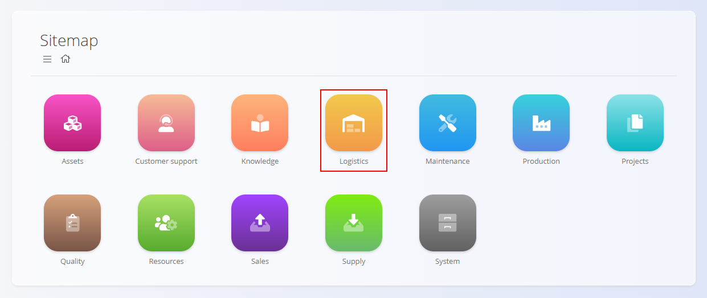
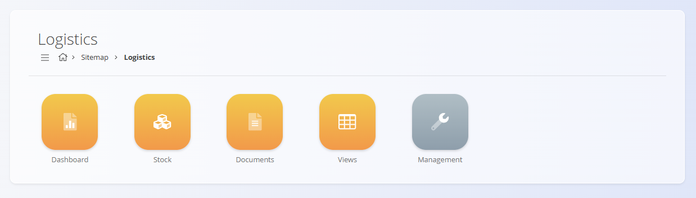

<!-- app_route: /sitemap/logistics -->
<!-- app_label: Logistika -->
<!-- canonical_source_url: https://github.com/Tom-PIT/Connected.Docs/blob/main/hr/Domene/Logistika/README.md -->
<!-- canonical_source_title: Logistika -->

# Logistika

Domena **Logistika** obuhvaća sve procese povezane sa skladišnim poslovanjem unutar organizacije. Uključuje upravljanje zalihama, skladišnim strukturama, kretanjem materijala te dokumentima koji omogućuju praćenje fizičkog toka robe.

Dok domena **[Materijali](../Sredstva/Materijali/README.md)** definira *što* postoji na zalihi, domena **Logistika** definira *gdje* se materijal nalazi, *kako* se kreće te *kako* se njime upravlja.

Za pristup ovoj domeni odaberite **Logistika** u [navigaciji](../../Zajednicko/UI/Navigacija.md).

> [!NOTE]
> Dostupne domene ovise o konfiguraciji sustava i poslovnom modelu pojedine tvrtke.

## Što uključuje domena Logistika?

Domena je organizirana u nekoliko funkcionalnih cjelina:

- **[Nadzorna ploča](Pogledi/NadzornaPloca.md)** – pregled aktivnosti logistike i ključnih pokazatelja skladišnog poslovanja
- **[Zaliha](Pogledi/Zaliha.md)** – pregled trenutnog stanja zaliha po skladištima i lokacijama
- **[Dokumenti](#dokumenti)** – svi logistički dokumenti koji utječu na stanje zaliha
- **[Pogledi](#pogledi)** – analitički pregledi potrošnje, izdatnica i rasporeda zaliha
- **[Upravljanje](#upravljanje)** – šifrarnici i konfiguracija logistike

## Nadzorna ploča

**[Nadzorna ploča](Pogledi/NadzornaPloca.md)** pruža pregled logističkih aktivnosti i skladišnog poslovanja. Prikazuje ključne operativne pokazatelje, poput broja ulaza i izlaza robe, otvorenih inventura te utvrđenih razlika u zalihama.

Nadzorna ploča predstavlja početnu točku za voditelje skladišta i skladišne operatere kojima je potreban brz pregled trenutnog stanja logističkih procesa.

## Zaliha

Stranica **[Zaliha](Pogledi/Zaliha.md)** omogućuje pregled svih materijala pohranjenih u skladištima i na skladišnim lokacijama. Prikazuje raspoložive količine, serijske brojeve, lotove i fizičke lokacije materijala. Ovaj pregled služi isključivo za pregled podataka.

## Dokumenti

Odjeljak **Dokumenti** sadrži sve logističke dokumente koji **mijenjaju stanje zaliha** ili **evidentiraju skladišne aktivnosti**.

Dostupni dokumenti:

- **[Primke](Dokumenti/Primke.md)** – evidentiranje ulaza robe u skladište. Povećavaju stanje zaliha.
- **[Simple receive](Dokumenti/SimpleReceive.md)** – pojednostavljeno evidentiranje ulaza robe.
- **[Izdatnice](Dokumenti/Izdatnice.md)** – evidentiranje izlaza robe iz skladišta. Smanjuju stanje zaliha.
- **[Međuskladišni promet](Dokumenti/MeduskladisniPromet.md)** – prijenos robe između skladišta.
- **[Premještaj spremnika](Dokumenti/PremjestajSpremnika.md)** – premještanje serijskih ili lot materijala između lokacija bez promjene količine.
- **[Inventure](Dokumenti/Inventure.md)** – provođenje inventure i usklađivanje stanja zaliha.
- **[Otpisi](Dokumenti/Otpisi.md)** – otpis oštećenog, izgubljenog ili neupotrebljivog materijala.
- **[Posudbe](Dokumenti/Posudbe.md)** – evidentiranje privremenih posudbi materijala.
- **[Potrošnje](Dokumenti/Potrosnje.md)** – evidentiranje potrošnje materijala.
- **[Proizvodnje](Dokumenti/Proizvodnje.md)** – evidentiranje proizvedenih proizvoda i poluproizvoda.
- **[Storno](Dokumenti/Storno.md)** – poništavanje prethodno knjiženih logističkih dokumenata.
- **[Spremnici](Dokumenti/Spremnici.md)** – upravljanje spremnicima i paletama.
- **[Razdvajanja](Dokumenti/Razdvajanja.md)** – razdvajanje proizvoda na sastavne dijelove.
- **[Corrections](Dokumenti/Corrections.md)** – ručne korekcije stanja zaliha uz revizijski trag.
- **[Premještaj spremnika](Dokumenti/PremjestajSpremnika.md)** – premještanje spremnika između lokacija.
- **[Analiza materijala](Dokumenti/AnalizaMaterijala.md)** – analiza i provjera materijala.

Svi ovi dokumenti osiguravaju potpunu sljedivost skladišnih procesa.

## Pogledi

Odjeljak **Pogledi** sadrži analitičke prikaze za praćenje kretanja materijala, potrošnje i raspodjele zaliha.

Dostupni pogledi:

- **[Consumption details](Pogledi/ConsumptionDetails.md)** – pregled potrošnje materijala prema datumu, materijalu, skladištu, korisniku ili mjestu troška.
- **[Issue details](Pogledi/IssueDetails.md)** – pregled izdatnica prema materijalu, dokumentu, skladištu, lokaciji ili korisniku.
- **[Pogled na zalihe prema lokacijama](Pogledi/PogledNaZalihePremaLokacijama.md)** – hijerarhijski prikaz zaliha po skladištima i lokacijama.

Ovi pregledi služe isključivo za analizu podataka i ne stvaraju nove transakcije.

## Upravljanje

Odjeljak **Upravljanje** sadrži šifrarnike i konfiguracijske postavke koje koriste svi logistički procesi.

Dostupni šifrarnici:

- **[Konfiguracija](Upravljanje/KonfiguracijaLogistike.md)**
- **[Poslovni imenik](../../Zajednicko/Upravljanje/PoslovniImenik.md)**
- **[Skladišta](Upravljanje/Skladista.md)**
- **[Države](../../Zajednicko/Upravljanje/Drzave.md)**
- **[Lokacije](Upravljanje/Lokacije.md)**
- **[Granice zalihe](Upravljanje/GraniceZalihe.md)**
- **[Mjerne jedinice](../../Zajednicko/Upravljanje/MjerneJedinice.md)**
- **[Analiza materijala](Upravljanje/AnalizaMaterijala.md)**

Ovi elementi određuju način rada logističkih procesa i organizaciju logističkih podataka.

> [!TIP]
> Pregled svih šifrarnika dostupan je u **[Popisu šifrarnika](../../ManagementIndex.md)**.

## Logistički procesi

Logistički procesi slijede uobičajeni tijek rada:

### 1. Zaprimanje robe

- Roba ulazi u skladište putem **[Primki](Dokumenti/Primke.md)** ili **[Proizvodnje](Dokumenti/Proizvodnje.md)**.

### 2. Premještanje i organizacija

- Roba se premješta između skladišta i lokacija pomoću **[Međuskladišnog prometa](Dokumenti/MeduskladisniPromet.md)**, **[Premještaja spremnika](Dokumenti/PremjestajSpremnika.md)** i **[Lokacija](Upravljanje/Lokacije.md)**.

### 3. Izdavanje i potrošnja

- Materijal napušta skladište putem **[Izdatnica](Dokumenti/Izdatnice.md)** i **[Potrošnji](Dokumenti/Potrosnje.md)**.

### 4. Inventura i usklađivanje

- Točnost zaliha održava se pomoću **[Inventura](Dokumenti/Inventure.md)**, **[Otpisa](Dokumenti/Otpisi.md)** i **[Corrections](Dokumenti/Corrections.md)**.

### 5. Izvještavanje i analiza

- Analitički pregledi omogućuju uvid u stanje, potrošnju i raspoloživost zaliha.

## Povezanost s drugim domenama

| Domena | Opis |
|--------|------|
| **[Materijali](../Sredstva/Materijali/README.md)** | Definira materijale kojima upravlja logistika. |
| **[Sredstva](../Sredstva/README.md)** | Koristi podatke o zalihama za izračun raspoloživosti. |
| **[Proizvodnja](../Proizvodnja/README.md)** | Povezana je s dokumentima proizvodnje i potrošnje. |
| **[Održavanje](../Odrzavanje/README.md)** | Koristi skladišne zalihe rezervnih dijelova. |
| **[Prodaja](../Prodaja/README.md)** / **[Nabava](../Nabava/README.md)** | Logistika osigurava raspoloživost robe i izvršenje skladišnih procesa. |